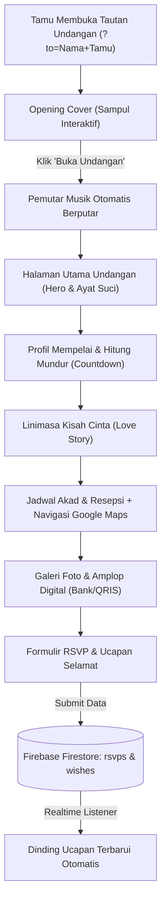
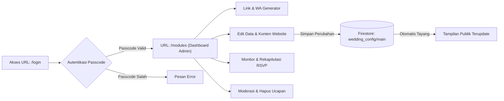

# 💍 Betawi Heritage - Digital Wedding Invitation SPA

> Platform undangan pernikahan digital interaktif dan responsif berbalut estetika budaya Betawi modern dengan sinkronisasi data *real-time*, audio *playlist* multifungsi, generator pesan WhatsApp, serta panel admin mandiri.

[](package.json)
[](https://react.dev)
[](https://www.typescriptlang.org/)
[](https://vitejs.dev)
[](https://tailwindcss.com)
[](https://firebase.google.com)
[](https://motion.dev)
[](https://vercel.com)
[](LICENSE)

---

- [🤖 Aturan AI Agent (AGENTS.md)](AGENTS.md)
- [📚 Dokumentasi Lengkap Proyek (Docs Suite)](#-dokumentasi-lengkap-proyek-docs-suite)
- [📖 Tentang Proyek](#-tentang-proyek)
- [🛠️ Teknologi & Library](#️-teknologi--library)
- [🏛️ Arsitektur & Alur Sistem](#️-arsitektur--alur-sistem)
- [🗄️ Struktur Database](#️-struktur-database)
- [👥 Hak Akses & Role Pengguna](#-hak-akses--role-pengguna)
- [✨ Fitur Utama](#-fitur-utama)
- [📋 Prasyarat Sistem](#-prasyarat-sistem)
- [🚀 Panduan Instalasi](#-panduan-instalasi)
- [💻 Panduan Penggunaan](#-panduan-penggunaan)
- [🔐 Kredensial Default](#-kredensial-default)
- [🔥 Panduan Setup Firebase & Environment Variables](#-panduan-setup-firebase--environment-variables)
- [☁️ Panduan Deploy ke Vercel](#️-panduan-deploy-ke-vercel)
- [🤝 Panduan Kontribusi](#-panduan-kontribusi)
- [📄 Lisensi](#-lisensi)

---

## 📚 Dokumentasi Lengkap Proyek (Docs Suite)

Untuk panduan mendalam sesuai peran dan kebutuhan operasional, silakan telusuri rangkaian dokumentasi di folder [`docs/`](docs/README.md) dan panduan protokol agen di [`AGENTS.md`](AGENTS.md):

| Panduan | Lokasi Berkas | Deskripsi Isi |
| :--- | :--- | :--- |
| 🤖 **Aturan AI Agent** | [`AGENTS.md`](AGENTS.md) | 10 pilar aturan operasional AI Assistant: SemVer, Conventional Commits, Sync Docs, OWASP, & Clean Code. |
| 📚 **Dokumentasi Hub** | [`docs/README.md`](docs/README.md) | Pusat navigasi, matriks panduan, dan jalan pintas cepat skenario umum. |
| 📟 **Daftar Perintah CLI** | [`docs/01-daftar-command.md`](docs/01-daftar-command.md) | Cheatsheet CLI harian, dev server, type checking, build produksi, & housekeeping. |
| 📖 **Buku Panduan Pengguna** | [`docs/02-buku-panduan-pengguna.md`](docs/02-buku-panduan-pengguna.md) | Manual book pengantin: generator link WhatsApp, ubah data, upload foto, & RSVP. |
| 🛠️ **Panduan Pengembang** | [`docs/03-developer-guide.md`](docs/03-developer-guide.md) | Arsitektur SPA React 19, zero-storage canvas, model Firestore, OWASP, & siklus fitur baru. |
| ☁️ **Panduan Deployment** | [`docs/04-panduan-deployment.md`](docs/04-panduan-deployment.md) | Panduan rilis ke Vercel, VPS Linux Nginx, cPanel (.htaccess), dan aaPanel. |

---

## 📖 Tentang Proyek

**Betawi Heritage Wedding Invitation** adalah aplikasi web *Single Page Application* (SPA) bertema pesta adat Betawi modern yang dirancang untuk memberikan pengalaman personal dan imersif kepada setiap tamu undangan. 

Aplikasi ini menyelesaikan sejumlah tantangan utama dalam penyebaran undangan konvensional:
1. **Efisiensi Biaya & Waktu**: Menggantikan undangan cetak fisik dengan undangan digital elegan yang dapat dibagikan secara instan melalui tautan WhatsApp.
2. **Personalisasi Tamu**: Nama tamu dapat disematkan secara dinamis pada halaman sampul depan (*Opening Cover*) melalui parameter URL.
3. **Interaktivitas Dua Arah**: Tamu dapat mengonfirmasi kehadiran (RSVP) serta mengirimkan doa restu secara langsung yang tersinkronisasi secara *real-time*.
4. **Kemudahan Digital Gift**: Menyediakan opsi transfer bank multi-rekening dengan tombol salin otomatis dan kode QRIS instan.
5. **Panel Admin Mandiri**: Mempelai dapat mengubah jadwal acara, profil, foto galeri, lagu, nomor rekening, hingga memantau daftar hadir tanpa perlu menyentuh kode program.

Sistem ini didesain dengan prinsip **Zero Storage Cost**; seluruh media foto dan barcode QRIS dikonversi dan dikompresi di sisi peramban (*client-side canvas*) menjadi string Base64 yang disimpan langsung ke Firestore, sehingga pengguna tidak perlu membayar biaya hosting file/storage cloud tambahan.

---

## 🛠️ Teknologi & Library

| Kategori | Teknologi / Library | Versi | Deskripsi Kegunaan |
| :--- | :--- | :--- | :--- |
| **Core Framework** | [React](https://react.dev) | `^19.0.1` | Pustaka UI deklaratif modern berbasis komponen. |
| **Language** | [TypeScript](https://www.typescriptlang.org) | `~5.8.2` | Menjamin keandalan kode dengan *static typing*. |
| **Build Tool & Bundler** | [Vite](https://vitejs.dev) | `^6.2.3` | *Development server* berkecepatan tinggi dan *bundling* produksi optimal. |
| **Styling & CSS** | [Tailwind CSS](https://tailwindcss.com) | `^4.1.14` | *Utility-first CSS framework* v4 dengan skema tema khusus Betawi. |
| **Animations** | [Motion](https://motion.dev) | `^12.23.24` | Menghadirkan animasi gerak halus, transisi cover, dan *stagger effects*. |
| **Database & Realtime** | [Firebase Firestore](https://firebase.google.com) | `^12.17.1` | Basis data NoSQL dokumen dengan *WebSocket real-time listener*. |
| **Media Player** | [React Player](https://github.com/cookpete/react-player) | `^3.4.0` | Pemutar audio fleksibel (mendukung YouTube, Google Drive, & file MP3). |
| **Icons** | [Lucide React](https://lucide.dev) | `^0.546.0` | Set ikon antarmuka modern, tajam, dan ringan. |
| **SEO & Meta Head** | [react-helmet-async](https://github.com/staylor/react-helmet-async) | `^3.0.0` | Manajemen tag `<head>` dinamis untuk pratinjau sosial media yang akurat. |
| **Utility Classes** | `clsx` & `tailwind-merge` | `^2.1.1` / `^3.6.0` | Penggabungan kelas Tailwind yang dinamis tanpa benturan style. |
| **Analytics** | `@vercel/analytics` | `^2.0.1` | Pelacakan analitik pengunjung ketika di-deploy pada platform Vercel. |

---

## 🏛️ Arsitektur & Alur Sistem

### 1. Alur Pengalaman Tamu Undangan (Guest Flow)


### 2. Alur Pengelolaan Administrator (Admin Flow)


---

## 🗄️ Struktur Database

Sistem memanfaatkan basis data **Google Cloud Firestore** (NoSQL). Struktur data terbagi ke dalam satu dokumen konfigurasi utama dan dua koleksi data interaksi:

### 1. Dokumen Konfigurasi: `wedding_config/main`
Menyimpan seluruh konfigurasi dinamis yang dapat disesuaikan melalui Admin Panel.

| Nama Field | Tipe Data | Deskripsi |
| :--- | :--- | :--- |
| `groom` | `Map / Object` | Informasi mempelai pria (`nickname`, `fullName`, `parents`, `instagram`, `image`). |
| `bride` | `Map / Object` | Informasi mempelai wanita (`nickname`, `fullName`, `parents`, `instagram`, `image`). |
| `dateStr` | `String` | Tanggal pernikahan dalam format teks formal (misal: "Minggu, 20 September 2026"). |
| `dateISO` | `String` | Timestamp format ISO 8601 untuk target hitung mundur *real-time*. |
| `events` | `Map / Object` | Rincian acara `akad` dan `resepsi` (`title`, `day`, `date`, `time`, `venue`, `address`, `mapUrl`). |
| `gallery` | `Array<String>` | Kumpulan URL gambar atau data URI gambar Base64 galeri foto. |
| `banks` | `Array<Object>` | Pengaturan rekening & QRIS (`name`, `account`, `holder`, `isQris`, `qrisImage`). |
| `loveStory` | `Array<Object>` | Perjalanan cinta kedua mempelai (`year`, `title`, `description`). |
| `music` | `Map / Object` | Pengaturan audio: `playlist` (`url[]`) dan `mode` (`repeat-all`, `repeat-one`, `shuffle`, `linear`). |
| `seo` | `Map / Object` | Metadata halaman: `title`, `description`, `keywords`, dan thumbnail `image`. |

### 2. Koleksi RSVP: `rsvps`
Menyimpan konfirmasi kehadiran dari para tamu.

| Nama Field | Tipe Data | Deskripsi |
| :--- | :--- | :--- |
| `name` | `String` | Nama tamu yang mengisi formulir konfirmasi. |
| `attendance` | `String` | Status konfirmasi: `"hadir"` atau `"tidak_hadir"`. |
| `guestCount` | `Number` | Jumlah tamu yang direncanakan hadir (apabila status hadir). |
| `notes` | `String` | Catatan atau doa tambahan dari tamu. |
| `createdAt` | `Timestamp` | Waktu pengiriman data RSVP. |

### 3. Koleksi Ucapan & Doa: `wishes`
Menyimpan daftar ucapan doa restu tamu yang ditampilkan pada *wishes wall*.

| Nama Field | Tipe Data | Deskripsi |
| :--- | :--- | :--- |
| `name` | `String` | Nama pengirim ucapan. |
| `text` | `String` | Isi pesan doa restu. |
| `createdAt` | `Timestamp` | Waktu pengiriman ucapan. |

---

## 👥 Hak Akses & Role Pengguna

| Role | Metode Akses | Hak Akses & Fitur yang Diizinkan |
| :--- | :--- | :--- |
| **Tamu Undangan** *(Public Guest)* | Membuka URL undangan publik (`https://domain.com/?to=Nama+Tamu`) | - Membuka sampul undangan interaktif (*Opening Cover*).<br>- Memutar dan menjeda musik latar (*Floating Audio Player*).<br>- Menavigasi seksi undangan via *Bottom Navigation* & *ScrollSpy*.<br>- Melihat detail acara dan membuka rute lokasi ke Google Maps.<br>- Mengirim konfirmasi kehadiran pada formulir RSVP.<br>- Mengirim doa restu dan melihat dinding ucapan secara *real-time*.<br>- Menyalin nomor rekening bank & memindai kode QRIS untuk hadiah. |
| **Mempelai / Admin** *(Administrator)* | Membuka URL rahasia `/login` dan memasukkan passcode (setelah login dialihkan ke `/modules`) | - Mengakses **WhatsApp Link Generator** (membuat link custom nama tamu dan template pesan WA instan).<br>- Mengubah data profil kedua mempelai dan unggah foto.<br>- Mengubah jadwal, jam, venue, dan link Google Maps acara.<br>- Menambah, menyusun, dan menghapus foto galeri pernikahan.<br>- Mengelola daftar rekening bank & unggah gambar kode QRIS.<br>- Mengatur playlist musik latar (YouTube/Google Drive) dan mode putar.<br>- Mengonfigurasi metadata SEO & pratinjau thumbnail media sosial.<br>- Memantau statistik kehadiran RSVP (Total Hadir, Tidak Hadir, Total Respon).<br>- Menghapus respon RSVP atau ucapan tamu yang tidak pantas (moderasi). |

---

## ✨ Fitur Utama

### 🌺 Ornamen & Estetika Budaya Betawi
- **Ilustrasi Khas Betawi**: Menghadirkan siluet Monumen Nasional (Monas), ornamen Rumah Kebaya, serta animasi karakter Ondel-ondel Betawi yang anggun.
- **Palet Warna Tematik**: Kombinasi warna *Sage Green*, *Betawi Red*, *Gold Accent*, dan *Ivory White* yang modern, hangat, dan berkelas.
- **Elemen Flora Mengambang**: Animasi dedaunan dan bunga yang bergerak lembut menggunakan CSS keyframes untuk memperkuat kesan natural.

### ✉️ Sampul Digital Interaktif (Opening Cover)
- Kartu undangan awal dengan amplop digital elegan yang menyapa nama tamu secara personal.
- Tombol *"Buka Undangan"* yang memicu animasi transisi mulus serta memulai pemutaran audio latar secara otomatis.

### ⏱️ Live Countdown Timer
- Penghitung mundur waktu otomatis (*Hari, Jam, Menit, Detik*) yang disinkronkan langsung dengan waktu target akad nikah.

### 📖 Kisah Cinta (Love Story)
- Garis waktu (*timeline*) bertahap yang menceritakan momen pertemuan pertama, perjalanan hubungan, proses lamaran, hingga jenjang pernikahan.

### 📍 Integrasi Peta Lokasi
- Informasi alamat lengkap gedung/masjid dengan tombol tautan langsung yang membuka navigasi Google Maps pada aplikasi seluler tamu.

### 💳 Amplop Digital (Multi-Bank & QRIS)
- Dukungan penambahan banyak rekening bank (BCA, Mandiri, BRI, BNI, e-Wallet).
- Fitur **"Salin Nomor Rekening"** dengan notifikasi tersalin instan.
- Dukungan gambar kode QRIS untuk mempermudah transfer dompet digital secara cepat.

### 📝 RSVP & Dinding Ucapan Real-Time
- Formulir konfirmasi kehadiran yang interaktif.
- Dinding ucapan doa restu yang terhubung dengan listener Firestore, sehingga ucapan baru langsung muncul tanpa perlu memuat ulang halaman (*zero reload*).

### 🎵 Pemutar Musik Latar Fleksibel
- Komponen audio mengambang dengan tombol *mute/unmute*.
- Mendukung pemutaran dari URL **YouTube Playlist** maupun file audio **Google Drive** secara otomatis.
- 4 Mode pemutaran: *Repeat All*, *Repeat One*, *Shuffle*, dan *Linear*.

### 📱 Navigasi Cepat (Floating Bottom Bar)
- Menu navigasi bawah mengambang dengan indikator *ScrollSpy* yang mendeteksi seksi yang sedang aktif secara otomatis.

### 🔐 Admin Panel Tersembunyi
- Halaman admin yang sengaja disembunyikan dari layar utama demi menjaga keindahan visual undangan.
- Generator link undangan WhatsApp 1-klik yang memudahkan mempelai membagikan undangan ke ratusan kontak dalam hitungan detik.

---

## 📋 Prasyarat Sistem

Sebelum memulai instalasi, pastikan lingkungan komputer atau server Anda memenuhi spesifikasi berikut:

- **Node.js**: Versi `18.0.0` atau lebih tinggi (Direkomendasikan: `v20.x` atau `v22.x LTS`).
- **Package Manager**: `npm` (v9.0+), `bun` (v1.0+), atau `pnpm`.
- **Akun Firebase**: Akun aktif di [Firebase Console](https://console.firebase.google.com) (Tersedia paket gratis *Spark Plan*).
- **Peramban Web Modern**: Google Chrome, Mozilla Firefox, Apple Safari, atau Microsoft Edge versi terbaru.

---

## 🚀 Panduan Instalasi

Ikuti langkah-langkah berikut untuk memasang dan menjalankan proyek di komputer lokal:

### 1. Kloning Repositori
```bash
git clone https://github.com/hndko/app_weddingbetawi_react.git
cd app_weddingbetawi_react
```

### 2. Pasang Dependensi Proyek
```bash
npm install
```

### 3. Konfigurasi Environment Variables
Salin template konfigurasi lingkungan:

```bash
cp .env.example .env
```

Buka file `.env` yang baru dibuat dan masukkan kredensial Firebase Anda:
```env
VITE_FIREBASE_API_KEY="AIzaSyB-xxxxxxxxxxxxxxxxxxxxxxxx"
VITE_FIREBASE_AUTH_DOMAIN="proyek-anda.firebaseapp.com"
VITE_FIREBASE_PROJECT_ID="proyek-anda"
VITE_FIREBASE_STORAGE_BUCKET="proyek-anda.appspot.com"
VITE_FIREBASE_MESSAGING_SENDER_ID="123456789012"
VITE_FIREBASE_APP_ID="1:123456789012:web:abcdef123456"
VITE_FIREBASE_DATABASE_ID=""
```

---

## 💻 Panduan Penggunaan

### Menjalankan Server Pengembangan (Localhost)
```bash
npm run dev
```
Buka browser dan akses alamat default: `http://localhost:3000`.

### Menguji Personalisasi Nama Tamu
Tambahkan parameter `?to=` pada akhir URL undangan:
- Mengundang perorangan: `http://localhost:3000/?to=Budi+Santoso`
- Mengundang keluarga: `http://localhost:3000/?to=Bapak+Ahmad+%26+Keluarga`

### Mengakses Halaman Admin
Akses path `/login` pada peramban Anda (setelah memasukkan passcode valid, sistem otomatis mengalihkan URL ke `/modules`):
- `http://localhost:3000/login`

### Melakukan Kompilasi Produksi (Production Build)
```bash
npm run build
```
File hasil kompilasi yang siap di-hosting akan tersimpan di dalam folder `dist/`.

---

## 🔐 Kredensial Default

Untuk keperluan pengujian awal dan mode pengembangan, sistem menyediakan passcode bawaan untuk masuk ke Admin Panel:

| Tipe Akun | Lokasi Akses | Passcode Default |
| :--- | :--- | :--- |
| **Administrator** | URL `/login` (dialihkan ke `/modules`) | **`password`** <br> *(Alternatif valid: `admin`, `admin123`)* |

> [!TIP]
> Anda dapat mengganti atau memperketat verifikasi passcode ini pada berkas [AdminPanel.tsx](file:///d:/laragon/www/app_weddingbetawi_react/src/components/admin/AdminPanel.tsx#L64) sesuai preferensi keamanan Anda.

---

## 🔥 Panduan Setup Firebase & Environment Variables

Apabila Anda ingin menggunakan database Firebase baru milik Anda sendiri:

### 1. Buat Proyek di Firebase Console
1. Kunjungi **[Firebase Console](https://console.firebase.google.com/)** dan masuk menggunakan akun Google.
2. Klik **"Add project"** dan masukkan nama proyek Anda (misal: `wedding-betawi`).
3. Anda dapat menonaktifkan *Google Analytics* jika tidak dibutuhkan, lalu klik **Create Project**.

### 2. Aktifkan Cloud Firestore Database
1. Pada menu navigasi sebelah kiri, buka **Build > Firestore Database**.
2. Klik tombol **Create database**.
3. Pilih lokasi server terdekat (contoh: `asia-southeast2` untuk wilayah Jakarta).
4. Pilih opsi **Start in production mode**, kemudian klik **Create**.
5. Setelah database aktif, masuk ke tab **Rules** dan perbarui aturannya menjadi:
   ```javascript
   rules_version = '2';
   service cloud.firestore {
     match /databases/{database}/documents {
       match /wedding_config/{document=**} {
         allow read, write: if true;
       }
       match /wishes/{document=**} {
         allow read, write: if true;
       }
       match /rsvps/{document=**} {
         allow read, write: if true;
       }
     }
   }
   ```
6. Klik tombol **Publish**.

### 3. Daftarkan Web App & Ambil Kredensial
1. Di halaman utama proyek Firebase, klik ikon roda gigi (⚙️ **Project Settings**) > tab **General**.
2. Gulir ke bawah ke bagian **"Your apps"**, lalu klik tombol berikon **`</>` (Web)**.
3. Masukkan nama aplikasi (misal: `wedding-web`), lalu klik **Register app**.
4. Salin data kredensial konfigurasi `firebaseConfig` dan masukkan ke berkas `.env` aplikasi Anda.

---

## ☁️ Panduan Deploy ke Vercel

Aplikasi ini telah disesuaikan untuk proses publikasi (*deployment*) secara instan ke [Vercel](https://vercel.com):

1. **Unggah Proyek ke GitHub**:
   ```bash
   git add .
   git commit -m "feat: persiapkan rilis undangan"
   git push origin main
   ```

2. **Impor Proyek ke Dashboard Vercel**:
   - Buka [Vercel Dashboard](https://vercel.com/dashboard) dan klik **Add New > Project**.
   - Pilih repositori `app_weddingbetawi_react` dari akun GitHub Anda.

3. **Pengaturan Build**:
   Vercel akan secara otomatis mendeteksi preset **Vite**:
   - **Framework Preset**: `Vite`
   - **Build Command**: `npm run build`
   - **Output Directory**: `dist`
   - **Install Command**: `npm install`

4. **Konfigurasi Environment Variables di Vercel**:
   Masuk ke bagian **Environment Variables** pada halaman setup Vercel dan tambahkan variabel-variabel berikut:
   - `VITE_FIREBASE_API_KEY`
   - `VITE_FIREBASE_AUTH_DOMAIN`
   - `VITE_FIREBASE_PROJECT_ID`
   - `VITE_FIREBASE_STORAGE_BUCKET`
   - `VITE_FIREBASE_MESSAGING_SENDER_ID`
   - `VITE_FIREBASE_APP_ID`

5. **Deploy**:
   - Klik tombol **Deploy**. Tunggu proses *build* selesai (sekitar 1 menit).
   - Undangan digital pernikahan Anda telah aktif secara global dan siap dibagikan!

---

## 🤝 Panduan Kontribusi

Kontribusi dan saran perbaikan sangat kami hargai! Untuk berkontribusi pada repositori ini:

1. Lakukan **Fork** pada repositori ini.
2. Buat *branch* fitur baru Anda:
   ```bash
   git checkout -b fitur/NamaFiturKeren
   ```
3. Lakukan *commit* terhadap perubahan Anda dengan pesan yang deskriptif:
   ```bash
   git commit -m "feat: menambahkan animasi kelopak bunga jatuh"
   ```
4. *Push* branch Anda ke GitHub:
   ```bash
   git push origin fitur/NamaFiturKeren
   ```
5. Buka repositori asli dan ajukan **Pull Request**.

---

## 📄 Lisensi

Proyek ini didistribusikan di bawah lisensi terbuka **MIT License**. Anda bebas menggunakan, memodifikasi, dan mendistribusikan kode ini untuk keperluan pribadi maupun komersial. Lihat berkas [LICENSE](LICENSE) untuk informasi lisensi selengkapnya.

---

<div align="center">
  <sub>Dibuat dengan penuh cinta dan dedikasi untuk melestarikan budaya Betawi dalam era digital. 🌺</sub>
</div>
