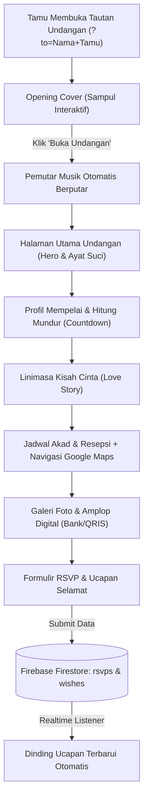
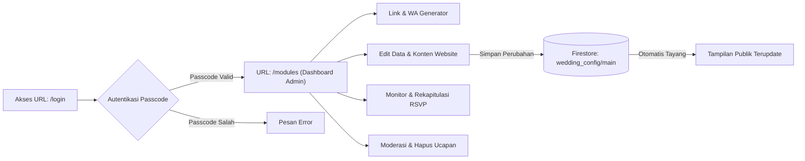

# 💍 Betawi Heritage - Digital Wedding Invitation SPA

> Platform undangan pernikahan digital interaktif dan responsif berbalut estetika budaya Betawi modern dengan sinkronisasi data *real-time*, audio *playlist* multifungsi, generator pesan WhatsApp, serta panel admin mandiri.

[](package.json)
[](https://react.dev)
[](https://www.typescriptlang.org/)
[](https://vitejs.dev)
[](https://tailwindcss.com)
[](https://firebase.google.com)
[](https://motion.dev)
[](https://vercel.com)
[](LICENSE)

---

- [🤖 Aturan AI Agent (AGENTS.md)](AGENTS.md)
- [📚 Dokumentasi Lengkap Proyek (Docs Suite)](#-dokumentasi-lengkap-proyek-docs-suite)
- [📖 Tentang Proyek](#-tentang-proyek)
- [🛠️ Teknologi & Library](#️-teknologi--library)
- [🏛️ Arsitektur & Alur Sistem](#️-arsitektur--alur-sistem)
- [🗄️ Struktur Database](#️-struktur-database)
- [👥 Hak Akses & Role Pengguna](#-hak-akses--role-pengguna)
- [✨ Fitur Utama](#-fitur-utama)
- [📋 Prasyarat Sistem](#-prasyarat-sistem)
- [🚀 Panduan Instalasi](#-panduan-instalasi)
- [💻 Panduan Penggunaan](#-panduan-penggunaan)
- [🔐 Kredensial Default](#-kredensial-default)
- [🔥 Panduan Setup Firebase & Environment Variables](#-panduan-setup-firebase--environment-variables)
- [☁️ Panduan Deploy ke Vercel](#️-panduan-deploy-ke-vercel)
- [🤝 Panduan Kontribusi](#-panduan-kontribusi)
- [📄 Lisensi](#-lisensi)

---

## 📚 Dokumentasi Lengkap Proyek (Docs Suite)

Untuk panduan mendalam sesuai peran dan kebutuhan operasional, silakan telusuri rangkaian dokumentasi di folder [`docs/`](docs/README.md) dan panduan protokol agen di [`AGENTS.md`](AGENTS.md):

| Panduan | Lokasi Berkas | Deskripsi Isi |
| :--- | :--- | :--- |
| 🤖 **Aturan AI Agent** | [`AGENTS.md`](AGENTS.md) | 10 pilar aturan operasional AI Assistant: SemVer, Conventional Commits, Sync Docs, OWASP, & Clean Code. |
| 📚 **Dokumentasi Hub** | [`docs/README.md`](docs/README.md) | Pusat navigasi, matriks panduan, dan jalan pintas cepat skenario umum. |
| 📟 **Daftar Perintah CLI** | [`docs/01-daftar-command.md`](docs/01-daftar-command.md) | Cheatsheet CLI harian, dev server, type checking, build produksi, & housekeeping. |
| 📖 **Buku Panduan Pengguna** | [`docs/02-buku-panduan-pengguna.md`](docs/02-buku-panduan-pengguna.md) | Manual book pengantin: generator link WhatsApp, ubah data, upload foto, & RSVP. |
| 🛠️ **Panduan Pengembang** | [`docs/03-developer-guide.md`](docs/03-developer-guide.md) | Arsitektur SPA React 19, zero-storage canvas, model Firestore, OWASP, & siklus fitur baru. |
| ☁️ **Panduan Deployment** | [`docs/04-panduan-deployment.md`](docs/04-panduan-deployment.md) | Panduan rilis ke Vercel, VPS Linux Nginx, cPanel (.htaccess), dan aaPanel. |

---

## 📖 Tentang Proyek

**Betawi Heritage Wedding Invitation** adalah aplikasi web *Single Page Application* (SPA) bertema pesta adat Betawi modern yang dirancang untuk memberikan pengalaman personal dan imersif kepada setiap tamu undangan. 

Aplikasi ini menyelesaikan sejumlah tantangan utama dalam penyebaran undangan konvensional:
1. **Efisiensi Biaya & Waktu**: Menggantikan undangan cetak fisik dengan undangan digital elegan yang dapat dibagikan secara instan melalui tautan WhatsApp.
2. **Personalisasi Tamu**: Nama tamu dapat disematkan secara dinamis pada halaman sampul depan (*Opening Cover*) melalui parameter URL.
3. **Interaktivitas Dua Arah**: Tamu dapat mengonfirmasi kehadiran (RSVP) serta mengirimkan doa restu secara langsung yang tersinkronisasi secara *real-time*.
4. **Kemudahan Digital Gift**: Menyediakan opsi transfer bank multi-rekening dengan tombol salin otomatis dan kode QRIS instan.
5. **Panel Admin Mandiri**: Mempelai dapat mengubah jadwal acara, profil, foto galeri, lagu, nomor rekening, hingga memantau daftar hadir tanpa perlu menyentuh kode program.

Sistem ini didesain dengan prinsip **Zero Storage Cost**; seluruh media foto dan barcode QRIS dikonversi dan dikompresi di sisi peramban (*client-side canvas*) menjadi string Base64 yang disimpan langsung ke Firestore, sehingga pengguna tidak perlu membayar biaya hosting file/storage cloud tambahan.

---

## 🛠️ Teknologi & Library

| Kategori | Teknologi / Library | Versi | Deskripsi Kegunaan |
| :--- | :--- | :--- | :--- |
| **Core Framework** | [React](https://react.dev) | `^19.0.1` | Pustaka UI deklaratif modern berbasis komponen. |
| **Language** | [TypeScript](https://www.typescriptlang.org) | `~5.8.2` | Menjamin keandalan kode dengan *static typing*. |
| **Build Tool & Bundler** | [Vite](https://vitejs.dev) | `^6.2.3` | *Development server* berkecepatan tinggi dan *bundling* produksi optimal. |
| **Styling & CSS** | [Tailwind CSS](https://tailwindcss.com) | `^4.1.14` | *Utility-first CSS framework* v4 dengan skema tema khusus Betawi. |
| **Animations** | [Motion](https://motion.dev) | `^12.23.24` | Menghadirkan animasi gerak halus, transisi cover, dan *stagger effects*. |
| **Database & Realtime** | [Firebase Firestore](https://firebase.google.com) | `^12.17.1` | Basis data NoSQL dokumen dengan *WebSocket real-time listener*. |
| **Media Player** | [React Player](https://github.com/cookpete/react-player) | `^3.4.0` | Pemutar audio fleksibel (mendukung YouTube, Google Drive, & file MP3). |
| **Icons** | [Lucide React](https://lucide.dev) | `^0.546.0` | Set ikon antarmuka modern, tajam, dan ringan. |
| **SEO & Meta Head** | [react-helmet-async](https://github.com/staylor/react-helmet-async) | `^3.0.0` | Manajemen tag `<head>` dinamis untuk pratinjau sosial media yang akurat. |
| **Utility Classes** | `clsx` & `tailwind-merge` | `^2.1.1` / `^3.6.0` | Penggabungan kelas Tailwind yang dinamis tanpa benturan style. |
| **Analytics** | `@vercel/analytics` | `^2.0.1` | Pelacakan analitik pengunjung ketika di-deploy pada platform Vercel. |

---

## 🏛️ Arsitektur & Alur Sistem

### 1. Alur Pengalaman Tamu Undangan (Guest Flow)


### 2. Alur Pengelolaan Administrator (Admin Flow)


---

## 🗄️ Struktur Database

Sistem memanfaatkan basis data **Google Cloud Firestore** (NoSQL). Struktur data terbagi ke dalam satu dokumen konfigurasi utama dan dua koleksi data interaksi:

### 1. Dokumen Konfigurasi: `wedding_config/main`
Menyimpan seluruh konfigurasi dinamis yang dapat disesuaikan melalui Admin Panel.

| Nama Field | Tipe Data | Deskripsi |
| :--- | :--- | :--- |
| `groom` | `Map / Object` | Informasi mempelai pria (`nickname`, `fullName`, `parents`, `instagram`, `image`). |
| `bride` | `Map / Object` | Informasi mempelai wanita (`nickname`, `fullName`, `parents`, `instagram`, `image`). |
| `dateStr` | `String` | Tanggal pernikahan dalam format teks formal (misal: "Minggu, 20 September 2026"). |
| `dateISO` | `String` | Timestamp format ISO 8601 untuk target hitung mundur *real-time*. |
| `events` | `Map / Object` | Rincian acara `akad` dan `resepsi` (`title`, `day`, `date`, `time`, `venue`, `address`, `mapUrl`). |
| `gallery` | `Array<String>` | Kumpulan URL gambar atau data URI gambar Base64 galeri foto. |
| `banks` | `Array<Object>` | Pengaturan rekening & QRIS (`name`, `account`, `holder`, `isQris`, `qrisImage`). |
| `loveStory` | `Array<Object>` | Perjalanan cinta kedua mempelai (`year`, `title`, `description`). |
| `music` | `Map / Object` | Pengaturan audio: `playlist` (`url[]`) dan `mode` (`repeat-all`, `repeat-one`, `shuffle`, `linear`). |
| `seo` | `Map / Object` | Metadata halaman: `title`, `description`, `keywords`, dan thumbnail `image`. |

### 2. Koleksi RSVP: `rsvps`
Menyimpan konfirmasi kehadiran dari para tamu.

| Nama Field | Tipe Data | Deskripsi |
| :--- | :--- | :--- |
| `name` | `String` | Nama tamu yang mengisi formulir konfirmasi. |
| `attendance` | `String` | Status konfirmasi: `"hadir"` atau `"tidak_hadir"`. |
| `guestCount` | `Number` | Jumlah tamu yang direncanakan hadir (apabila status hadir). |
| `notes` | `String` | Catatan atau doa tambahan dari tamu. |
| `createdAt` | `Timestamp` | Waktu pengiriman data RSVP. |

### 3. Koleksi Ucapan & Doa: `wishes`
Menyimpan daftar ucapan doa restu tamu yang ditampilkan pada *wishes wall*.

| Nama Field | Tipe Data | Deskripsi |
| :--- | :--- | :--- |
| `name` | `String` | Nama pengirim ucapan. |
| `text` | `String` | Isi pesan doa restu. |
| `createdAt` | `Timestamp` | Waktu pengiriman ucapan. |

### 4. Koleksi Anggaran Pernikahan: `wedding_expenses`
Menyimpan rincian target anggaran dan kontrak vendor acara pernikahan.

| Nama Field | Tipe Data | Deskripsi |
| :--- | :--- | :--- |
| `category` | `String` | Kategori pos biaya (Venue, Catering, MUA, Dekorasi, dll.). |
| `name` | `String` | Nama pos atau item pengeluaran. |
| `vendor` | `String` | Nama vendor atau penyedia jasa. |
| `phone` | `String` | Nomor WhatsApp vendor untuk kontak cepat. |
| `estimatedCost` | `Number` | Estimasi anggaran biaya yang direncanakan. |
| `actualCost` | `Number` | Nilai kontrak riil yang disepakati dengan vendor. |
| `paidAmount` | `Number` | Jumlah uang yang telah dibayarkan (DP / termin). |
| `status` | `String` | Status pelunasan (`unpaid`, `partial`, `paid`). |
| `isReady` | `Boolean` | Status kesiapan logistik hari-H. |

### 5. Koleksi Meja & Denah Ballroom: `wedding_tables`
Menyimpan denah meja dan alokasi tamu undangan resepsi pernikahan.

| Nama Field | Tipe Data | Deskripsi |
| :--- | :--- | :--- |
| `tableNumber` | `String` | Nomor/kode meja (misal: `VIP-01`, `TBL-02`). |
| `tableName` | `String` | Nama label meja (misal: "VIP Utama & Tamu Kehormatan"). |
| `zone` | `String` | Zona penempatan meja (`front`, `center`, `back`, `left_wing`, `right_wing`). |
| `capacity` | `Number` | Daya tampung maksimal kursi di meja (2-20 kursi). |
| `shape` | `String` | Bentuk meja (`round`, `rectangle`). |
| `assignedGuests` | `Array<Object>` | Daftar tamu yang duduk (`id`, `guestName`, `pax`, `assignedAt`). |
| `notes` | `String` | Catatan khusus meja (*opsional*). |

---

## 👥 Hak Akses & Role Pengguna

| Role | Metode Akses | Hak Akses & Fitur yang Diizinkan |
| :--- | :--- | :--- |
| **Tamu Undangan** *(Public Guest)* | Membuka URL undangan publik (`https://domain.com/?to=Nama+Tamu`) | - Membuka sampul undangan interaktif (*Opening Cover*).<br>- Memutar dan menjeda musik latar (*Floating Audio Player*).<br>- Menavigasi seksi undangan via *Bottom Navigation* & *ScrollSpy*.<br>- Melihat detail acara dan membuka rute lokasi ke Google Maps.<br>- Mengirim konfirmasi kehadiran pada formulir RSVP.<br>- Mengirim doa restu dan melihat dinding ucapan secara *real-time*.<br>- Menyalin nomor rekening bank & memindai kode QRIS untuk hadiah. |
| **Mempelai / Admin** *(Administrator)* | Membuka URL rahasia `/login` dan memasukkan passcode (setelah login dialihkan ke `/modules`) | - Mengakses **WhatsApp Link Generator** (membuat link custom nama tamu dan template pesan WA instan).<br>- Mengubah data profil kedua mempelai dan unggah foto.<br>- Mengubah jadwal, jam, venue, dan link Google Maps acara.<br>- Menambah, menyusun, dan menghapus foto galeri pernikahan.<br>- Mengelola daftar rekening bank & unggah gambar kode QRIS.<br>- Mengatur playlist musik latar (YouTube/Google Drive) dan mode putar.<br>- Mengonfigurasi metadata SEO & pratinjau thumbnail media sosial.<br>- Memantau statistik kehadiran RSVP (Total Hadir, Tidak Hadir, Total Respon).<br>- Mengelola meja resepsi dan pemindai QR pass tamu hari-H.<br>- Menghapus respon RSVP atau ucapan tamu yang tidak pantas (moderasi). |
| **Operator Panggung / MC** *(Stage Display)* | Membuka rute publik mandiri `/live` atau `/projector` (atau via tombol jalan pintas di `/modules`) | - Menampilkan layar penuh 16:9 sinematik di proyektor/LED ballroom panggung pernikahan.<br>- Menampilkan QR Code interaktif untuk dipindai tamu dari meja.<br>- Memutar selebrasi spotlight & audio chime harmonis secara otomatis saat ada ucapan baru.<br>- Mengatur kecepatan putar otomatis (carousel) dan audio chime via floating control bar. |

---

## ✨ Fitur Utama

### 🎵 Sinkronisasi Mutlak Mode Pemutaran Audio & Engine Playlist (v1.36.1)
- **4 Mode Pemutaran Audio Responsif**: Sinkronisasi penuh antara Panel Admin Modules dan Audio Engine klien:
  - *Repeat All (Ulangi Semua)*: Mengulang seluruh daftar lagu di playlist secara berurutan tanpa henti (termasuk penanganan loop otomatis untuk single track).
  - *Repeat One (Ulangi Satu Lagu)*: Mengulang satu lagu aktif secara terus-menerus tanpa berpindah track.
  - *Shuffle (Acak)*: Memutar lagu-lagu di playlist secara acak tanpa mengulang lagu yang sama berturut-turut.
  - *Linear (Sekali Jalan)*: Memutar urutan playlist satu kali dari awal hingga akhir, lalu berhenti otomatis setelah lagu terakhir selesai.
- **Transisi Mulus YouTube IFrame API**: Menggunakan `loadVideoById` pada instance player aktif tanpa merusak DOM iframe, mencegah pemblokiran autoplay oleh browser seluler (iOS Safari & Android Chrome).
- **Indikator Badge Mode Interaktif**: Floating button musik kini dilengkapi mini-badge ikon mode pemutaran (`Repeat`, `Repeat1`, `Shuffle`, `ListMusic`) serta *tooltip* informatif yang mencerminkan pilihan aktif dari Admin Panel.
- **Normalisasi Data Firestore**: Penanganan fallback otomatis untuk struktur `weddingConfig.music` agar konfigurasi mode dan playlist selalu tersimpan dan termuat secara utuh.

### 🦅 Tema Dayak Kenyah Borneo & ⚡ Cyberpunk 2077 Night City (v1.36.0)
- **Total 20 Tema Siap Pakai**: Menembus 20 variasi tema pernikahan digital yang kaya budaya adat Nusantara dan konsep modern futuristik.
- **Dayak Kenyah Borneo (`id: dayak`)**: Nuansa agung adat Dayak Kenyah Kalimantan dengan perisai sakral Talawang, bulu burung Enggang yang melayang lembut, sulur naga Aso Kenyah, serta petikan harmoni magis alat musik dawai Sape' dan denting gong tradisi via Web Audio API.
- **Cyberpunk 2077 Neo-Jakarta (`id: cyberpunk`)**: Konsep futuristik sci-fi Night City berhias sirkuit neon cyan & magenta, HUD biometrik kuantum cinta (*100% Neural Sync*), efek audio hologram boot glitch, dan denting laser synth masa depan.

### 📲 Asisten Broadcast & Pengingat WhatsApp (Queue Runner) (v1.36.0)
- **Modal Interaktif Antrean Tamu (Queue Runner)**: Mengirimkan link undangan personal dan pengingat kehadiran 1-klik ke nomor WhatsApp para tamu dengan alur antrean otomatis (*Next Tamu*).
- **4 Pilihan Template Siap Kirim**:
  - *Undangan Resmi*: Format formal akad & resepsi lengkap dengan tautan personal.
  - *Pengingat H-3*: Pengingat konfirmasi kehadiran RSVP agar katering dan meja tertata presisi.
  - *Pengingat H-1*: Pengingat hari menjelang pernikahan beserta link peta Google Maps & panduan lokasi.
  - *Template Kustom*: Fleksibel disesuaikan dengan variabel `{nama}`, `{mempelai}`, `{tanggal}`, `{venue}`, `{link}`.
- **Otomatisasi Status Firestore**: Menandai tamu sebagai `Sudah Terkirim` secara otomatis begitu tombol kirim WhatsApp diklik.

### 🎙️ Audio Guestbook / Voice Memo Wishes (v1.36.0)
- **Perekaman Suara Klien Tanpa Biaya Server (*Zero Storage Cost*)**: Tamu dapat merekam pesan suara selamat dan doa restu hingga 20 detik langsung dari browser menggunakan MediaRecorder API.
- **Kompresi Audio Base64 WebM/Opus**: Disimpan langsung ke dalam dokumen ucapan Firestore (~40-60KB) tanpa membutuhkan Firebase Storage berbayar.
- **Waveform Audio Player Interaktif**: Pemutar audio terintegrasi pada Dinding Ucapan tamu dan Layar Panggung Proyektor (*Live Wishes Projector*) lengkap dengan animasi gelombang suara (*soundwave*).

### 🌺 Ornamen & Estetika Budaya Betawi
- **Ilustrasi Khas Betawi**: Menghadirkan siluet Monumen Nasional (Monas), ornamen Rumah Kebaya, serta animasi karakter Ondel-ondel Betawi yang anggun.
- **Palet Warna Tematik**: Kombinasi warna *Sage Green*, *Betawi Red*, *Gold Accent*, dan *Ivory White* yang modern, hangat, dan berkelas.
- **Elemen Flora Mengambang**: Animasi dedaunan dan bunga yang bergerak lembut menggunakan CSS keyframes untuk memperkuat kesan natural.

### ✉️ Sampul Digital Interaktif (Opening Cover)
- Kartu undangan awal dengan amplop digital elegan yang menyapa nama tamu secara personal.
- Tombol *"Buka Undangan"* yang memicu animasi transisi mulus serta memulai pemutaran audio latar secara otomatis.

### ⏱️ Live Countdown Timer
- Penghitung mundur waktu otomatis (*Hari, Jam, Menit, Detik*) yang disinkronkan langsung dengan waktu target akad nikah.

### 📖 Kisah Cinta (Love Story)
- Garis waktu (*timeline*) bertahap yang menceritakan momen pertemuan pertama, perjalanan hubungan, proses lamaran, hingga jenjang pernikahan.

### 📍 Integrasi Peta Lokasi
- Informasi alamat lengkap gedung/masjid dengan tombol tautan langsung yang membuka navigasi Google Maps pada aplikasi seluler tamu.

### 💳 Amplop Digital (Multi-Bank & QRIS)
- Dukungan penambahan banyak rekening bank (BCA, Mandiri, BRI, BNI, e-Wallet).
- Fitur **"Salin Nomor Rekening"** dengan notifikasi tersalin instan.
- Dukungan gambar kode QRIS untuk mempermudah transfer dompet digital secara cepat.

### 📝 RSVP & Dinding Ucapan Real-Time
- Formulir konfirmasi kehadiran yang interaktif.
- Dinding ucapan doa restu yang terhubung dengan listener Firestore, sehingga ucapan baru langsung muncul tanpa perlu memuat ulang halaman (*zero reload*).

### 🎵 Pemutar Musik Latar Fleksibel
- Komponen audio mengambang dengan tombol *mute/unmute*.
- Mendukung pemutaran dari URL **YouTube Playlist** maupun file audio **Google Drive** secara otomatis.
- 4 Mode pemutaran: *Repeat All*, *Repeat One*, *Shuffle*, dan *Linear*.

### 📱 Navigasi Cepat (Floating Bottom Bar)
- Menu navigasi bawah mengambang dengan indikator *ScrollSpy* yang mendeteksi seksi yang sedang aktif secara otomatis.

### 🎫 Digital Pass & E-Ticket PDF Export Suite (v1.37.0)
- **Ultra-Sharp High-Density Rendering (1200x1850 px, 300 DPI Equivalent)**:
  - Generator canvas murni di sisi klien dengan kartu pass digital bertekstur modern, ambient glow tematik, monogram inisial mempelai emas, perforated dashed cutouts, dynamic name auto-scaling, badge meja seating & kuota pax, barcode watermark, serta QR code kontras tinggi.
- **Dual Export Formats (PNG HD & PDF Print-Ready via `jsPDF`)**:
  - Unduhan instan format gambar PNG resolusi tinggi untuk disimpan di galeri smartphone atau dibagikan via WhatsApp.
  - Dokumen PDF A6 Portrait *print-ready* tanpa margin berlebih via `jspdf`, siap dicetak oleh panitia, vendor EO, atau tamu.
- **Dual-Sided Access (Sisi Tamu & Sisi Admin)**:
  - **Sisi Tamu (`GuestQRPassModal`)**: Tersedia tombol ganda *"Simpan Gambar HD (PNG)"* dan *"Unduh Tiket PDF (Siap Cetak)"* langsung pada pop-up tiket digital tamu.
  - **Sisi Admin Panel (`Panel.tsx`)**: Tersedia tombol unduh PNG & PDF pada generator tautan tamu personal serta tombol aksi tabel icon-only di setiap baris daftar tamu undangan.
  - **Sisi Meja Resepsi (`ReceptionCheckin.tsx`)**: Akses unduh tiket pass instan dari daftar hasil pencarian cepat manual maupun dari tabel riwayat check-in untuk melayani tamu yang memerlukan slip fisik di lokasi acara.
- **Thematic Adaptive Styling**:
  - Secara cerdas mengadaptasi token warna primer (`tokens.primary`), latar belakang kartu, dan teks sesuai salah satu dari 20 tema desain aktif (Betawi, Jawa, Sunda, Minang, Bali, Batak, Dayak, Bugis, Modern Minimalist, Vintage Retro, Cyberpunk, Netflix, Spotify, dsb.).

### 📺 Live Wishes Stage Projector Screen (Layar LED Panggung Hari-H) (v1.18.0)
- **Akses Mandiri Standalone**: Dapat dibuka melalui URL publik `/live` atau `/projector` tanpa memerlukan otentikasi login, serta tombol jalan pintas langsung dari Admin Panel (`/modules`).
- **Tata Letak Sinematik Split Stage 16:9**:
  - **Panel Kiri (35%)**: Monogram emas inisial kedua mempelai beranimasi elegan, nama lengkap mempelai, tanggal akad/resepsi & nama gedung ballroom, *Live Counter* jumlah ucapan masuk, serta **QR Code Interaktif** berukuran besar yang dapat langsung dipindai oleh para tamu dari meja mereka untuk membuka formulir ucapan doa.
  - **Panel Aliran Kanan (65%)**: Aliran kartu ucapan mewah berlatar gelap malam (*Midnight Slate & Emerald*) dengan tipografi aksen emas bercahaya.
- **Spotlight Celebration Pop-Up & Efek Konfeti**:
  - Setiap kali ada ucapan baru yang masuk via Firestore listener, layar proyektor otomatis menampilkan pop-up modal selebrasi *Spotlight* dengan animasi partikel emas/konfeti berkilau selama 6,5 detik sebelum meluncur anggun ke posisi teratas daftar ucapan.
- **Harmonic Audio Chime (Web Audio API Synthesizer)**:
  - Nada lonceng akor harmonis C5-E5-G5-C6 dengan peluruhan nada alami berdurasi 2,4 detik tanpa perlu aset file audio eksternal (*zero external network download*).
- **Auto-Cycling Carousel & Kontrol Operator Mengambang**:
  - Jika tidak ada ucapan baru, daftar ucapan bergulir otomatis per halaman (*carousel*) secara halus.
  - Operator panggung dapat mengontrol kecepatan transisi (Cepat 4s, Normal 7s, Lambat 10s, Jeda), tombol *Fullscreen* (F11), dan tombol *Mute/Unmute* nada audio melalui bilah kontrol bawah mengambang yang otomatis bersembunyi setelah 3,5 detik kursor tidak bergerak.

### 📅 Sinkronisasi Kalender 1-Klik (Google Calendar & Apple iCal .ics) (v1.22.0)
- **Modal Dialog Interaktif Multi-Kalender**: Tombol *"Simpan ke Kalender"* pada setiap kartu acara (Akad & Resepsi) membuka pop-up pilihan aplikasi kalender favorit tamu undangan.
- **Sinkronisasi Google Calendar**: Tautan langsung template Google Calendar dengan tanggal mulai & selesai yang terstruktur dalam format UTC ISO.
- **Dukungan Apple Calendar / iCal (`.ics`)**: Unduhan file iCalendar RFC 5545 standar yang langsung dikenali dan diimpor otomatis oleh perangkat Apple (iPhone, iPad, Mac) serta Microsoft Outlook.
- **Alarm Pengingat Otomatis Ganda (Double Reminder)**:
  - Notifikasi **H-1 Acara** (`-P1D`): Pengingat persiapan satu hari menjelang hari pernikahan.
  - Notifikasi **1 Jam Sebelum Acara** (`-PT1H`): Pengingat keberangkatan menuju venue akad / resepsi.
- **Integrasi Google Maps**: Tautan rute peta lokasi venue yang disematkan langsung di dalam deskripsi acara kalender dan tombol aksi navigasi cepat.

### 💰 Wedding Budget & Checklist Vendor Tracker (v1.21.0)
- **Dasbor Finansial Real-Time**: 4 Kartu KPI finansial: Target Anggaran, Kontrak Aktual, Terbayar/DP, dan Sisa Tagihan Pelunasan yang tersinkronisasi langsung via Firestore listener.
- **Kalkulasi Selisih & Efisiensi Otomatis**: Mendeteksi otomatis apakah kontrak berada di bawah anggaran (*hemat*) atau melebihi estimasi rencana (*over-budget*).
- **Progress Bar Realisasi**: Indikator visual persentase pelunasan anggaran dan counter rasio kesiapan logistik hari-H.
- **Manajemen Vendor & 1-Klik Chat WhatsApp**: Integrasi kontak nomor WhatsApp vendor yang otomatis membuka obrolan chat perorangan dengan format internasional `wa.me/62...`.
- **10 Template Pos Anggaran Nusantara (1-Klik)**: Pemuatan instan 10 pos biaya pernikahan adat Nusantara (Sewa Venue, Katering, MUA/Busana, Dekorasi, Foto & Video Sinematik, Sound & MC, Souvenir & Undangan, Cincin Kawin & Mahar, Tenda & Genset, Seserahan & Perlengkapan Adat).
- **Checklist Kesiapan Logistik Hari-H**: Tombol centang 1-klik untuk memantau status persiapan vendor dan barang bawaan.
- **Ekspor Rekapitulasi CSV (UTF-8 BOM)**: Unduh seluruh data finansial dan status vendor ke file spreadsheet untuk pelaporan bendahara dan keluarga.
- **Redesain Estetika Light Theme Selaras Admin Panel (v1.22.1)**: Mengadopsi palet warna *warm light* terpadu (`bg-[#fcfaf7]`), kartu putih dengan aksen *sage green* & *warm gold*, badge kategori pastel lembut, tipografi berkejelasan tinggi, tabel data bersih dengan efek *hover*, serta modal form dan konfirmasi SweetAlert2 bernuansa terang elegan.

### 🪄 Floating Feature Hub (Show/Hide Speed Dial) (v1.29.1)
- **Pengelompokan Fitur Interaktif Terpadu**: Mengeliminasi tombol terapung yang tersebar di layar dengan menyatukan tombol **Photo Booth**, **Wedding Trivia Mini Game**, dan **E-Ticket QR Pass** ke dalam 1 tombol pemicu (*Floating Speed Dial*) di kiri bawah.
- **Layar Bersih & Rapi (*Collapsed by Default*)**: Saat pertama kali dibuka, layar mobile hanya menampilkan 1 tombol pemicu di sisi kiri bawah berhias lencana kilau (*sparkle ping*) halus, dan 1 tombol pemutar musik (*Music Player*) di sisi kanan bawah.
- **Mekanisme Show / Hide Interaktif**:
  - Tombol trigger berganti dari ikon `Sparkles` menjadi ikon `X` untuk menutup menu.
  - Ketiga tombol fitur mekar meluncur ke atas (*vertical stagger animation*) lengkap dengan tombol ikon bulat dan pil label keterangan teks:
    - 📷 **Photo Booth** (*"Photo Booth • BARU • Cetak Photostrip HD"*)
    - 🎮 **Mini Game Trivia** (*"Mini Game Trivia • GAME • Kuis Seru Mempelai"*)
    - 🎟️ **E-Ticket QR Pass** (*"E-Ticket QR Pass • TIKET • Check-in Resepsi"*)
- **Backdrop Catcher & Click Outside**: Latar belakang menggelap halus dengan efek blur ringan (`backdrop-blur-[2px]`) yang otomatis menutup menu saat area luar diketuk.
- **Isolasi Pemutar Musik Latar**: Tombol musik di sisi kanan bawah tetap mandiri dan terpisah dari menu fitur tamu.

### 📸 Digital Photo Booth & Guest Photostrip Generator (v1.29.0)
- **Wedding Virtual Photobooth Tamu**: Pengalaman photobooth digital interaktif langsung di smartphone tamu undangan tanpa perlu aplikasi tambahan.
- **Format Layout Fleksibel Ganda**:
  - **3-Pose Photostrip (Korean Self-Photo Studio)**: 3 slot foto berurutan secara vertikal (resolusi tinggi 600x1800 px) dengan margin studio profesional dan footer nama mempelai.
  - **Single Polaroid Frame**: Format kotak klasik (resolusi 800x1000 px) berbingkai polaroid dengan catatan cinta dan tanggal pernikahan.
- **Metode Pengambilan Foto Ganda**:
  - **Kamera Langsung (Live Selfie Camera)**: Streaming HTML5 video responsif dengan dukungan kamera depan/belakang (*user* vs *environment*).
  - **Timer Hitung Mundur Ritmik 3 Detik**: Overlay hitung mundur interaktif (3.. 2.. 1.. 📸) dengan efek lampu kilat studio putih (*white shutter flash*) dan synthesizer audio mekanik kamera.
  - **Unggah dari Galeri Perangkat**: Alternatif bagi tamu yang ingin memilih foto terbaik yang telah tersimpan di galeri ponsel.
- **Multitemplat Desain Bingkai**:
  - **Theme-Matched Frame**: Otomatis mengadaptasi warna latar belakang, border, dan aksen tipografi dari tema undangan yang sedang aktif (Betawi, Jawa, Sunda, Minang, Bali, Modern, Rustic, Oriental, Netflix, Spotify).
  - **Classic Black Studio**: Nuansa gelap premium (`#121214`) dengan aksen teks emas murni (`#D4AF37`).
  - **Clean White Studio**: Nuansa putih bersih (`#FFFFFF`) minimalis modern dengan aksen charcoal.
  - **Soft Romantic Pastel**: Nuansa blush pink lembut (`#FDF2F4`) dengan tipografi rose burgundy (`#881337`).
- **Filter Foto Artistik Real-Time**:
  - **Natural**: Tampilan warna asli foto berdefinisi tinggi.
  - **B&W Vintage**: Monokrom hitam-putih artistik dengan kontras terangkat.
  - **Sepia Retro**: Nuansa hangat bernostalgia ala film analog tempo dulu.
  - **Warm Glow**: Pancaran keemasan lembut (*warm bloom*) untuk foto romantis.
- **Engine Sintesis Canvas API & 1-Click HD Download**:
  - Seluruh penggabungan foto, filter warna, border ganda, stempel pernikahan, dan nama mempelai dirender seketika di sisi klien (*Canvas API*).
  - Tombol **"Unduh Photostrip HD (PNG)"** mengunduh berkas gambar jernih secara instan ke galeri tamu dengan 100% privasi dan zero storage cost database (Pilar 2.3 & 3).
- **Aksesibilitas Terapung & Seksi Undangan**:
  - Tombol mengambang kamera terpadu (`PhotoBoothFloatingButton`) di kanan bawah atas tombol musik.
  - Kartu promosi seksi undangan (`PhotoBoothSection`) di bawah galeri pernikahan.

### 🎨 Semantic Theme Tokens & Full Theme Synchronization (v1.28.0)
- **Harmonisasi Antarmuka Menyeluruh Lintas 10 Tema**: Mengeliminasi seluruh kelas warna statis (*hardcoded* krem/sage Betawi) pada elemen terapung, bilah navigasi bawah, dan seksi konten bersama sehingga 100% beradaptasi secara dinamis terhadap tema aktif.
- **Arsitektur Semantic Theme Tokens (`ThemeVisualTokens`)**:
  - Pemetaan token lengkap per tema: `isDark`, `bg`, `cardBg`, `cardBorder`, `textPrimary`, `textMuted`, `primary`, `secondary`, `accent`, `inputBg`, `inputBorder`, `btnPrimaryBg`, `navBg`, `navBorder`, `navActive`, `floatingBtnBg`, `floatingBtnBorder`, dan `floatingBtnRing`.
  - Diinjeksi melalui context terpusat `ThemeProvider` dan custom hook `useThemeTokens()`.
- **Adaptasi Elemen Terapung (Floating Action Buttons)**:
  - Tombol Pemutar Musik (`MusicPlayer`), Tiket Masuk E-Pass QR (`GuestQRPassFloatingButton`), dan Gamepad Kuis (`TriviaFloatingButton`) mengadopsi gaya *sleek dark glass* beraksen tematik pada tema gelap (Netflix & Spotify) dan kaca elegan beraksen pada tema terang.
- **Bilah Navigasi Bawah Adaptif (`BottomNavigation`)**:
  - Menampilkan kontainer pil gelap dengan efek blur dan indikator aktif merah Netflix (`#E50914`) atau hijau neon Spotify (`#1DB954`) pada tema gelap, serta pil krem/putih beraksen emas/hijau ningrat pada tema adat Nusantara.
- **Seksi Bersama Adaptif (`shared/sections/`)**:
  - **Countdown Section**: Angka hitung mundur memancarkan warna aksen tema (merah Netflix, hijau neon Spotify, emas kraton Jawa) dengan kartu dan latar belakang yang menyatu sempurna.
  - **Location Section**: Kartu Google Maps, tombol peta, dan tombol denah meja beradaptasi kontras penuh.
  - **RSVP & Wishes Section**: Formulir konfirmasi kehadiran, input teks, tombol kirim, dan kartu ucapan doa bertransformasi sesuai palet tema tanpa merusak netralitas budaya layer `shared/`.
  - **Wedding Gift & Gallery**: Kartu rekening bank, pratinjau QRIS, tombol salin rekening, dan bingkai foto galeri selaras warna tema.
- **Bingkai Mockup Container Desktop Adaptif**:
  - Border mockup smartphone pada tampilan desktop otomatis berganti menjadi gelap elegan (`md:border-[#242424]`) pada tema gelap dan putih bersih pada tema terang, dengan latar desktop radial dots yang selaras.

### 🎮 Wedding Trivia Quiz & Mini Games ("Seberapa Kenal Kamu dengan Mempelai?") (v1.27.0)
- **Permainan Interaktif Smartphone Tamu**: Tamu undangan dapat menguji seberapa dalam mereka mengenal kedua mempelai melalui mini kuis seru berisi pertanyaan seputar pertemuan pertama, momen kencan lucu, hingga rahasia cinta kedua mempelai.
- **Synthesizer Efek Suara Web Audio API**:
  - Nada benar (*Correct Chime* arpeggio C6-G6) dan nada salah (*Wrong Buzz* F3-C3) instan saat memilih jawaban.
  - Terompet kemenangan (*Victory Fanfare* akor C5-E5-G5-C6 crescendo) saat kuis selesai (*zero external MP3 file*).
- **Lencana Predikat Juara & Confetti Burst**:
  - Skor 100%: 🏆 *Sahabat Sejati (Bestie Abadi)*
  - Skor 80%: 🌟 *Sahabat Dekat Pengantin*
  - Skor 60%: 💖 *Kolega Kompak & Suportif*
  - Skor <60%: 😄 *Yuk Ngobrol & Akrabin Lagi di Resepsi!*
- **Tantang Teman via WhatsApp**: Tombol bagikan ke WhatsApp dengan template pesan tantangan seru yang memuat skor, persentase, gelar juara, dan tautan undangan personal.
- **Papan Peringkat Real-Time (Live Leaderboard)**: Papan skor tamu real-time Firestore (`wedding_trivia_scores`) berhias medali emas 🥇, perak 🥈, dan perunggu 🥉.
- **Manajemen Bank Soal & Skor di Admin Panel (`/modules`)**:
  - 4 Kartu KPI: Total Soal Aktif, Tamu Bermain, Rata-Rata Skor, dan Skor Sempurna (100%).
  - Bank soal interaktif: tambah/ubah/hapus pertanyaan, kunci jawaban, dan ulasan fakta seru.
  - Tombol **"Muat 5 Soal Default Trivia"** (1-klik inisialisasi batch Firestore).
  - Ekspor seluruh nilai kuis tamu ke CSV (UTF-8 BOM).
- **Aksesibilitas Ganda & Netral Budaya**: Tersedia via tombol mengambang gamepad (`TriviaFloatingButton`) dan kartu seksi undangan (`TriviaQuizSection`) yang kompatibel di seluruh 10 tema undangan aktif.

### 🎬 Tema Netflix Cinematic Premiere ("The Wedding Premiere") (v1.26.0)
- **Konsep Serial Streaming OTT Populer**: Mengadaptasi identitas visual bioskop streaming OTT global Netflix bertema gelap pekat (`#141414`) dengan aksen merah ikonis Netflix Red (`#E50914`), badge rating match 99%, dan kartu video sinematik.
- **Synthesizer Suara Intro "Ta-Dum!" (Web Audio API)**: Suara intro ikonis "Ta-Dum!" disintesis secara murni di sisi peramban menggunakan Web Audio API (kompresor dinamis, sub-bass segitiga D1/D2 frekuensi 36.7-73.4 Hz, dan kilau harmonik A6 1760 Hz) saat tombol sampul *"TONTON TRAILER & BUKA"* diklik tanpa ketergantungan file MP3 eksternal (*zero external audio file*).
- **Sampul Teaser Film & Tiket VIP Screening Pass**: Sampul pembuka bergaya poster rilis resmi dengan lencana *"TOP 1 IN MOVIES TODAY"*, rating *"99% Match"*, kartu undangan personal tamu *"VIP Screening Pass • Premiere Row"*, dan tombol play beranimasi denyut merah.
- **Hero Billboard & Rangkaian Rilis Episode**:
  - Banner billboard sinematik dengan status `99% Match • 2026 • SU • 4K ULTRA HD • ★5.0` dan tombol aksi cepat (*Daftar Saya, Beri Nilai, Bagikan, Pemeran*).
  - Seksi acara berformat Episode Serial Streaming: **Episode 1: "Akad Nikah: The Sacred Vow"** dan **Episode 2: "Resepsi: The Grand Celebration"** berdurasi menit & navigasi Google Maps.
- **Profil Bintang Utama & Produser (Cast & Crew)**: Penataan vertikal murni terpusat (*vertical stack flex-col*) yang bebas pemotongan (*anti-clipping*) pada kontainer mobile 430px dengan lencana *"LEAD ACTOR"* & *"LEAD ACTRESS"*, nama lengkap mempelai, silsilah keluarga, dan akun Instagram.
- **Garis Waktu Musim Cinta (Series Timeline & Seasons)**: Kilas balik perjalanan cinta mempelai disajikan dalam format musim serial (Season 1 s/d Finale) dengan status kartu interaktif.
- **Dekorasi Animasi Partikel Sinema**: Debu bintang dan partikel cahaya proyektor sinema beranimasi halus menggunakan `motion/react` dengan utilitas `pointer-events-none`.
- **Paket Aset Mandiri Offline**: Dilengkapi `thumbnail.svg`, `pattern.svg`, dan `favicon.svg` di `public/assets/themes/netflix/` (*zero external CDN dependency*).

### 🎵 Tema Spotify Interactive Edition ("Wedding Track & Love Playlist") (v1.25.0)
- **Konsep Viral Pemutar Musik Streaming**: Mengadaptasi antarmuka aplikasi pemutar musik global Spotify bertema gelap modern (`#121212`, `#181818`) dengan aksen neon hijau Spotify (`#1DB954`) dan emas berkilau.
- **Sampul Album Vinyl Berputar (Rotating Vinyl Cover)**: Sampul pembuka interaktif dengan piringan hitam vinyl beranimasi rotasi 360 derajat yang meluncur keluar dari jaket album pengantin, lengkap dengan alur gerigi (*vinyl grooves*) dan tombol hijau menyala *"BUKA & PUTAR UNDANGAN"*.
- **Lencana Verified Newlyweds & Statistik Bulanan**: Header profil artis mempelai dilengkapi lencana centang biru-hijau *"VERIFIED NEWLYWEDS"*, penghitung *"1,250 Monthly Guests"*, tombol suka beranimasi hati, dan bilah kontrol interaktif (*Shuffle, Play, Share, Options*).
- **Album Tracklist Kisah Cinta (Love Story)**: Perjalanan cinta kedua mempelai disajikan dalam tabel interaktif lagu pernikahan lengkap dengan nomor urut (`01`, `02`, dst.), durasi waktu menit:detik, ikon equalizer yang memantul, serta kartu akordeon deskripsi cerita.
- **Profil Artis Mempelai (Featured Artists)**: Penataan vertikal terpusat (*vertical stack flex-col*) yang bebas clipping pada kontainer mobile 430px, menampilkan foto lingkaran artis, nama lengkap, orang tua, dan tautan Instagram.
- **Dekorasi Animasi Partikel Nada Musik**: Hujan partikel not balok (♪, ♫, ♬, ♩) dan garis lengkung equalizer sudut beranimasi halus menggunakan `motion/react` dengan utilitas `pointer-events-none`.
- **Paket Aset Mandiri Offline**: Dilengkapi `thumbnail.svg`, `pattern.svg`, dan `favicon.svg` di `public/assets/themes/spotify/` (*zero external CDN dependency*).

### 🪑 Manajemen Meja & Seating Chart Ballroom (v1.24.0)
- **Denah Lantai Interaktif Ballroom (Floor Plan Layout)**: Visualisasi tata letak panggung pelaminan, meja VIP kehormatan, meja bundar keluarga besar & tamu umum, hingga area prasmanan/katering dengan zona terarah (*Depan, Tengah, Belakang, Samping Kiri, Samping Kanan*).
- **4 Kartu Indikator KPI Kapasitas**: Total Meja Aktif, Kapasitas Ballroom Keseluruhan, Kursi Terisi, dan Sisa Kursi Tersedia secara real-time tersinkronisasi via Firestore listener `wedding_tables`.
- **12 Preset Meja Standar Ballroom (1-Klik)**: Tombol pemuatan instan 12 meja standar ballroom berkapasitas total 108 kursi (VIP Pengantin, Keluarga Pria & Wanita, VIP Pejabat, Kolega, dan Tamu Umum).
- **Drawer Alokasi Tamu & Kursi (Guest Assignment)**: Panel interaktif untuk menempatkan atau mencabut tamu undangan (`guests`) ke meja tertentu dengan deteksi kapasitas otomatis (*Sisa Kursi*).
- **Sinkronisasi Otomatis E-Ticket QR Pass & Meja Resepsi**:
  - Badge alokasi meja (`📍 Meja: VIP-01 (VIP Utama)`) otomatis tercetak pada QR pass digital tamu serta pada berkas gambar tiket PNG yang diunduh ke galeri ponsel.
  - Pemindai QR Meja Resepsi (`ReceptionCheckin`) otomatis menampilkan nama dan zona meja tamu saat check-in tanpa input manual.
- **Pencarian Mandiri Tamu (Self-Service Lookup)**: Tamu undangan dapat mencari nomor dan denah mejanya secara mandiri lewat tombol *"Cari Meja & Denah Anda"* di seksi Lokasi.
- **Ekspor Rekapitulasi Seating Chart CSV**: Unduh denah dan alokasi meja ke format spreadsheet CSV UTF-8 BOM untuk koordinasi tim *event organizer* (EO) dan *usher*.

### ⛰️ Tema Batak Toba Royal Gorga (Unjuk Adat Bolon Batak Toba) (v1.23.0)
- **Kemegahan Seni Ukir Gorga & Ruma Bolon**: Menghadirkan siluet atap pelana melengkung Ruma Bolon dengan puncak tanduk kerbau (*simatutu*), ukiran suci Gorga Simeol-meol, Gorga Boraspati, dan fasad *dorpi*.
- **Palet Kosmis Tolu Bolit**: Perpaduan sakral tiga warna adat Batak Toba (Merah Marun Bara Gorga `#7A1B1E`, Hitam Arang Batu Ruma `#1C1917`, dan Putih Gading Sihapor `#FAF6F0`) berpadu dengan aksen kemewahan Emas Antik Tenun Ulos (`#D4AF37`).
- **Salam Tradisional & Falsafah Luhur**: Salam sakral *"Horas Jala Gabe!"*, falsafah luhur adat Batak (*"Aek godang tu aek laut, Dos ni roha sibaen na saut"*), serta doa berkat pernikahan dan permohonan restu para kerabat, Hula-hula, Dongan Tubu, Boru, dan sahabat.
- **Profil Mempelai Pangoli & Oroan**: Penandaan adat mempelai pria (*Pangoli*) dan mempelai wanita (*Oroan*) berbingkai ukiran ganda Ulos & Gorga.
- **Partikel Dekorasi Melayang Tematik**: Serpihan benang emas tenun Ulos Sadum dan daun sirih adat (*demban*) yang melayang lembut dengan rotasi alami menggunakan `motion/react` berutilitas `pointer-events-none`.
- **Penutup Adat Horas**: Salam penutup *"Mauliate Godang"* dan doa berkat *"Horas, Horas, Horas ma di hita sasudena!"*.
- **Paket Aset Mandiri Offline**: Dilengkapi `thumbnail.svg`, `pattern.svg`, dan `favicon.svg` di `public/assets/themes/batak/` (*zero external CDN dependency*).

### 🛕 Tema Balinese Royal Temple (Adat Pawiwahan Ageng Bali) (v1.20.0)
- **Kemegahan Pura & Arsitektur Tradisional Bali**: Menghadirkan siluet Gapura Candi Bentar bertingkat, payung Tedung Agung upacara kembar, penjor emas melengkung, serta motif relief ukiran Patra Punggel.
- **Salam Tradisional & Sloka Rgveda**: Pembuka salam sakral *"Om Swastyastu"* berlatar piringan surya mandala emas, serta kutipan suci pernikahan Hindu Dharma (*Rgveda Mandala X Sukta 85 Sloka 42*) yang sarat berkah keharmonisan keluarga (*Grhastha Ashrama*).
- **Profil Mempelai Purusha & Pradana**: Penandaan mempelai pria (*Purusha*) dan mempelai wanita (*Pradana*) berbingkai relief batu padas Bali mewah.
- **Bunga Kamboja / Jepun Melayang**: Partikel kelopak Bunga Jepun kuning-putih harum yang melayang lembut dengan rotasi alami menggunakan `motion/react` berutilitas `pointer-events-none`.
- **Penutup Penuh Doa**: Doa penutup *"Matur Suksma"* dan mantram kedamaian abadi *"Om Shanti Shanti Shanti Om"*.
- **Paket Aset Mandiri Offline**: Dilengkapi `thumbnail.svg`, `pattern.svg`, dan `favicon.svg` di `public/assets/themes/bali/` (*zero external CDN dependency*).

### ⚡ Optimasi Performa & Vite Code-Splitting Modular (v1.19.0)
- **Pengurangan Ukuran Entry Point Hingga 97%**: Entry bundle publik berkurang drastis dari **1.82 MB** menjadi hanya **56 KB** (19 KB gzip) melalui partisi cerdas *Rollup manualChunks* dan *asynchronous lazy-loading*.
- **Route Lazy-Loading (React.lazy & Suspense)**:
  - Modul Dasbor Admin Panel (`/modules` & `/login`) berukuran 171 KB diisolasi secara asinkron sehingga tidak pernah diunduh oleh tamu undangan umum.
  - Modul Layar Proyektor Panggung (`/live` & `/projector`) berukuran 15 KB diisolasi secara mandiri.
- **On-Demand Dynamic Imports Pustaka Berat**:
  - Pustaka spreadsheet **XLSX / SheetJS** (~430 KB) hanya diunduh oleh peramban jika pengantin memilih untuk mengunggah berkas `.xlsx/.xls` pada modal import tamu WhatsApp.
  - Pustaka **jsQR & QRCode Canvas** (~156 KB) hanya diunduh saat kamera pemindai resepsi aktif atau saat tamu membuka kartu E-Pass.
- **Isolasi Dynamic Multi-Theme**:
  - Komponen visual dan ornamen dekorasi dari 6 tema Nusantara dipecah menjadi chunk mandiri (0.8 KB - 14 KB). Tamu yang membuka tema tertentu hanya mengunduh aset tema tersebut, mengeliminasi pengunduhan berlebih dari 5 tema lainnya.
- **Zero Chunk Size Warnings**: Lulus kompilasi produksi Vite tanpa peringatan bundle berukuran melebihi batas 500 KB / 600 KB.

### 🔐 Panel Modules Responsif & Standar UI/UX Interaktif (v1.9.0)
- **Arsitektur Dashboard Modern**: Tata letak modular di `/modules` dengan Sidebar desktop (expand/collapse), Mobile Slide-over Drawer (hamburger toggle), Topbar dengan breadcrumb navigasi dinamis, dan tombol pintas Live Preview.
- **Menu 1: Dashboard Overview (Ringkasan Real-Time)**:
  - Banner hitung mundur hari-H pernikahan interaktif.
  - 4 Kartu KPI Ringkasan: Total Hadir, Total Tidak Hadir, Total Respon, dan Total Doa.
  - Rasio Kehadiran visual (*Progress Bar* persentase Hadir vs Tidak Hadir).
  - Tombol jalan pintas cepat (*Quick Action Shortcuts*: WhatsApp Generator, Meja Resepsi QR Pass, Layar Panggung Live Proyektor, Ubah Konten, Ekspor RSVP).
  - Feed aktivitas interaksi terbaru (*Live Recent Feeds* untuk RSVP & Doa Tamu).
- **Menu 2: Meja Resepsi & Scanner QR Pass Hari-H (v1.17.0)**:
  - **Pemindai Kamera Langsung**: Pemindai kamera performa tinggi murni sisi klien via `jsQR` dengan animasi laser pemindai, tombol sakelar on/off hemat baterai, dan toggle kamera depan/belakang.
  - **Synthesizer Umpan Balik Audio (Web Audio API)**: Nada *beep* harmonis 880Hz saat pindai sukses dan nada peringatan ganda jika tamu terdeteksi sudah pernah check-in sebelumnya (*zero external audio file*).
  - **Deteksi Anti-Duplikasi Pintar**: Mencegah kecurangan klaim suvenir ganda atau check-in dobel dengan menampilkan riwayat jam check-in sebelumnya.
  - **Pencarian In-Memory & Check-In Manual**: Opsi pencarian cepat nama/nomor tamu jika tamu kehabisan baterai ponsel atau tidak membawa QR pass, lengkap dengan tombol check-in manual 1-klik.
  - **Modal Konfirmasi Check-In Tamu**: Penyesuaian jumlah pax aktual yang hadir (+/- stepper), tombol sakelar penyerahan paket suvenir, dan pencatatan zona/nomor meja tamu.
  - **4 Kartu KPI Real-Time Meja Resepsi**: Tamu Check-In, Total Pax Fisik Hadir, Suvenir Diberikan, dan Estimasi Tamu Belum Hadir.
  - **Riwayat Kedatangan & Ekspor CSV**: Tabel log kedatangan berpenomoran otomatis 1-indexed (`#`), pencarian log instan, dan tombol unduh rekap CSV berformat UTF-8 BOM untuk pelaporan pasca acara.
  - **Tiket Digital Tamu (E-Ticket & QR Pass)**: Tombol tiket mengambang dan tombol seksi RSVP pada sisi tamu yang menampilkan kartu tiket mewah berornamen emas, kode tiket unik, jumlah pax, QR Code resolusi tinggi, serta fitur unduh tiket langsung sebagai gambar PNG ke galeri ponsel via Canvas API.
- **Menu 3: Generator & Manajemen Tamu WhatsApp (Import & Bulk Management)**:
  - **Dukungan Multi-Format Impor**: Mengimpor ratusan tamu sekaligus dari file **Excel (.xlsx, .xls)**, file **CSV (.csv, .txt)**, maupun **Salin-Tempel Teks Multiline**.
  - **Sinkronisasi Cloud Firestore (`guests`)**: Data daftar tamu dan status pengiriman pesan tersimpan permanen di cloud sehingga pengantin dapat mengimpor via laptop dan mengirim pesan via smartphone.
  - **Direct WhatsApp Blasting**: Tombol kirim pesan 1-klik yang otomatis membuka chat WhatsApp langsung ke nomor tujuan (dengan sanitasi format internasional `628...`) dan mengubah status menjadi *Sudah Dikirim*.
  - **Statistik & Filter Pengiriman**: 3 Kartu indikator (Total Tamu, Belum Dikirim, Sudah Dikirim), filter status dinamis, dan live in-memory search.
  - **Unduh Template CSV**: Format berkas spreadsheet standar yang siap diisi dan diunggah ulang.
  - **Mode Cepat (Generator Tunggal)**: Opsi pembuatan link personal dadakan untuk satu nama tamu secara instan.
- **Menu 4: Manajemen Konten Terpartisi (Sub-Tabs)**: 
  - Tab pill rapi untuk Tema Desain, Mempelai, Acara & Lokasi, Galeri Foto, Kisah Cinta, Musik & Hadiah/QRIS, serta SEO & Metadata dengan bilah simpan melayang (*sticky action bar*).
  - **Arsitektur Multi-Tema & Separasi Budaya Terisolasi (v1.16.0)**:
    - *Isolasi Ornamen Budaya 100%*: Seksi visual budaya (Hero, Intro, Profil Mempelai, Penutup) diisolasi penuh per tema tanpa pencemaran silang.
    - *Tema Siap Pakai (Ready)*:
      - **Betawi Heritage** (`betawi`): Siluet Monas, Ondel-ondel interaktif, Rumah Kebaya.
      - **Javanese Royal Kraton** (`jawa`): Gunungan Wayang Mas sakral, Pendopo Joglo Keraton.
      - **Sundanese Parahyangan** (`sunda`): Mahkota Siger Sunda, ronce melati, gerbang bambu Priangan.
      - **Modern Botanical Minimalist** (`minimalist`): Daun eucalyptus, lengkung geometris modern.
      - **Islamic Arabian Garden** (`islamic`): Kubah masjid Nabawi, ornamen bintang 8-point rub el hizb.
      - **Minangkabau Royal Songket** (`minang`): Rumah Gadang gonjong megah, tabir pelaminan emas Baralek Gadang.
      - **Balinese Royal Temple** (`bali`): Gapura Candi Bentar, Penjor Emas, Payung Tedung Agung, ukiran Patra Punggel, sloka Rgveda 10.85.42, kelopak Bunga Jepun (Kamboja) melayang.
    - *Favicon & Meta Theme-Color Dinamis*: Favicon peramban otomatis berganti dan `meta theme-color` menyesuaikan palet tema aktif.
    - *Centralized Theme Registry*: Standarisasi kontrak antarmuka tema untuk skalabilitas tanpa batas.
    - *Pemilih Tema Visual*: Pratinjau palet warna tema, badge kategori gaya, dan tombol aktivasi 1-klik yang tersinkronisasi ke Firestore.
    - *Demo URL Preview*: Uji coba instan dengan parameter query `?theme=bali`, `?theme=minang`, `?theme=islamic`, `?theme=minimalist`, `?theme=sunda`, `?theme=jawa`, atau `?theme=betawi`.
  - **Modal Lightbox Slider Berkas Terunggah**: Kartu pratinjau foto dapat diklik untuk membuka foto penuh dalam modal Lightbox interaktif berlatar gelap & blur, tombol geser Kiri/Kanan, counter foto, dan shortcut keyboard (`ArrowLeft`, `ArrowRight`, `Escape`).
  - **Reorder Timeline Kisah Cinta (Tombol Naik & Turun)**: Pengaturan kronologi momen kisah cinta fleksibel dengan tombol **Naik (`<ArrowUp />`)** dan **Turun (`<ArrowDown />`)** di samping penomoran dinamis (`#1`, `#2`, dst.), mengeliminasi keharusan menghapus dan mengetik ulang jika terjadi kesalahan urutan.
  - **Pemilih Tanggal & Waktu Interaktif (Date & Time Picker)**:
    - Target Countdown menggunakan `<input type="datetime-local">` yang otomatis menghasilkan format ISO 8601 dengan offset zona waktu (`+07:00`) tanpa ketik manual.
    - Jadwal Akad & Resepsi menggunakan `<input type="date">` cerdas yang otomatis mengekstrak nama Hari Indonesia (misal: *Minggu*) dan penanggalan formal (misal: *20 September 2026*).
    - Pemilih jam terstruktur: Jam Mulai, Jam Selesai, centang *Sampai Selesai*, dan selector Zona Waktu (*WIB, WITA, WIT*) yang otomatis merangkai teks standar (misal: *08:00 - 10:00 WIB* atau *08:00 WIB - Selesai*), dengan toggle input kustom teks untuk acara khusus (*"Ba'da Isya"*).
    - Tombol Sinkronisasi Kilat: 1-klik untuk menyelaraskan tanggal countdown ke seluruh sesi acara dan menyamakan jadwal/tempat Resepsi dengan Akad.
- **Menu 5: Wedding Budget & Checklist Vendor Tracker (v1.21.0)**:
  - **Dasbor Finansial Terpusat**: 4 Kartu KPI real-time (Target Anggaran, Kontrak Aktual, Telah Dibayar/DP, dan Sisa Tagihan Pelunasan).
  - **Status & Realisasi Pembayaran**: Progress bar persentase pembayaran terbayar, badge status *Lunas*, *DP Terbayar*, dan *Belum Bayar*.
  - **Manajemen Vendor & Kontak Cepat WhatsApp**: Kategori pos (Venue, Katering, MUA, Dekorasi, Foto, Hiburan, Souvenir, Cincin, Logistik), nama vendor, tanggal jatuh tempo, dan tombol 1-klik chat WhatsApp via `wa.me/62...`.
  - **Checklist Kesiapan Logistik Hari-H**: Tombol centang 1-klik untuk menandai kesiapan vendor dan logistik.
  - **10 Template Pos Anggaran Nusantara (1-Klik)**: Tombol pemuatan otomatis 10 pos biaya umum pernikahan adat Nusantara.
  - **Export Rekap Anggaran (CSV UTF-8 BOM)**: Unduh seluruh rincian anggaran, kontrak, dan sisa pembayaran ke berkas Excel.
- **Menu 6: Buku Tamu RSVP & Export CSV**: Daftar konfirmasi kehadiran dengan pencarian latar *real-time*, penomoran urut otomatis 1-indexed (`#`), dan tombol **Export ke Excel (CSV)** berformat UTF-8 BOM.
- **Menu 7: Moderasi Ucapan & Doa**: Pengawasan doa restu tamu dengan pencarian instan, dialog hapus SweetAlert2, serta tombol akses cepat **"Buka Layar Proyektor Panggung"** (`/live`).
- **Penerapan Penuh 8 Pilar UI/UX Interaktif (`interactive-ux-standards`)**:
  1. *Toast Alerts*: Umpan balik status sukses dan error mengambang yang ramah pengguna (auto-dismiss 3,5 detik).
  2. *SweetAlert2 Confirmation Modals*: Dialog konfirmasi hapus data dengan badge bahaya dan tombol *Icon + Text*.
  3. *Live Background Search*: Pencarian real-time pada data RSVP & Wishes secara instan tanpa mengotori URL browser.
  4. *Full-Screen Viewport Backdrop*: Penutup latar modal `fixed inset-0 w-screen h-screen z-[9999]` dengan pencegah scroll latar (`overflow: hidden`).
  5. *Input Icon Groups & Placeholders*: Seluruh form input dilengkapi grup ikon semantik dan teks panduan format.
  6. *Drag & Drop File Upload*: Dropzone interaktif dengan kompresi Canvas otomatis dan pratinjau kartu berkas terunggah (*itemized preview card*).
  7. *Dual Button Convention*: Tombol UI umum berformat *Icon + Text*, sedangkan tombol aksi tabel berformat *Icon-Only*.
  8. *Tabel Responsif Bernomor Otomatis (`#`)*: Kolom nomor urut dinamis 1-indexed yang tetap konsisten saat difilter.

---

## 📋 Prasyarat Sistem

Sebelum memulai instalasi, pastikan lingkungan komputer atau server Anda memenuhi spesifikasi berikut:

- **Node.js**: Versi `18.0.0` atau lebih tinggi (Direkomendasikan: `v20.x` atau `v22.x LTS`).
- **Package Manager**: Standar proyek menggunakan **`npm`** (`npm run lint`, `npm run build`).
- **Akun Firebase**: Akun aktif di [Firebase Console](https://console.firebase.google.com) (Tersedia paket gratis *Spark Plan*).
- **Peramban Web Modern**: Google Chrome, Mozilla Firefox, Apple Safari, atau Microsoft Edge versi terbaru.

---

## 🚀 Panduan Instalasi

Ikuti langkah-langkah berikut untuk memasang dan menjalankan proyek di komputer lokal:

### 1. Kloning Repositori
```bash
git clone https://github.com/hndko/app_weddingbetawi_react.git
cd app_weddingbetawi_react
```

### 2. Pasang Dependensi Proyek
```bash
npm install
```

### 3. Konfigurasi Environment Variables
Salin template konfigurasi lingkungan:

```bash
cp .env.example .env
```

Buka file `.env` yang baru dibuat dan masukkan kredensial Firebase Anda:
```env
VITE_FIREBASE_API_KEY="AIzaSyB-xxxxxxxxxxxxxxxxxxxxxxxx"
VITE_FIREBASE_AUTH_DOMAIN="proyek-anda.firebaseapp.com"
VITE_FIREBASE_PROJECT_ID="proyek-anda"
VITE_FIREBASE_STORAGE_BUCKET="proyek-anda.appspot.com"
VITE_FIREBASE_MESSAGING_SENDER_ID="123456789012"
VITE_FIREBASE_APP_ID="1:123456789012:web:abcdef123456"
VITE_FIREBASE_DATABASE_ID=""
```

---

## 💻 Panduan Penggunaan

### Menjalankan Server Pengembangan (Localhost)
```bash
npm run dev
```
Buka browser dan akses alamat default: `http://localhost:3000`.

### Menguji Personalisasi Nama Tamu
Tambahkan parameter `?to=` pada akhir URL undangan:
- Mengundang perorangan: `http://localhost:3000/?to=Budi+Santoso`
- Mengundang keluarga: `http://localhost:3000/?to=Bapak+Ahmad+%26+Keluarga`

### Mengakses Halaman Admin
Akses path `/login` pada peramban Anda (setelah memasukkan passcode valid, sistem otomatis mengalihkan URL ke `/modules`):
- `http://localhost:3000/login`

### Melakukan Kompilasi Produksi (Production Build)
```bash
npm run build
```
File hasil kompilasi yang siap di-hosting akan tersimpan di dalam folder `dist/`.

---

## 🔐 Kredensial Default

Untuk keperluan pengujian awal dan mode pengembangan, sistem menyediakan passcode bawaan untuk masuk ke Admin Panel:

| Tipe Akun | Lokasi Akses | Passcode Default |
| :--- | :--- | :--- |
| **Administrator** | URL `/login` (dialihkan ke `/modules`) | **`password`** <br> *(Alternatif valid: `admin`, `admin123`)* |

> [!TIP]
> Anda dapat mengganti atau memperketat verifikasi passcode ini pada berkas [AdminPanel.tsx](file:///d:/laragon/www/app_weddingbetawi_react/src/components/admin/AdminPanel.tsx#L64) sesuai preferensi keamanan Anda.

---

## 🔥 Panduan Setup Firebase & Environment Variables

Apabila Anda ingin menggunakan database Firebase baru milik Anda sendiri:

### 1. Buat Proyek di Firebase Console
1. Kunjungi **[Firebase Console](https://console.firebase.google.com/)** dan masuk menggunakan akun Google.
2. Klik **"Add project"** dan masukkan nama proyek Anda (misal: `wedding-betawi`).
3. Anda dapat menonaktifkan *Google Analytics* jika tidak dibutuhkan, lalu klik **Create Project**.

### 2. Aktifkan Cloud Firestore Database
1. Pada menu navigasi sebelah kiri, buka **Build > Firestore Database**.
2. Klik tombol **Create database**.
3. Pilih lokasi server terdekat (contoh: `asia-southeast2` untuk wilayah Jakarta).
4. Pilih opsi **Start in production mode**, kemudian klik **Create**.
5. Setelah database aktif, masuk ke tab **Rules** dan perbarui aturannya menjadi:
   ```javascript
   rules_version = '2';
   service cloud.firestore {
     match /databases/{database}/documents {
       match /wedding_config/{document=**} {
         allow read, write: if true;
       }
       match /wishes/{document=**} {
         allow read, write: if true;
       }
       match /rsvps/{document=**} {
         allow read, write: if true;
       }
     }
   }
   ```
6. Klik tombol **Publish**.

### 3. Daftarkan Web App & Ambil Kredensial
1. Di halaman utama proyek Firebase, klik ikon roda gigi (⚙️ **Project Settings**) > tab **General**.
2. Gulir ke bawah ke bagian **"Your apps"**, lalu klik tombol berikon **`</>` (Web)**.
3. Masukkan nama aplikasi (misal: `wedding-web`), lalu klik **Register app**.
4. Salin data kredensial konfigurasi `firebaseConfig` dan masukkan ke berkas `.env` aplikasi Anda.

---

## ☁️ Panduan Deploy ke Vercel

Aplikasi ini telah disesuaikan untuk proses publikasi (*deployment*) secara instan ke [Vercel](https://vercel.com):

1. **Unggah Proyek ke GitHub**:
   ```bash
   git add .
   git commit -m "feat: persiapkan rilis undangan"
   git push origin main
   ```

2. **Impor Proyek ke Dashboard Vercel**:
   - Buka [Vercel Dashboard](https://vercel.com/dashboard) dan klik **Add New > Project**.
   - Pilih repositori `app_weddingbetawi_react` dari akun GitHub Anda.

3. **Pengaturan Build**:
   Vercel akan secara otomatis mendeteksi preset **Vite**:
   - **Framework Preset**: `Vite`
   - **Build Command**: `npm run build`
   - **Output Directory**: `dist`
   - **Install Command**: `npm install`

4. **Konfigurasi Environment Variables di Vercel**:
   Masuk ke bagian **Environment Variables** pada halaman setup Vercel dan tambahkan variabel-variabel berikut:
   - `VITE_FIREBASE_API_KEY`
   - `VITE_FIREBASE_AUTH_DOMAIN`
   - `VITE_FIREBASE_PROJECT_ID`
   - `VITE_FIREBASE_STORAGE_BUCKET`
   - `VITE_FIREBASE_MESSAGING_SENDER_ID`
   - `VITE_FIREBASE_APP_ID`

5. **Deploy**:
   - Klik tombol **Deploy**. Tunggu proses *build* selesai (sekitar 1 menit).
   - Undangan digital pernikahan Anda telah aktif secara global dan siap dibagikan!

---

## 🤝 Panduan Kontribusi

Kontribusi dan saran perbaikan sangat kami hargai! Untuk berkontribusi pada repositori ini:

1. Lakukan **Fork** pada repositori ini.
2. Buat *branch* fitur baru Anda:
   ```bash
   git checkout -b fitur/NamaFiturKeren
   ```
3. Lakukan *commit* terhadap perubahan Anda dengan pesan yang deskriptif:
   ```bash
   git commit -m "feat: menambahkan animasi kelopak bunga jatuh"
   ```
4. *Push* branch Anda ke GitHub:
   ```bash
   git push origin fitur/NamaFiturKeren
   ```
5. Buka repositori asli dan ajukan **Pull Request**.

---

## 📄 Lisensi

Proyek ini didistribusikan di bawah lisensi terbuka **MIT License**. Anda bebas menggunakan, memodifikasi, dan mendistribusikan kode ini untuk keperluan pribadi maupun komersial. Lihat berkas [LICENSE](LICENSE) untuk informasi lisensi selengkapnya.

---

<div align="center">
  <sub>Dibuat dengan penuh cinta dan dedikasi untuk melestarikan budaya Betawi dalam era digital. 🌺</sub>
</div>
