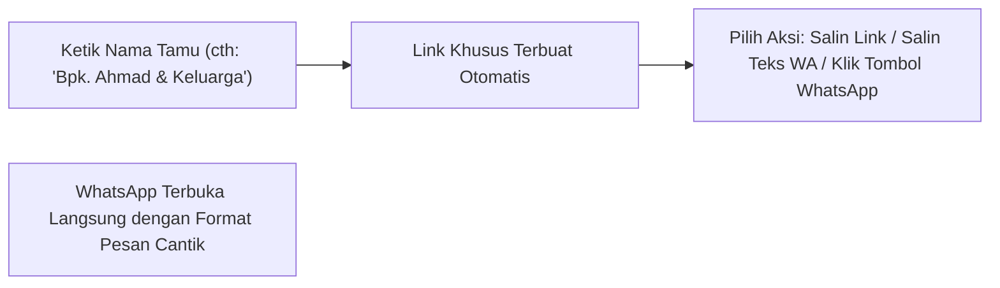

# 📖 Buku Panduan Pengguna & Manual Book Lengkap (User Manual)

Buku panduan ini disusun khusus untuk calon pengantin, keluarga penyelenggara acara, maupun operator non-teknis dalam mengelola dan menyebarkan undangan pernikahan digital **Betawi Heritage Wedding Invitation**.

---

## 💍 1. Profil Singkat Sistem & Manfaat Operasional

Aplikasi ini adalah platform undangan pernikahan digital berbasis web responsif yang menggabungkan estetika adat Betawi dengan teknologi modern.

### Nilai Utama untuk Pengguna:
* **Hemat Biaya & Waktu**: Tidak perlu mencetak dan mendistribusikan ratusan undangan fisik secara manual.
* **Personalisasi Instan**: Nama tamu dapat disematkan langsung pada amplop digital dan template pesan WhatsApp.
* **Rekapitulasi Kehadiran Otomatis**: Mengetahui secara pasti jumlah tamu yang akan hadir untuk efisiensi katering.
* **Amplop Digital Cashless**: Memudahkan tamu memberikan hadiah pernikahan via transfer bank dan QRIS.
* **Bebas Ribet Tanpa Coding**: Pengantin dapat mengubah nama, tanggal, lokasi, lagu, hingga foto galeri secara mandiri lewat layar Admin Panel yang sederhana.

---

## 👥 2. Matriks Hak Akses Peran Pengguna

| Fitur / Tindakan | Tamu Undangan *(Public Guest)* | Calon Pengantin / Admin |
| :--- | :---: | :---: |
| Membuka sampul digital dengan nama pribadi | ✅ Ya | ✅ Ya |
| Mendengarkan & mengontrol pemutar musik latar | ✅ Ya | ✅ Ya |
| Melihat jadwal, peta lokasi, & kisah cinta | ✅ Ya | ✅ Ya |
| Mengisi konfirmasi kehadiran (RSVP) | ✅ Ya | ✅ Ya |
| Menulis doa restu di dinding ucapan | ✅ Ya | ✅ Ya |
| Mengakses generator pesan WhatsApp nama tamu | ❌ Tidak | ✅ Ya |
| Mengubah teks mempelai, tanggal acara, & lokasi | ❌ Tidak | ✅ Ya |
| Mengunggah foto mempelai & galeri foto | ❌ Tidak | ✅ Ya |
| Mengatur daftar rekening & upload kode QRIS | ❌ Tidak | ✅ Ya |
| Mengatur playlist musik & mode putar lagu | ❌ Tidak | ✅ Ya |
| Memantau total tamu hadir & menghapus RSVP/ucapan spam | ❌ Tidak | ✅ Ya |

---

## 🔐 3. Cara Mengakses Admin Panel

Demi menjaga keanggunan tampilan undangan saat dibuka oleh tamu, **tombol akses admin sengaja tidak diletakkan di layar utama undangan**.

### Langkah Masuk ke Admin Panel:
1. Buka peramban di ponsel atau komputer Anda.
2. Ketik alamat website undangan Anda dengan menambahkan path `/login`:
   - Contoh di komputer lokal: `http://localhost:3000/login`
   - Contoh di website publik: `https://undangan-saya.vercel.app/login`
3. Layar login pengaman (*Passcode Gate*) akan muncul.
4. Masukkan salah satu passcode bawaan:
   - **`password`** (atau `admin`, `admin123`)
5. Klik tombol **"Masuk"**. Sistem akan memverifikasi passcode, menyimpan sesi aktif di peramban (`sessionStorage`), dan otomatis mengalihkan URL Anda ke `/modules` (Dasbor Admin Panel).
6. **Logout & Navigasi:**
   - Untuk keluar dan mengakhiri sesi admin, klik tombol **"Logout"** di kanan atas header (sesi dibersihkan dan URL kembali ke `/login`).
   - Untuk kembali melihat tampilan undangan utama tanpa logout, klik tombol silang (**✕**) di pojok kanan atas (kembali ke beranda `/`).

---

## 📱 4. Tata Letak Dasbor Admin Modern (Dashboard Layout)

Dasbor Admin telah didesain dengan konsep modern dan sepenuhnya responsif di semua perangkat:
- **Sidebar Desktop**: Navigasi vertikal di sisi kiri dengan 5 menu utama serta tombol ciutkan/lebarkan (*collapse toggle*).
- **Mobile Slide-Over Drawer**: Menu navigasi laci yang dapat dibuka lewat tombol hamburger di ponsel.
- **Header Topbar**: Menampilkan breadcrumb lokasi menu aktif, tombol pintas **"Lihat Undangan"** (*live preview*), status role Admin, dan tombol **"Logout"**.

---

## 📊 5. Modul Ringkasan Dasbor / Overview (Menu 1)

Modul ini adalah beranda dasbor yang memberikan gambaran umum seketika tentang kesiapan acara dan respon tamu:
1. **Banner Countdown Hari-H**: Menampilkan sisa waktu menuju hari pernikahan dalam hitungan hari, jam, menit, dan detik.
2. **4 Kartu Indikator KPI**:
   - **Total Tamu Hadir**: Akumulasi seluruh tamu dan rombongan keluarga yang menyatakan hadir.
   - **Tidak Hadir**: Jumlah tamu yang mengonfirmasi tidak bisa hadir.
   - **Total Respon**: Total formulir konfirmasi yang telah masuk.
   - **Doa Restu**: Total ucapan doa yang dikirimkan oleh para tamu.
3. **Rasio Kehadiran Visual**: Batang persentase dinamis yang membandingkan perbandingan tamu hadir vs tidak hadir.
4. **Tombol Jalan Pintas Cepat**: Akses instan untuk membuat link WA tamu, mengubah konten, atau mengekspor buku tamu.
5. **Feed Aktivitas Terbaru**: Memperlihatkan 5 konfirmasi kehadiran dan ucapan terbaru yang masuk secara langsung.

---

## 🔗 6. Modul Generator Link Tamu & Pesan WhatsApp (Menu 2)

Modul ini digunakan saat Anda siap menyebarkan undangan ke keluarga dan sahabat.

### Langkah-Langkah:
1. Masuk ke Dasbor Admin, pilih menu **"Link Tamu & WA"** (Menu 2).
2. Pada kolom **Nama Tamu Undangan**, ketikkan nama tamu yang ingin Anda undang.
   - *Contoh format santai*: `Budi Santoso`
   - *Contoh format formal*: `Bapak Dr. H. Faisal, M.Si & Keluarga`
3. Sistem secara otomatis membuat:
   - **Link Khusus**: Berisi parameter `?to=...` yang memastikan nama tamu tersebut muncul di sampul depan undangan.
   - **Template Pesan WhatsApp**: Pesan sopan berformat islami dan rapi yang langsung memuat nama tamu serta tautan undangan.
4. **Pilih Metode Pembagian:**
   - **Klik "Kirim via WhatsApp"**: Peramban akan otomatis membuka aplikasi WhatsApp dengan teks pesan yang sudah terisi. Anda tinggal memilih kontak tujuan dan klik kirim.
   - **Salin Teks WA**: Klik tombol *"Salin Teks WA"* jika ingin mengedit atau menempelkan pesan ke aplikasi chat lain.
   - **Salin URL**: Hanya menyalin tautan website singkatnya saja.

---

## ✏️ 7. Modul Manajemen Konten Website (Menu 3)

Melalui modul ini, Anda dapat memperbarui seluruh isi undangan pernikahan Anda kapan saja secara *real-time*. Konten diatur dalam sub-tab rapi:

### A. Sub-Tab Mempelai (Groom & Bride)
* Masukkan **Nama Panggilan**, **Nama Lengkap**, **Nama Orang Tua**, dan akun **Instagram**.
* **Unggah Foto Mempelai**: Kotak Drag & Drop dengan pratinjau kartu foto. Kompresi otomatis menjaga performa web tetap cepat.

### B. Sub-Tab Acara & Lokasi (Akad & Resepsi)
* Atur **Judul Acara**, **Hari**, **Tanggal**, dan **Waktu Pelaksanaan** (misal: `09:00 - 11:00 WIB`).
* Atur **Tanggal Format Teks** dan **Format ISO untuk Hitung Mundur**.
* Masukkan **Nama Gedung / Masjid**, **Alamat Lengkap**, dan **Tautan Google Maps**.

### C. Sub-Tab Galeri Foto
* Tambahkan foto-foto pra-nikah (*prewedding*) melalui dropzone drag & drop atau URL langsung.
* Dilengkapi daftar kartu pratinjau foto dan tombol hapus individual.

### D. Sub-Tab Kisah Cinta (Love Story)
* Tambah, edit, atau hapus momen perjalanan asmara kedua mempelai dengan mengisi **Tahun**, **Judul Momen**, dan **Cerita Singkat**.

### E. Sub-Tab Musik & Hadiah (Playlist & Digital Gift)
* Masukkan URL playlist lagu dari **YouTube** atau tautan audio **Google Drive**.
* Pilih **Mode Pemutaran**: *Repeat All*, *Repeat One*, *Shuffle*, atau *Linear*.
* Kelola rekening bank (BCA, Mandiri, BRI, dll.) atau centang opsi **QRIS** untuk mengunggah gambar barcode pembayaran.

### F. Sub-Tab SEO & Metadata
* **Judul Halaman**, **Deskripsi Singkat**, dan **Foto Thumbnail Preview** saat dibagikan ke WhatsApp dan media sosial.

> [!IMPORTANT]
> Selalu tekan tombol **"Simpan Perubahan"** pada bilah aksi mengambang (*sticky save bar*) di bagian bawah setelah mengubah data.

---

## 📋 8. Modul Buku Tamu RSVP & Export CSV (Menu 4)

Menu ini menyediakan rekapitulasi interaktif konfirmasi kehadiran:
1. **Pencarian Real-Time**: Kolom pencarian cepat di latar belakang tanpa mengubah URL peramban, dilengkapi tombol reset instan.
2. **Penomoran Urut Otomatis (`#`)**: Nomor urut 1-indexed yang tetap konsisten dan berurutan saat data disaring.
3. **Export ke Excel (CSV)**: Tombol **"Export ke CSV"** untuk mengunduh seluruh data konfirmasi kehadiran ke berkas spreadsheet berformat UTF-8 BOM yang rapi.
4. **Hapus Data Spam**: Tombol aksi berikon tong sampah dengan konfirmasi SweetAlert2 berlatar layar penuh.

---

## 💬 9. Modul Moderasi Ucapan Doa (Menu 5)

Dinding ucapan doa restu tamu diperbarui secara otomatis secara *real-time*:
1. **Pencarian Cepat Ucapan**: Mempermudah pencarian nama tamu atau isi doa tertentu.
2. **Penomoran Urut Otomatis (`#`)**: Tabel ucapan tersusun rapi dengan nomor urut dinamis.
3. **Moderasi Pesan**: Hapus pesan spam atau tidak sopan secara aman dengan dialog konfirmasi SweetAlert2.

---

## ❓ 8. Tanya Jawab Umum (FAQ)

### T: Apakah musik otomatis berputar saat tamu pertama kali membuka website?
**J:** Kebijakan peramban modern (Chrome, Safari, iOS) melarang suara berputar otomatis (*autoplay*) sebelum ada interaksi fisik dari pengguna. Oleh sebab itu, aplikasi menyediakan gerbang **Opening Cover** dengan tombol *"Buka Undangan"*. Saat tamu mengetuk tombol tersebut, musik akan langsung berputar secara mulus.

### T: Apakah foto yang saya upload akan menghabiskan kuota bayar Google Firebase?
**J:** Tidak. Aplikasi ini dirancang dengan teknologi kompresi kanvas di peramban, di mana foto dikompresi menjadi teks Base64 yang sangat efisien dan disimpan langsung ke Firestore. Anda tidak memerlukan penyimpanan *Firebase Storage* berbayar.

### T: Bagaimana jika saya lupa passcode untuk masuk ke Admin Panel?
**J:** Passcode default adalah `password`. Jika Anda ingin mengubah passcode ini, Anda dapat memintanya kepada developer untuk memperbarui variabel pada berkas `AdminPanel.tsx`.

### T: Apakah nama tamu dengan karakter khusus (seperti gelar, tanda koma, atau "&") akan terbaca normal?
**J:** Ya. Generator link WhatsApp pada Tab 1 sudah dilengkapi fitur *URL Encoding* otomatis, sehingga karakter khusus seperti `&`, spasi, titik, dan koma akan tetap tampil sempurna di layar tamu.
