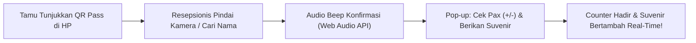
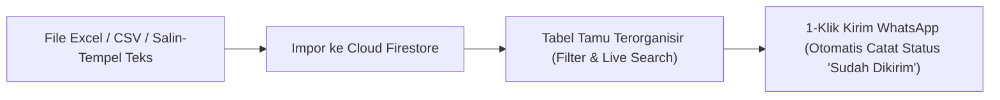
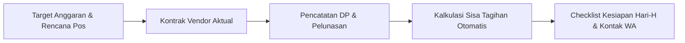
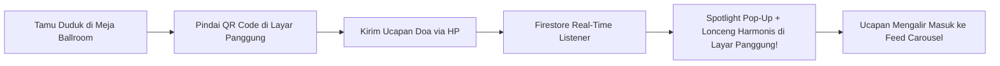
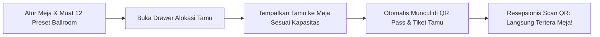

# 📖 Buku Panduan Pengguna & Manual Book Lengkap (User Manual)

Buku panduan ini disusun khusus untuk calon pengantin, keluarga penyelenggara acara, maupun operator non-teknis dalam mengelola dan menyebarkan undangan pernikahan digital **Betawi Heritage Wedding Invitation**.

---

## 💍 1. Profil Singkat Sistem & Manfaat Operasional

Aplikasi ini adalah platform undangan pernikahan digital berbasis web responsif yang menggabungkan estetika adat Betawi dengan teknologi modern.

### Nilai Utama untuk Pengguna:
* **Hemat Biaya & Waktu**: Tidak perlu mencetak dan mendistribusikan ratusan undangan fisik secara manual.
* **Personalisasi Instan**: Nama tamu dapat disematkan langsung pada amplop digital dan template pesan WhatsApp.
* **Rekapitulasi Kehadiran Otomatis**: Mengetahui secara pasti jumlah tamu yang akan hadir untuk efisiensi katering.
* **Amplop Digital Cashless**: Memudahkan tamu memberikan hadiah pernikahan via transfer bank dan QRIS.
* **Bebas Ribet Tanpa Coding**: Pengantin dapat mengubah nama, tanggal, lokasi, lagu, hingga foto galeri secara mandiri lewat layar Admin Panel yang sederhana.

---

## 👥 2. Matriks Hak Akses Peran Pengguna

| Fitur / Tindakan | Tamu Undangan *(Public Guest)* | Calon Pengantin / Admin |
| :--- | :---: | :---: |
| Membuka sampul digital dengan nama pribadi | ✅ Ya | ✅ Ya |
| Mendengarkan & mengontrol pemutar musik latar | ✅ Ya | ✅ Ya |
| Melihat jadwal, peta lokasi, & kisah cinta | ✅ Ya | ✅ Ya |
| Menyimpan jadwal acara ke Google Calendar & Apple/iCal | ✅ Ya | ✅ Ya |
| Mengisi konfirmasi kehadiran (RSVP) | ✅ Ya | ✅ Ya |
| Menulis doa restu di dinding ucapan | ✅ Ya | ✅ Ya |
| Mengakses generator pesan WhatsApp nama tamu | ❌ Tidak | ✅ Ya |
| Mengubah teks mempelai, tanggal acara, & lokasi | ❌ Tidak | ✅ Ya |
| Mengunggah foto mempelai & galeri foto | ❌ Tidak | ✅ Ya |
| Mengatur daftar rekening & upload kode QRIS | ❌ Tidak | ✅ Ya |
| Mengatur playlist musik & mode putar lagu | ❌ Tidak | ✅ Ya |
| Memantau total tamu hadir & menghapus RSVP/ucapan spam | ❌ Tidak | ✅ Ya |
| Membuka Layar Proyektor LED Panggung Hari-H (`/live`) | ✅ Ya (Tanpa Login) | ✅ Ya |

---

## 🔐 3. Cara Mengakses Admin Panel

Demi menjaga keanggunan tampilan undangan saat dibuka oleh tamu, **tombol akses admin sengaja tidak diletakkan di layar utama undangan**.

### Langkah Masuk ke Admin Panel:
1. Buka peramban di ponsel atau komputer Anda.
2. Ketik alamat website undangan Anda dengan menambahkan path `/login`:
   - Contoh di komputer lokal: `http://localhost:3000/login`
   - Contoh di website publik: `https://undangan-saya.vercel.app/login`
3. Layar login pengaman (*Passcode Gate*) akan muncul.
4. Masukkan salah satu passcode bawaan:
   - **`password`** (atau `admin`, `admin123`)
5. Klik tombol **"Masuk"**. Sistem akan memverifikasi passcode, menyimpan sesi aktif di peramban (`sessionStorage`), dan otomatis mengalihkan URL Anda ke `/modules` (Dasbor Admin Panel).
6. **Logout & Navigasi:**
   - Untuk keluar dan mengakhiri sesi admin, klik tombol **"Logout"** di kanan atas header (sesi dibersihkan dan URL kembali ke `/login`).
   - Untuk kembali melihat tampilan undangan utama tanpa logout, klik tombol silang (**✕**) di pojok kanan atas (kembali ke beranda `/`).

---

## 📱 4. Tata Letak Dasbor Admin Modern (Dashboard Layout)

Dasbor Admin telah didesain dengan konsep modern dan sepenuhnya responsif di semua perangkat:
- **Sidebar Desktop**: Navigasi vertikal di sisi kiri dengan 5 menu utama serta tombol ciutkan/lebarkan (*collapse toggle*).
- **Mobile Slide-Over Drawer**: Menu navigasi laci yang dapat dibuka lewat tombol hamburger di ponsel.
- **Header Topbar**: Menampilkan breadcrumb lokasi menu aktif, tombol pintas **"Lihat Undangan"** (*live preview*), status role Admin, dan tombol **"Logout"**.

---

## 📊 5. Modul Ringkasan Dasbor / Overview (Menu 1)

Modul ini adalah beranda dasbor yang memberikan gambaran umum seketika tentang kesiapan acara dan respon tamu:
1. **Banner Countdown Hari-H**: Menampilkan sisa waktu menuju hari pernikahan dalam hitungan hari, jam, menit, dan detik.
2. **4 Kartu Indikator KPI**:
   - **Total Tamu Hadir**: Akumulasi seluruh tamu dan rombongan keluarga yang menyatakan hadir.
   - **Tidak Hadir**: Jumlah tamu yang mengonfirmasi tidak bisa hadir.
   - **Total Respon**: Total formulir konfirmasi yang telah masuk.
   - **Doa Restu**: Total ucapan doa yang dikirimkan oleh para tamu.
3. **Rasio Kehadiran Visual**: Batang persentase dinamis yang membandingkan perbandingan tamu hadir vs tidak hadir.
4. **Tombol Jalan Pintas Cepat**: Akses instan untuk membuat link WA tamu, mengubah konten, atau mengekspor buku tamu.
5. **Feed Aktivitas Terbaru**: Memperlihatkan 5 konfirmasi kehadiran dan ucapan terbaru yang masuk secara langsung.

---

## 🎟️ 6. Modul Meja Resepsi & Scanner QR Pass Hari-H (Menu 2)

Modul ini adalah **alat operasional inti pada hari pelaksanaan resepsi (*killer feature*)** untuk meja penerimaan tamu:



### A. Fitur Meja Resepsi:
1. **Pemindai Kamera Instan**:
   - Arahkan kamera ponsel/laptop resepsionis ke layar ponsel tamu.
   - Deteksi QR code super cepat murni sisi klien via `jsQR`.
   - Tombol pengalih **Kamera Depan / Belakang** dan tombol **Nyalakan / Matikan Kamera** untuk menghemat baterai perangkat resepsionis.
2. **Umpan Balik Audio (Web Audio API Synthesizer)**:
   - Suara *beep* harmonis frekuensi 880Hz saat scan berhasil (*zero file audio eksternal*).
   - Nada peringatan ganda jika tamu terdeteksi **sudah pernah check-in sebelumnya** (*mencegah kecurangan klaim suvenir ganda*).
3. **Pencarian In-Memory & Check-In Manual**:
   - Jika baterai ponsel tamu habis atau tidak membawa QR pass, ketik nama atau nomor WhatsApp tamu di kotak pencarian manual.
   - Tombol 1-klik **"Check-in"** langsung membuka modal konfirmasi.
4. **Modal Konfirmasi Check-In Tamu**:
   - Stepper jumlah pax fisik yang hadir (`-` / `+`).
   - Sakelar status penyerahan paket suvenir (*Centang: Suvenir Diserahkan*).
   - Pencatatan zona/nomor meja tamu (*opsional, misal: "Meja VIP 1"*).
5. **4 Kartu KPI Real-Time**:
   - **Tamu Check-In**: Total undangan yang tiba di lokasi fisik.
   - **Total Pax Hadir**: Total fisik orang yang berada di dalam ballroom.
   - **Suvenir Diberikan**: Total paket suvenir yang telah diserahkan.
   - **Belum Hadir**: Estimasi tamu yang belum memindai tiket.
6. **Riwayat Kedatangan & Unduh Rekap CSV**:
   - Tabel berpenomoran urut otomatis `#` (1-indexed), jam kedatangan presisi, dan metode masuk (*Scan QR* / *Manual*).
   - Tombol **"Unduh CSV Rekap"** berformat UTF-8 BOM untuk laporan pertanggungjawaban keluarga pasca resepsi.

### B. Tiket Digital & QR Pass Sisi Tamu:
- Tamu yang membuka undangan (baik via link WhatsApp `?to=Nama` maupun setelah mengisi formulir RSVP) memiliki tombol mengambang emas dan tombol di seksi RSVP: **"🎟️ Buka E-Ticket & QR Guest Pass"**.
- Menampilkan kartu tiket elegan berornamen emas, nama tamu, kode tiket unik (misal: `WDG-CF46B1`), jumlah pax, dan QR Code resolusi tinggi.
- Tombol **"Simpan Tiket ke HP (PNG)"**: Mengonversi tiket menjadi berkas gambar beresolusi tinggi langsung ke galeri foto tamu via Canvas API tanpa internet.

---

## 🔗 7. Modul Generator & Manajemen Tamu WhatsApp (Menu 3)

Modul ini adalah pusat pengelolaan penyebaran undangan kepada keluarga, kerabat, dan sahabat secara personal. Dilengkapi dukungan impor massal dari file spreadsheet dan sinkronisasi cloud Firestore.



### A. Impor Massal dari File Excel / CSV
1. Masuk ke Dasbor Admin, pilih menu **"Generator Link WA"** (Menu 2).
2. Klik tombol **"Template CSV"** jika ingin mengunduh contoh susunan kolom yang benar.
3. Siapkan file Excel (`.xlsx`, `.xls`) atau CSV (`.csv`) dengan dua kolom:
   - **Nama Tamu** (Wajib): misal *Bapak Dr. H. Faisal, M.Si & Keluarga*.
   - **Nomor WhatsApp** (Opsional): format lokal `0812...` atau internasional `62812...`.
4. Klik tombol **"Impor Tamu"**.
5. Tarik atau pilih file spreadsheet Anda. Sistem akan memindai baris data dan menampilkan kotak pratinjau daftar tamu.
6. Klik **"Simpan & Impor Tamu"**. Ratusan data tamu akan tersimpan otomatis ke cloud Firestore secara instan.

### B. Impor Cepat via Salin-Tempel Teks (Multiline)
1. Pada modal impor, pilih tab **"Salin-Tempel Teks (Multiline)"**.
2. Ketik atau tempelkan daftar nama tamu (satu nama per baris atau dengan format `Nama, Nomor WA`):
   ```text
   Bapak Dr. H. Faisal, 081234567890
   Ibu Hj. Siti Rahmawati, 085712345678
   Budi Santoso & Rekan
   ```
3. Klik **"Periksa & Tampilkan Pratinjau"**, lalu klik **"Simpan & Impor Tamu"**.

### C. Mengirim Undangan via WhatsApp & Pemantauan Status
1. **Kirim WhatsApp 1-Klik**: Klik ikon pesawat kertas/bagikan (`Share2`) pada baris tamu:
   - Jika nomor WhatsApp terisi, peramban akan langsung membuka obrolan chat ke nomor tamu tersebut beserta template pesan islami yang dipersonalisasi.
   - Jika nomor WhatsApp kosong, peramban membuka pemilih kontak WhatsApp.
   - Status pengiriman secara otomatis berubah dari **"Belum Dikirim"** menjadi **"Sudah Dikirim"**.
2. **Filter & Pencarian Cepat**:
   - Gunakan filter pill *Semua*, *Belum Terkirim*, atau *Sudah Terkirim* untuk memilah tamu yang belum sempat dihubungi.
   - Gunakan kotak pencarian live untuk mencari nama tamu secara seketika.
3. **Aksi Cepat Lainnya**:
   - Salin link personal atau salin teks pesan WhatsApp perorangan.
   - Klik ikon centang untuk mengubah status terkirim secara manual kapan saja.
   - Klik tombol **"Generator Cepat"** di pojok kanan atas untuk membuat link personal dadakan bagi 1 tamu tanpa perlu mengimpor.

---

## ✏️ 8. Modul Manajemen Konten Website (Menu 4)

Melalui modul ini, Anda dapat memperbarui seluruh isi undangan pernikahan Anda kapan saja secara *real-time*. Konten diatur dalam sub-tab rapi:

### A. Sub-Tab Mempelai (Groom & Bride)
* Masukkan **Nama Panggilan**, **Nama Lengkap**, **Nama Orang Tua**, dan akun **Instagram**.
* **Unggah Foto Mempelai**: Kotak Drag & Drop dengan pratinjau kartu foto. Kompresi otomatis menjaga performa web tetap cepat.

### B. Sub-Tab Acara & Lokasi (Akad & Resepsi)
* **Target Hitung Mundur Interaktif**: Gunakan pemilih tanggal & waktu (`datetime-local`) untuk menentukan waktu target countdown tanpa perlu mengetik string ISO secara manual.
* **Tombol Sinkronisasi Cepat**: Klik *"Salin ke Tanggal Tampil & Akad"* untuk menyelaraskan seluruh penanggalan secara instan dengan 1-klik.
* **Pemilih Tanggal Kalender Cerdas**: Cukup pilih tanggal pada kalender (`type="date"`), sistem akan otomatis mengisi nama Hari Indonesia (contoh: *Minggu*) dan format penanggalan formal (contoh: *20 September 2026*). Opsi sunting teks manual tetap tersedia jika ingin penyesuaian khusus.
* **Pemilih Jam Terstruktur**: Tentukan **Jam Mulai**, **Jam Selesai**, centang opsi **"Sampai Selesai"**, dan pilih **Zona Waktu** (*WIB, WITA, WIT*). Sistem otomatis menyusun format string yang rapi. Tersedia pula mode teks bebas untuk format non-jam seperti *"Ba'da Isya"*.
* **Samakan Resepsi dengan Akad**: Tombol 1-klik untuk menyalin tanggal, nama gedung, alamat, dan link Google Maps dari sesi Akad ke sesi Resepsi.
* Masukkan **Nama Gedung / Masjid**, **Alamat Lengkap**, dan **Tautan Google Maps**.
* **Integrasi Kalender Tamu Otomatis**: Setiap perubahan jadwal Akad & Resepsi langsung memperbarui data tombol *"Simpan ke Kalender"* di kartu acara publik, memungkinkan tamu mengimpor jadwal ke **Google Calendar** atau **Apple Calendar / iCal (.ics)** dengan alarm pengingat H-1 dan 1 Jam sebelum acara.

### C. Sub-Tab Galeri Foto
* Tambahkan foto-foto pra-nikah (*prewedding*) melalui dropzone drag & drop atau URL langsung.
* Dilengkapi daftar kartu pratinjau foto dan tombol hapus individual.
* **Pratinjau Layar Penuh (Lightbox Slider)**: Klik kartu foto mana saja pada daftar berkas terunggah untuk membuka foto penuh berlatar gelap & blur. Anda dapat menggeser foto ke kiri/kanan menggunakan tombol navigasi atau tombol panah keyboard (`←` / `→`), serta menutupnya dengan tombol `Esc` atau ikon silang.

### D. Sub-Tab Kisah Cinta (Love Story)
* Tambah, edit, atau hapus momen perjalanan asmara kedua mempelai dengan mengisi **Tahun**, **Judul Momen**, dan **Cerita Singkat**.
* **Pengaturan Kronologi Fleksibel (Tombol Naik & Turun)**: Gunakan tombol **Naik** (`↑`) dan **Turun** (`↓`) di pojok kanan atas setiap kartu momen untuk memindahkan urutan cerita tanpa harus menghapus atau mengetik ulang. Penomoran urut (`#1`, `#2`, dst.) otomatis menyesuaikan.

### E. Sub-Tab Musik & Hadiah (Playlist & Digital Gift)
* Masukkan URL playlist lagu dari **YouTube** atau tautan audio **Google Drive**.
* Pilih **Mode Pemutaran**: *Repeat All*, *Repeat One*, *Shuffle*, atau *Linear*.
* Kelola rekening bank (BCA, Mandiri, BRI, dll.) atau centang opsi **QRIS** untuk mengunggah gambar barcode pembayaran.

### F. Sub-Tab SEO & Metadata
* **Judul Halaman**, **Deskripsi Singkat**, dan **Foto Thumbnail Preview** saat dibagikan ke WhatsApp dan media sosial.

### G. Sub-Tab Tema Desain (Multi-Theme Engine)
* **Katalog Tema Desain**: Pilih nuansa visual undangan dari berbagai konsep adat dan modern Nusantara:
  - **Betawi Heritage** (*Adat Tradisional*): Motif Gigi Balang, siluet Ondel-ondel, rumah Kebaya, palet Sage Green & Warm Gold.
  - **Javanese Royal Kraton** (*Adat Tradisional*): Ornamen Gunungan Wayang Kulit autentik, pembuka Serat Ulem Pawiwahan Ageng, bingkai ukiran emas, palet Forest Green & Burnished Gold.
  - **Sundanese Parahyangan** (*Adat Tradisional*): Ornamen Mahkota Siger Sunda kembang tanjung emas, ronce melati untun suci, gerbang lengkung bambu Priangan, palet Parahyangan Forest Green & Soft Champagne Gold.
  - **Modern Botanical Minimalist** (*Modern & Intimate*): Cabang daun eucalyptus & olive sprig halus, garis lengkung geometris modern, palet Slate Charcoal, Soft Sage & Off-White.
  - **Islamic Arabian Garden** (*Nuansa Islami & Sakral*): Ornamen lengkungan kubah Moorish / Arabesque Arch, bintang 8-sudut Rub el Hizb, bulan sabit Hilal bercahaya, doa QS. Ar-Rum: 21, palet Midnight Oasis, Arabian Teal & Royal Arabesque Gold.
  - **Minangkabau Royal Songket** (*Adat Tradisional*): Ornamen atap Rumah Gadang Gonjong megah, mahkota Suntiang emas bertingkat, ukiran Pucuak Rebung, pepatah Adat Basandi Syarak, palet Royal Crimson Maroon & Antique Songket Gold.
  - **Balinese Royal Temple** (*Adat Tradisional*): Ornamen Gapura Candi Bentar pura, payung Tedung Agung, penjor emas, ukiran Patra Punggel, kelopak Bunga Jepun (Kamboja) melayang, sloka Rgveda 10.85.42, salam Om Swastyastu & Matur Suksma, palet Sandstone Gold & Deep Brick Stone.
* **Filter Kategori Tema**: Saring katalog berdasarkan tab *Semua*, *Adat Tradisional*, *Modern Minimalist*, atau *Nuansa Islami*.
* **Titik Palet Warna Interaktif**: Setiap kartu tema memperlihatkan 3 warna khas tema tersebut.
* **1-Klik Ganti Tema**: Klik tombol **"Gunakan Tema Ini"** untuk beralih tema seketika ke seluruh tamu secara instan tanpa perlu memprogram ulang.
* **Tautan Pratinjau Langsung**: Klik tautan *"Coba Pratinjau Langsung (Demo)"* untuk melihat tampilan tema via parameter URL khusus (contoh: `?theme=jawa`) tanpa mengubah tema utama pengantin.

> [!IMPORTANT]
> Selalu tekan tombol **"Simpan Perubahan"** pada bilah aksi mengambang (*sticky save bar*) di bagian bawah setelah mengubah data.

---

## 💰 9. Modul Wedding Budget & Checklist Vendor Tracker (Menu 5)

Modul ini adalah pusat pengelolaan anggaran finansial pernikahan dan pemantauan koordinasi vendor bagi kedua calon mempelai beserta keluarga. Dilengkapi sinkronisasi cloud real-time Firestore pada koleksi `wedding_expenses`.



### A. 4 Kartu Indikator KPI Finansial Real-Time:
1. **Target Anggaran**: Total akumulasi batas biaya yang direncanakan oleh kedua keluarga pengantin.
2. **Kontrak Aktual**: Total kesepakatan nilai kontrak riil dengan vendor, dilengkapi notifikasi penghematan atau selisih lebih.
3. **Telah Dibayar (DP / Lunas)**: Total rupiah yang telah ditransfer beserta persentase pemenuhan anggaran.
4. **Sisa Tagihan Pelunasan**: Total kewajiban finansial yang masih harus dilunasi menjelang hari-H pernikahan.

### B. Fitur & Kemudahan Operasional:
1. **10 Template Pos Anggaran Nusantara (1-Klik)**:
   - Jika data masih kosong, klik tombol **"Muat Template Standar"** untuk memuat 10 pos pengeluaran umum pernikahan adat Nusantara secara otomatis (Venue, Katering, MUA/Busana, Dekorasi, Foto/Video, Sound/MC, Souvenir/Undangan, Cincin/Mahar, Tenda/Genset, dan Perlengkapan Adat).
2. **Kontak Cepat WhatsApp Vendor**:
   - Nomor WhatsApp vendor yang tersimpan dapat langsung diklik untuk membuka chat WhatsApp (`wa.me/62...`) tanpa perlu menyimpan kontak secara manual di buku telepon HP.
3. **Checklist Kesiapan Logistik Hari-H**:
   - Tombol kotak centang pada setiap baris untuk menandai pos atau barang yang sudah siap 100% menjelang acara.
4. **Filter Cerdas & Pencarian In-Memory**:
   - Saring pos pengeluaran berdasarkan kategori (Venue, Katering, Rias, Dekor, dll.) atau status pembayaran (*Belum Bayar, DP Terbayar, Lunas*), serta pencarian nama vendor/catatan secara instan.
5. **Ekspor Rekapitulasi Anggaran ke CSV (UTF-8 BOM)**:
   - Tombol **"Export CSV"** untuk mengunduh seluruh data anggaran ke dalam berkas spreadsheet yang rapi dan terstruktur untuk pelaporan bendahara keluarga.

---

## 📋 10. Modul Buku Tamu RSVP & Export CSV (Menu 6)

Menu ini menyediakan rekapitulasi interaktif konfirmasi kehadiran:
1. **Pencarian Real-Time**: Kolom pencarian cepat di latar belakang tanpa mengubah URL peramban, dilengkapi tombol reset instan.
2. **Penomoran Urut Otomatis (`#`)**: Nomor urut 1-indexed yang tetap konsisten dan berurutan saat data disaring.
3. **Export ke Excel (CSV)**: Tombol **"Export ke CSV"** untuk mengunduh seluruh data konfirmasi kehadiran ke berkas spreadsheet berformat UTF-8 BOM yang rapi.
4. **Hapus Data Spam**: Tombol aksi berikon tong sampah dengan konfirmasi SweetAlert2 berlatar layar penuh.

---

## 💬 11. Modul Moderasi Ucapan Doa (Menu 7)

Dinding ucapan doa restu tamu diperbarui secara otomatis secara *real-time*:
1. **Pencarian Cepat Ucapan**: Mempermudah pencarian nama tamu atau isi doa tertentu.
2. **Penomoran Urut Otomatis (`#`)**: Tabel ucapan tersusun rapi dengan nomor urut dinamis.
3. **Moderasi Pesan**: Hapus pesan spam atau tidak sopan secara aman dengan dialog konfirmasi SweetAlert2.

---

## 📺 12. Layar Proyektor LED Panggung Hari-H / Live Wishes Screen (`/live`)

Fitur ini dirancang khusus untuk memproyeksikan doa restu para tamu secara langsung (*real-time*) di layar videotron LED panggung ballroom pernikahan atau layar proyektor besar di venue acara.



### A. Cara Membuka Layar Proyektor Panggung:
1. Hubungkan laptop operator panggung / MC ke videotron LED atau proyektor panggung via HDMI.
2. Buka peramban (Google Chrome / Edge) dan akses salah satu alamat berikut:
   - Akses langsung mandiri: `https://undangan-anda.vercel.app/live` atau `/projector` (bebas tanpa perlu login passcode).
   - Melalui Admin Panel: Buka menu **Moderasi Ucapan** atau **Overview**, lalu klik tombol emas **"Buka Layar Proyektor Panggung"**.
3. Tekan tombol **F11** atau klik ikon layar penuh (**Fullscreen**) pada bilah kontrol di bawah untuk pengalaman tampilan sinematik 16:9 tanpa gangguan antarmuka browser.

### B. Komponen Tampilan Layar Panggung (Split Stage Cinema 16:9):
1. **Panel Sisi Kiri (35%)**:
   - **Monogram Emas Mempelai**: Inisial kedua mempelai beranimasi pernapasan lembut (*breathing animation*).
   - **Nama Pasangan & Tanggal Acara**: Menampilkan nama kedua mempelai dan venue acara dengan tipografi aksen emas mewah.
   - **Counter Ucapan Live**: Angka total doa yang masuk terbarui secara dinamis saat ada tamu yang mengirimkan doa.
   - **QR Code Interaktif Ukuran Besar**: Mengarah langsung ke formulir ucapan undangan digital (`#ucapan`). Tamu undangan yang sedang duduk di ballroom dapat langsung mengarahkan kamera ponsel ke layar panggung untuk mengirim doa restu.
2. **Panel Aliran Doa Restu (65%)**:
   - Menampilkan feed ucapan tamu dengan kartu berdesain malam eksklusif (*Midnight Slate & Emerald*).
   - Jika belum ada ucapan, menampilkan ucapan selamat datang yang anggun mengajak para tamu memindai QR code.

### C. Efek Selebrasi Spotlight Pop-Up & Audio Chime:
1. **Deteksi Real-Time Kilat**:
   - Begitu seorang tamu menekan tombol "Kirim Doa Restu" di ponselnya, layar panggung langsung mendeteksi kedatangan data baru dalam hitungan milidetik melalui WebSocket Firestore.
2. **Modal Spotlight Pop-Up**:
   - Kartu doa tamu yang baru masuk langsung melayang ke tengah layar dengan latar redup dramatis, lingkaran halo emas bercahaya, dan partikel konfeti/bintang berkilau beranimasi selama 6,5 detik.
3. **Harmonic Bell Chime (Web Audio API)**:
   - Bersamaan dengan munculnya spotlight, speaker panggung akan memperdengarkan nada lonceng akor C-Mayor harmonis (C5-E5-G5-C6) dengan peluruhan alami (*natural decay*) tanpa membutuhkan unduhan file MP3 eksternal (*zero external network download*).
4. **Transisi Mengalir**:
   - Setelah 6,5 detik, kartu ucapan menutup dan meluncur anggun ke posisi teratas aliran feed.

### D. Kontrol Bilah Bawah Operator (Floating Auto-Hide Toolbar):
- Arahkan kursor mouse ke bagian bawah layar untuk memunculkan bilah kontrol operator:
  - **Status Suara**: Tombol ikon lonceng untuk mematikan (*Mute*) atau mengaktifkan (*Unmute*) suara chime panggung.
  - **Pilihan Kecepatan Putar (Carousel)**:
    - **Cepat (4 detik)**: Cocok untuk acara resepsi dengan ribuan tamu dan arus doa sangat deras.
    - **Normal (7 detik)**: Kecepatan standar ideal yang nyaman dibaca oleh tamu undangan.
    - **Lambat (10 detik)**: Memberikan waktu lebih lama bagi tamu untuk menikmati setiap doa restu.
    - **Jeda**: Menghentikan perputaran otomatis jika MC ingin membacakan doa tertentu.
  - **Mode Layar Penuh (Fullscreen)**: Memaksimalkan jendela peramban ke seluruh layar monitor LED.
  - **Bilah Kontrol Otomatis Sembunyi**: Bilah ini otomatis menghilang setelah 3,5 detik kursor diam agar tampilan panggung tetap bersih dan mewah.

---

## 🪑 13. Modul Manajemen Meja & Seating Chart Ballroom (Menu 8)

Modul ini adalah pusat penataan denah lantai (*floor plan layout*) ballroom dan alokasi tempat duduk para tamu undangan resepsi pernikahan:



### A. 4 Kartu Indikator KPI Kapasitas Ballroom:
1. **Total Meja Aktif**: Jumlah keseluruhan meja yang terdaftar di ballroom.
2. **Kapasitas Kursi**: Total daya tampung fisik kursi dari semua meja aktif.
3. **Kursi Terisi**: Akumulasi pax tamu yang telah dialokasikan ke nomor meja tertentu.
4. **Sisa Kursi Tersedia**: Kapasitas kursi kosong yang masih dapat ditempati oleh tamu.

### B. Fitur & Kemudahan Operasional:
1. **12 Preset Meja Standar Ballroom (1-Klik)**:
   - Jika data meja masih kosong, klik tombol **"Muat 12 Preset Meja"** untuk langsung menyusun tata letak standar ballroom berkapasitas 108 kursi:
     - `VIP-01`: Meja Utama Pelaminan (12 Kursi - Zona Depan)
     - `VIP-02`: Keluarga Besar Mempelai Pria (10 Kursi - Zona Depan)
     - `VIP-03`: Keluarga Besar Mempelai Wanita (10 Kursi - Zona Depan)
     - `VIP-04`: Pejabat & Tamu VVIP (8 Kursi - Zona Depan)
     - `TBL-01` s/d `TBL-04`: Meja Tamu Kehormatan & Kolega (Zona Tengah)
     - `TBL-05` s/d `TBL-08`: Meja Tamu Umum & Sahabat (Zona Belakang & Samping)
2. **Denah Lantai Visual Interaktif (Visual Floor Plan)**:
   - Kartu denah meja dikelompokkan berdasarkan zona (*Zona Depan, Zona Tengah, Zona Belakang, Sayap Kiri, Sayap Kanan*).
   - Setiap kartu meja menampilkan nomor meja, bentuk meja (Bundar / Persegi Panjang), kapasitas maksimal, sisa kursi, indikator okupansi warna, serta daftar nama tamu yang duduk.
3. **Drawer Alokasi Tamu (Guest Assignment Drawer)**:
   - Klik tombol **"Atur Tamu"** pada salah satu meja untuk membuka panel laci samping (*slide-over drawer*).
   - Menampilkan daftar tamu yang sudah duduk di meja tersebut dan daftar tamu yang belum dialokasikan meja (*Unassigned Guests*).
   - Tambah atau keluarkan tamu dengan 1-klik, dilengkapi peringatan otomatis jika kapasitas kursi meja telah penuh.
4. **Tambah & Edit Meja Fleksibel**:
   - Tambahkan meja baru dengan nomor custom, nama label, zona tata letak, kapasitas kursi (2 s/d 20 kursi), serta bentuk meja.
5. **Ekspor CSV Seating Chart (UTF-8 BOM)**:
   - Klik tombol **"Export CSV"** untuk mengunduh rekapitulasi data meja, kapasitas, dan alokasi nama tamu ke format spreadsheet untuk dibagikan kepada tim *usher* penerima tamu dan *event organizer* (EO).

### C. Sinkronisasi Sisi Tamu & Meja Resepsi:
1. **Badge Meja di E-Ticket & QR Pass**:
   - Tamu yang telah dialokasikan meja akan otomatis melihat nomor dan nama meja mereka di badge emas QR pass digital (`📍 Meja: VIP-01 (VIP Utama)`).
   - Saat tamu menekan tombol *"Simpan Tiket ke HP (PNG)"*, nomor meja otomatis tercetak jelas pada gambar tiket masuk ponsel mereka.
2. **Pencarian Mandiri Tamu ("Cari Meja & Denah Anda")**:
   - Di seksi Lokasi acara undangan digital, tamu dapat mengetuk tombol *"Cari Meja & Denah Anda"* untuk membuka dialog pencarian nama dan mengetahui nomor meja serta petunjuk letak zonanya sebelum memasuki ballroom.
3. **Deteksi Otomatis di Scanner Meja Resepsi**:
   - Saat resepsionis memindai QR code tamu pada modul Meja Resepsi (`ReceptionCheckin`), sistem langsung menampilkan nomor dan zona meja tamu tersebut sehingga staf *usher* dapat langsung mengarahkan tamu ke meja yang tepat.

---

## ❓ 14. Tanya Jawab Umum (FAQ)

### T: Apakah musik otomatis berputar saat tamu pertama kali membuka website?
**J:** Kebijakan peramban modern (Chrome, Safari, iOS) melarang suara berputar otomatis (*autoplay*) sebelum ada interaksi fisik dari pengguna. Oleh sebab itu, aplikasi menyediakan gerbang **Opening Cover** dengan tombol *"Buka Undangan"*. Saat tamu mengetuk tombol tersebut, musik akan langsung berputar secara mulus.

### T: Apakah foto yang saya upload akan menghabiskan kuota bayar Google Firebase?
**J:** Tidak. Aplikasi ini dirancang dengan teknologi kompresi kanvas di peramban, di mana foto dikompresi menjadi teks Base64 yang sangat efisien dan disimpan langsung ke Firestore. Anda tidak memerlukan penyimpanan *Firebase Storage* berbayar.

### T: Bagaimana jika saya lupa passcode untuk masuk ke Admin Panel?
**J:** Passcode default adalah `password`. Jika Anda ingin mengubah passcode ini, Anda dapat memintanya kepada developer untuk memperbarui variabel pada berkas `AdminPanel.tsx`.

### T: Apakah nama tamu dengan karakter khusus (seperti gelar, tanda koma, atau "&") akan terbaca normal?
**J:** Ya. Generator link WhatsApp pada Tab 1 sudah dilengkapi fitur *URL Encoding* otomatis, sehingga karakter khusus seperti `&`, spasi, titik, dan koma akan tetap tampil sempurna di layar tamu.
