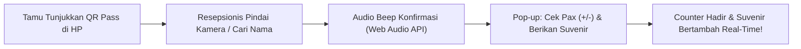
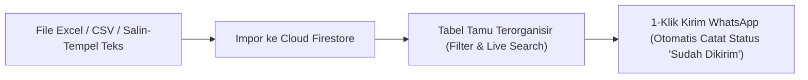
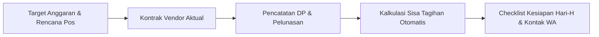
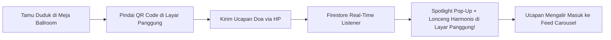
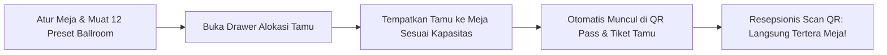
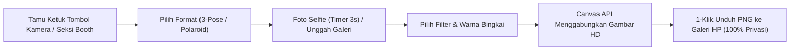

# 📖 Buku Panduan Pengguna & Manual Book Lengkap (User Manual)

Buku panduan ini disusun khusus untuk calon pengantin, keluarga penyelenggara acara, maupun operator non-teknis dalam mengelola dan menyebarkan undangan pernikahan digital **Betawi Heritage Wedding Invitation**.

---

## 💍 1. Profil Singkat Sistem & Manfaat Operasional

Aplikasi ini adalah platform undangan pernikahan digital berbasis web responsif yang menggabungkan estetika adat Betawi dengan teknologi modern.

### Nilai Utama untuk Pengguna:
* **Hemat Biaya & Waktu**: Tidak perlu mencetak dan mendistribusikan ratusan undangan fisik secara manual.
* **Personalisasi Instan**: Nama tamu dapat disematkan langsung pada amplop digital dan template pesan WhatsApp.
* **Rekapitulasi Kehadiran Otomatis**: Mengetahui secara pasti jumlah tamu yang akan hadir untuk efisiensi katering.
* **Amplop Digital Cashless**: Memudahkan tamu memberikan hadiah pernikahan via transfer bank dan QRIS.
* **Bebas Ribet Tanpa Coding**: Pengantin dapat mengubah nama, tanggal, lokasi, lagu, hingga foto galeri secara mandiri lewat layar Admin Panel yang sederhana.

---

## 👥 2. Matriks Hak Akses Peran Pengguna

| Fitur / Tindakan | Tamu Undangan *(Public Guest)* | Calon Pengantin / Admin |
| :--- | :---: | :---: |
| Membuka sampul digital dengan nama pribadi | ✅ Ya | ✅ Ya |
| Mendengarkan & mengontrol pemutar musik latar | ✅ Ya | ✅ Ya |
| Melihat jadwal, peta lokasi, & kisah cinta | ✅ Ya | ✅ Ya |
| Menyimpan jadwal acara ke Google Calendar & Apple/iCal | ✅ Ya | ✅ Ya |
| Mengisi konfirmasi kehadiran (RSVP) | ✅ Ya | ✅ Ya |
| Menulis doa restu di dinding ucapan | ✅ Ya | ✅ Ya |
| Merekam & mendengarkan pesan suara (*Audio Guestbook*) | ✅ Ya | ✅ Ya |
| Berfoto & mengunduh photostrip di Virtual Photo Booth | ✅ Ya | ✅ Ya |
| Mengirim broadcast & pengingat WhatsApp (*Queue Runner*) | ❌ Tidak | ✅ Ya |
| Mengakses generator pesan WhatsApp nama tamu | ❌ Tidak | ✅ Ya |
| Mengubah teks mempelai, tanggal acara, & lokasi | ❌ Tidak | ✅ Ya |
| Mengunggah foto mempelai & galeri foto | ❌ Tidak | ✅ Ya |
| Mengatur daftar rekening & upload kode QRIS | ❌ Tidak | ✅ Ya |
| Mengatur playlist musik & mode putar lagu | ❌ Tidak | ✅ Ya |
| Memantau total tamu hadir & menghapus RSVP/ucapan spam | ❌ Tidak | ✅ Ya |
| Membuka Layar Proyektor LED Panggung Hari-H (`/live`) | ✅ Ya (Tanpa Login) | ✅ Ya |

---

## 🔐 3. Cara Mengakses Admin Panel

Demi menjaga keanggunan tampilan undangan saat dibuka oleh tamu, **tombol akses admin sengaja tidak diletakkan di layar utama undangan**.

### Langkah Masuk ke Admin Panel:
1. Buka peramban di ponsel atau komputer Anda.
2. Ketik alamat website undangan Anda dengan menambahkan path `/login`:
   - Contoh di komputer lokal: `http://localhost:3000/login`
   - Contoh di website publik: `https://undangan-saya.vercel.app/login`
3. Layar login pengaman (*Passcode Gate*) akan muncul.
4. Masukkan salah satu passcode bawaan:
   - **`password`** (atau `admin`, `admin123`)
5. Klik tombol **"Masuk"**. Sistem akan memverifikasi passcode, menyimpan sesi aktif di peramban (`sessionStorage`), dan otomatis mengalihkan URL Anda ke `/modules` (Dasbor Admin Panel).
6. **Logout & Navigasi:**
   - Untuk keluar dan mengakhiri sesi admin, klik tombol **"Logout"** di kanan atas header (sesi dibersihkan dan URL kembali ke `/login`).
   - Untuk kembali melihat tampilan undangan utama tanpa logout, klik tombol silang (**✕**) di pojok kanan atas (kembali ke beranda `/`).

---

## 📱 4. Tata Letak Dasbor Admin Modern (Dashboard Layout)

Dasbor Admin telah didesain dengan konsep modern dan sepenuhnya responsif di semua perangkat:
- **Sidebar Desktop**: Navigasi vertikal di sisi kiri dengan 5 menu utama serta tombol ciutkan/lebarkan (*collapse toggle*).
- **Mobile Slide-Over Drawer**: Menu navigasi laci yang dapat dibuka lewat tombol hamburger di ponsel.
- **Header Topbar**: Menampilkan breadcrumb lokasi menu aktif, tombol pintas **"Lihat Undangan"** (*live preview*), status role Admin, dan tombol **"Logout"**.

---

## 📊 5. Modul Ringkasan Dasbor / Overview (Menu 1)

Modul ini adalah beranda dasbor yang memberikan gambaran umum seketika tentang kesiapan acara dan respon tamu:
1. **Banner Countdown Hari-H**: Menampilkan sisa waktu menuju hari pernikahan dalam hitungan hari, jam, menit, dan detik.
2. **4 Kartu Indikator KPI**:
   - **Total Tamu Hadir**: Akumulasi seluruh tamu dan rombongan keluarga yang menyatakan hadir.
   - **Tidak Hadir**: Jumlah tamu yang mengonfirmasi tidak bisa hadir.
   - **Total Respon**: Total formulir konfirmasi yang telah masuk.
   - **Doa Restu**: Total ucapan doa yang dikirimkan oleh para tamu.
3. **Rasio Kehadiran Visual**: Batang persentase dinamis yang membandingkan perbandingan tamu hadir vs tidak hadir.
4. **Tombol Jalan Pintas Cepat**: Akses instan untuk membuat link WA tamu, mengubah konten, atau mengekspor buku tamu.
5. **Feed Aktivitas Terbaru**: Memperlihatkan 5 konfirmasi kehadiran dan ucapan terbaru yang masuk secara langsung.

---

## 🎟️ 6. Modul Meja Resepsi & Scanner QR Pass Hari-H (Menu 2)

Modul ini adalah **alat operasional inti pada hari pelaksanaan resepsi (*killer feature*)** untuk meja penerimaan tamu:



### A. Fitur Meja Resepsi:
1. **Pemindai Kamera Instan**:
   - Arahkan kamera ponsel/laptop resepsionis ke layar ponsel tamu.
   - Deteksi QR code super cepat murni sisi klien via `jsQR`.
   - Tombol pengalih **Kamera Depan / Belakang** dan tombol **Nyalakan / Matikan Kamera** untuk menghemat baterai perangkat resepsionis.
2. **Umpan Balik Audio (Web Audio API Synthesizer)**:
   - Suara *beep* harmonis frekuensi 880Hz saat scan berhasil (*zero file audio eksternal*).
   - Nada peringatan ganda jika tamu terdeteksi **sudah pernah check-in sebelumnya** (*mencegah kecurangan klaim suvenir ganda*).
3. **Pencarian In-Memory & Check-In Manual**:
   - Jika baterai ponsel tamu habis atau tidak membawa QR pass, ketik nama atau nomor WhatsApp tamu di kotak pencarian manual.
   - Tombol 1-klik **"Check-in"** langsung membuka modal konfirmasi.
4. **Modal Konfirmasi Check-In Tamu**:
   - Stepper jumlah pax fisik yang hadir (`-` / `+`).
   - Sakelar status penyerahan paket suvenir (*Centang: Suvenir Diserahkan*).
   - Pencatatan zona/nomor meja tamu (*opsional, misal: "Meja VIP 1"*).
5. **4 Kartu KPI Real-Time**:
   - **Tamu Check-In**: Total undangan yang tiba di lokasi fisik.
   - **Total Pax Hadir**: Total fisik orang yang berada di dalam ballroom.
   - **Suvenir Diberikan**: Total paket suvenir yang telah diserahkan.
   - **Belum Hadir**: Estimasi tamu yang belum memindai tiket.
6. **Riwayat Kedatangan & Unduh Rekap CSV**:
   - Tabel berpenomoran urut otomatis `#` (1-indexed), jam kedatangan presisi, dan metode masuk (*Scan QR* / *Manual*).
   - Tombol **"Unduh CSV Rekap"** berformat UTF-8 BOM untuk laporan pertanggungjawaban keluarga pasca resepsi.

### B. Tiket Digital & E-Ticket QR Pass (v1.37.0):
- Tamu yang membuka undangan (baik via link WhatsApp `?to=Nama` maupun setelah mengisi formulir RSVP) memiliki tombol mengambang emas dan tombol di seksi RSVP: **"🎟️ Buka E-Ticket & QR Guest Pass"**.
- Menampilkan kartu tiket elegan berornamen emas, inisial monogram mempelai, nama tamu personal, kode tiket unik (misal: `WDG-CF46B1`), jumlah pax, zona nomor meja (*seating*), dan QR Code kontras tinggi.
- **Dua Opsi Format Unduhan Cepat (Dual Export Suite)**:
  1. **Simpan Gambar HD (PNG)**: Mengonversi tiket menjadi berkas gambar beresolusi tinggi (1200x1850 px) langsung ke galeri foto smartphone tamu via Canvas API tanpa internet.
  2. **Unduh Tiket PDF (Siap Cetak)**: Menghasilkan dokumen PDF ukuran A6 Portrait yang terformat rapi dan presisi via `jsPDF` untuk kemudahan pencetakan fisik atau arsip digital.
- **Akses Tiket di Seluruh Layar**: Tombol unduh PNG dan PDF tersedia pada sisi tamu (`GuestQRPassModal`), panel pengelola tamu (`Panel.tsx`), dan meja resepsi resepsionis (`ReceptionCheckin.tsx`).

---

## 🔗 7. Modul Generator & Manajemen Tamu WhatsApp (Menu 3)

Modul ini adalah pusat pengelolaan penyebaran undangan kepada keluarga, kerabat, dan sahabat secara personal. Dilengkapi dukungan impor massal dari file spreadsheet dan sinkronisasi cloud Firestore.



### A. Impor Massal dari File Excel / CSV
1. Masuk ke Dasbor Admin, pilih menu **"Generator Link WA"** (Menu 2).
2. Klik tombol **"Template CSV"** jika ingin mengunduh contoh susunan kolom yang benar.
3. Siapkan file Excel (`.xlsx`, `.xls`) atau CSV (`.csv`) dengan dua kolom:
   - **Nama Tamu** (Wajib): misal *Bapak Dr. H. Faisal, M.Si & Keluarga*.
   - **Nomor WhatsApp** (Opsional): format lokal `0812...` atau internasional `62812...`.
4. Klik tombol **"Impor Tamu"**.
5. Tarik atau pilih file spreadsheet Anda. Sistem akan memindai baris data dan menampilkan kotak pratinjau daftar tamu.
6. Klik **"Simpan & Impor Tamu"**. Ratusan data tamu akan tersimpan otomatis ke cloud Firestore secara instan.

### B. Impor Cepat via Salin-Tempel Teks (Multiline)
1. Pada modal impor, pilih tab **"Salin-Tempel Teks (Multiline)"**.
2. Ketik atau tempelkan daftar nama tamu (satu nama per baris atau dengan format `Nama, Nomor WA`):
   ```text
   Bapak Dr. H. Faisal, 081234567890
   Ibu Hj. Siti Rahmawati, 085712345678
   Budi Santoso & Rekan
   ```
3. Klik **"Periksa & Tampilkan Pratinjau"**, lalu klik **"Simpan & Impor Tamu"**.

### C. Mengirim Undangan via WhatsApp & Pemantauan Status
1. **Kirim WhatsApp 1-Klik**: Klik ikon pesawat kertas/bagikan (`Share2`) pada baris tamu:
   - Jika nomor WhatsApp terisi, peramban akan langsung membuka obrolan chat ke nomor tamu tersebut beserta template pesan islami yang dipersonalisasi.
   - Jika nomor WhatsApp kosong, peramban membuka pemilih kontak WhatsApp.
   - Status pengiriman secara otomatis berubah dari **"Belum Dikirim"** menjadi **"Sudah Dikirim"**.
2. **Filter & Pencarian Cepat**:
   - Gunakan filter pill *Semua*, *Belum Terkirim*, atau *Sudah Terkirim* untuk memilah tamu yang belum sempat dihubungi.
   - Gunakan kotak pencarian live untuk mencari nama tamu secara seketika.
3. **Aksi Cepat Lainnya**:
   - Salin link personal atau salin teks pesan WhatsApp perorangan.
   - Klik ikon centang untuk mengubah status terkirim secara manual kapan saja.
   - Klik tombol **"Generator Cepat"** di pojok kanan atas untuk membuat link personal dadakan bagi 1 tamu tanpa perlu mengimpor.

---

## ✏️ 8. Modul Manajemen Konten Website (Menu 4)

Melalui modul ini, Anda dapat memperbarui seluruh isi undangan pernikahan Anda kapan saja secara *real-time*. Konten diatur dalam sub-tab rapi:

### A. Sub-Tab Mempelai (Groom & Bride)
* Masukkan **Nama Panggilan**, **Nama Lengkap**, **Nama Orang Tua**, dan akun **Instagram**.
* **Unggah Foto Mempelai**: Kotak Drag & Drop dengan pratinjau kartu foto. Kompresi otomatis menjaga performa web tetap cepat.

### B. Sub-Tab Acara & Lokasi (Akad & Resepsi)
* **Target Hitung Mundur Interaktif**: Gunakan pemilih tanggal & waktu (`datetime-local`) untuk menentukan waktu target countdown tanpa perlu mengetik string ISO secara manual.
* **Tombol Sinkronisasi Cepat**: Klik *"Salin ke Tanggal Tampil & Akad"* untuk menyelaraskan seluruh penanggalan secara instan dengan 1-klik.
* **Pemilih Tanggal Kalender Cerdas**: Cukup pilih tanggal pada kalender (`type="date"`), sistem akan otomatis mengisi nama Hari Indonesia (contoh: *Minggu*) dan format penanggalan formal (contoh: *20 September 2026*). Opsi sunting teks manual tetap tersedia jika ingin penyesuaian khusus.
* **Pemilih Jam Terstruktur**: Tentukan **Jam Mulai**, **Jam Selesai**, centang opsi **"Sampai Selesai"**, dan pilih **Zona Waktu** (*WIB, WITA, WIT*). Sistem otomatis menyusun format string yang rapi. Tersedia pula mode teks bebas untuk format non-jam seperti *"Ba'da Isya"*.
* **Samakan Resepsi dengan Akad**: Tombol 1-klik untuk menyalin tanggal, nama gedung, alamat, dan link Google Maps dari sesi Akad ke sesi Resepsi.
* Masukkan **Nama Gedung / Masjid**, **Alamat Lengkap**, dan **Tautan Google Maps**.
* **Integrasi Kalender Tamu Otomatis**: Setiap perubahan jadwal Akad & Resepsi langsung memperbarui data tombol *"Simpan ke Kalender"* di kartu acara publik, memungkinkan tamu mengimpor jadwal ke **Google Calendar** atau **Apple Calendar / iCal (.ics)** dengan alarm pengingat H-1 dan 1 Jam sebelum acara.

### C. Sub-Tab Galeri Foto & Pilihan Konsep Tata Letak (v1.38.0)
* **Unggah Foto Galeri**: Tambahkan foto-foto pra-nikah (*prewedding*) melalui dropzone drag & drop interaktif atau URL langsung. Dilengkapi kartu pratinjau foto dan tombol hapus individual.
* **4 Pilihan Konsep Tata Letak Galeri (Visual Card Selector)**:
  Pengantin dapat memilih konsep tampilan galeri foto di halaman undangan melalui kartu pemilih visual:
  1. **Editorial Asymmetric (`editorial`)** *(Default Populer)*:
     - Tata letak asimetris dinamis bergaya majalah *high-fashion* dengan ritme berulang yang elegan (1 foto portrait rasio 4/5, 2 foto kotak rasio 1:1, dan 1 foto landscape rasio 3/2).
     - Mendukung jumlah foto tanpa batas (*infinite repeating loop*).
  2. **Modern Masonry (`masonry`)** *(Rekomendasi)*:
     - Grid 2-kolom bertingkat ala *Pinterest* yang mempertahankan proporsi asli foto tanpa terpotong (*aspect-ratio preservation*).
     - Dilengkapi animasi pemuatan bertahap (*staggered entrance*).
  3. **Interactive Carousel / 3D Slider (`carousel`)** *(Interaktif)*:
     - Slider horizontal *swipeable* dengan kartu tengah membesar (*scale-up effect*), tombol panah navigasi, deretan *thumbnail strip* di bagian bawah, dan titik indikator dot adaptif tema.
  4. **Polaroid Stack (`polaroid`)** *(Artistik)*:
     - Gaya cetak foto polaroid klasik berbingkai putih dengan bayangan realistis, efek rotasi kemiringan acak halus (-2° s/d +2°), hiasan selotip artistik (*washi tape*), dan penomoran momen manis.
* **Pratinjau Layar Penuh (Universal Fullscreen Lightbox)**:
  Setiap foto pada seluruh 4 pilihan layout dapat diklik oleh tamu untuk membuka modal Lightbox resolusi tinggi dengan tombol geser Kiri/Kanan, nomor urut foto, dan pintasan keyboard (`←`, `→`, `Esc`).

### D. Sub-Tab Kisah Cinta (Love Story)
* Tambah, edit, atau hapus momen perjalanan asmara kedua mempelai dengan mengisi **Tahun**, **Judul Momen**, dan **Cerita Singkat**.
* **Pengaturan Kronologi Fleksibel (Tombol Naik & Turun)**: Gunakan tombol **Naik** (`↑`) dan **Turun** (`↓`) di pojok kanan atas setiap kartu momen untuk memindahkan urutan cerita tanpa harus menghapus atau mengetik ulang. Penomoran urut (`#1`, `#2`, dst.) otomatis menyesuaikan.

### E. Sub-Tab Musik & Hadiah (Playlist & Digital Gift)
* Masukkan URL playlist lagu dari **YouTube** atau tautan audio **Google Drive**.
* Pilih **Mode Pemutaran**: *Repeat All*, *Repeat One*, *Shuffle*, atau *Linear*.
* Kelola rekening bank (BCA, Mandiri, BRI, dll.) atau centang opsi **QRIS** untuk mengunggah gambar barcode pembayaran.

### F. Sub-Tab SEO & Metadata
* **Judul Halaman**, **Deskripsi Singkat**, dan **Foto Thumbnail Preview** saat dibagikan ke WhatsApp dan media sosial.

### G. Sub-Tab Tema Desain (Suite 34 Tema: 20 Siap Pakai & 14 Segera Hadir) (v1.39.0)
Panel Admin menyediakan katalog tema paling komprehensif dengan total **34 tema** (20 siap pakai dan 14 segera hadir) yang mencakup berbagai konsep adat Nusantara, modern pop culture, dan nuansa islami syar'i:

#### 1. Tema Siap Pakai (Status `ready` - 20 Tema):
* **Adat Tradisional Nusantara (9 Tema)**:
  - **Betawi Heritage** (`betawi`): Ornamen Gigi Balang, siluet Ondel-ondel, arsitektur Rumah Kebaya, bunga melayang.
  - **Javanese Royal Kraton** (`jawa`): Ornamen Gunungan Wayang Kulit autentik, pembuka Serat Ulem Pawiwahan Ageng, ukiran keraton emas.
  - **Sundanese Parahyangan** (`sunda`): Mahkota Siger Sunda kembang tanjung, ronce melati suci, gerbang lengkung bambu Priangan.
  - **Minangkabau Royal Songket** (`minang`): Atap Rumah Gadang Gonjong, mahkota Suntiang emas bertingkat, ukiran Pucuak Rebung.
  - **Balinese Royal Temple** (`bali`): Gapura Candi Bentar, payung Tedung Agung, penjor emas, ukiran Patra Punggel, kelopak Bunga Jepun melayang.
  - **Batak Toba Royal Gorga** (`batak`): Ukiran Gorga Simeol-meol & Boraspati sakral, siluet Ruma Bolon tanduk kerbau, tenun Ulos Sadum.
  - **Bugis-Makassar Royal Baju Bodo** (`bugis`): Wadah kue adat Bosara emas, istana Saoraja timpa laja, corak tenun sutra Lipa Sabbe, aksara Lontara.
  - **Palembang Sriwijaya Songket Aesan Gede** (`palembang`): Mahkota Kesuhun Aesan Gede, kalung Teratai Dada, Rumah Limas simbar tanduk kambing, kain Songket Lepus benang emas murni.
  - **Toraja Tongkonan Royal Heritage** (`toraja`): Atap melengkung perahu Rumah Adat Tongkonan, kepala kerbau Tedong Bonga emas, ukiran Pa'teddong mistis.
  - **Dayak Kenyah Borneo** (`dayak`): Perisai sakral Talawang, bulu burung Enggang, sulur Kenyah Aso Naga, dan petikan musik Sape'.
* **Modern Minimalist & Pop Culture (9 Tema)**:
  - **Modern Botanical Minimalist** (`minimalist`): Dedaunan eucalyptus cat air, tipografi serif bersih, tata letak lapang tanpa sekat.
  - **Vintage Newspaper Gazette** (`vintage`): Surat kabar broadsheet antik tahun 1920-an, masthead retro, stempel pos, dan efek audio mesin tik.
  - **Netflix Cinematic Premiere** (`netflix`): Serial streaming OTT, intro audio "Ta-Dum!", billboard 99% Match, rangkaian Episode 1 & 2.
  - **Spotify Interactive** (`spotify`): Pemutar musik streaming, piringan hitam vinyl berputar 360°, album tracklist, not balok melayang.
  - **Instagram Stories & Reels** (`instagram`): Antarmuka 9:16 vertikal imersif, progress bar segmen, polling RSVP, stiker audio, efek tap hati.
  - **Apple iOS Bento Grid** (`apple`): Ekosistem iOS Bento Grid, Dynamic Island, Lock Screen jam besar, kartu Apple Wallet, balon iMessage.
  - **Arcade Retro 8-Bit Gaming** (`arcade`): Video game retro 8-bit/16-bit, dialog RPG Player 1 & 2 Co-Op, Love Bar, chiptune sintetis.
  - **Royal Decree & Wax Seal** (`royal`): Titah kerajaan abad pertengahan, gulungan perkamen antik, stempel segel lilin merah 3D, harpa magis.
  - **Cyberpunk Neo-Jakarta** (`cyberpunk`): Cyberpunk Night City, sirkuit neon cyan/magenta, HUD biometrik kuantum, efek digital glitch dinamis.
* **Syar'i / Islami (1 Tema)**:
  - **Islamic Arabian Garden** (`islamic`): Lengkungan kubah Moorish / Arabesque Arch, bintang 8-sudut Rub el Hizb, kaligrafi Bismillah.

#### 2. Tema Segera Hadir (Status `coming_soon` - 14 Tema):
* **Adat Nusantara (+5 Tema)**:
  - **Aceh Serambi Mekkah** (`aceh`): Pinto Aceh geometris, Kupiah Meukeutop emas, sulur Awan Siweueh.
  - **Banjar Baamar Galung** (`banjar`): Mahkota Baamar Galung kemilau intan Martapura, Rumah Bubungan Tinggi.
  - **Melayu Riau Teluk Belanga** (`melayu`): Tenun songket Siak benang emas, hiasan atap Selembayung, kuning diraja.
  - **Sasak Lombok Bale Tani** (`sasak`): Kain tenun ikat Subahnale khas Sade, lumbung tradisional Bale Tani, siluet Gunung Rinjani.
  - **Papua Cenderawasih Paradise** (`papua`): Mahkota bulu Cenderawasih, ukiran kayu Asmat magis, noken, zamrud Raja Ampat.
* **Modern & Pop Culture (+5 Tema)**:
  - **IMAX Cinema Premiere** (`cinema`): Tiket gala premiere barcode robek, sorotan spotlight premiere Hollywood.
  - **First-Class Boarding Pass** (`airline`): Format boarding pass maskapai first-class IATA, paspor visa cinta, radar rute.
  - **Romantic Anime & Manga Panel** (`anime`): Estetika manga & anime Jepang, guguran sakura, langit senja Makoto Shinkai.
  - **Glassmorphism Aurora Hologram** (`glassmorphism`): Frosted glass tembus pandang, pembiasan prisma pelangi aurora borealis.
  - **Retro 80s Synthwave & Neon** (`synthwave`): Wireframe 3D outrun, matahari terbenam neon bergaris, palem neon 80-an.
* **Syar'i / Islami (+4 Tema)**:
  - **Ottoman Empire Istanbul** (`ottoman`): Keramik Iznik biru pirus, kaligrafi Thuluth emas, kubah Hagia Sophia, bulan sabit kembar.
  - **Moroccan Riad & Zellige** (`moroccan`): Mozaik geometris Zellige terakota, lengkungan tapal kuda Moorish, lentera Marrakech.
  - **Al-Andalus Granada Alhambra** (`andalusia`): Relief plafon Muqarnas, air mancur marmer Generalife Alhambra, daun zaitun.
  - **Madinah Nabawi Serenity** (`nabawi`): Siluet Kubah Hijau (Green Dome), pilar marmer putih Rawdah, payung hidrolik mekar.

#### 3. Interaktivitas Katalog Tema:
* **Filter Kategori Tema**: Saring katalog dengan tombol tab *Semua Gaya*, *Adat Nusantara*, *Modern*, atau *Syar'i / Islami*.
* **Titik Palet Warna Interaktif**: Setiap kartu tema memperlihatkan 4 titik warna khas (`primary`, `secondary`, `accent`, `bg`).
* **1-Klik Ganti Tema**: Klik tombol **"Aktifkan Tema"** pada tema yang berstatus *ready* untuk mengaktifkan tema secara instan.
* **Tautan Pratinjau Langsung**: Klik ikon tautan eksternal untuk menguji coba tampilan tema via URL query parameter (misal: `?theme=dayak` atau `?theme=cyberpunk`) tanpa mengubah tema utama pengantin.
* **Proteksi Tema Coming Soon**: Tema berstatus *coming soon* menampilkan badge status jam (*"Segera Hadir"*), menonaktifkan tombol aktivasi, dan menyembunyikan pratinjau live secara elegan.

> [!IMPORTANT]
> Selalu tekan tombol **"Simpan ke Firestore"** pada bilah aksi mengambang (*sticky save bar*) di bagian bawah setelah selesai memilih tema atau mengedit data.

---

## 💰 9. Modul Wedding Budget & Checklist Vendor Tracker (Menu 5)

Modul ini adalah pusat pengelolaan anggaran finansial pernikahan dan pemantauan koordinasi vendor bagi kedua calon mempelai beserta keluarga. Dilengkapi sinkronisasi cloud real-time Firestore pada koleksi `wedding_expenses`.



### A. 4 Kartu Indikator KPI Finansial Real-Time:
1. **Target Anggaran**: Total akumulasi batas biaya yang direncanakan oleh kedua keluarga pengantin.
2. **Kontrak Aktual**: Total kesepakatan nilai kontrak riil dengan vendor, dilengkapi notifikasi penghematan atau selisih lebih.
3. **Telah Dibayar (DP / Lunas)**: Total rupiah yang telah ditransfer beserta persentase pemenuhan anggaran.
4. **Sisa Tagihan Pelunasan**: Total kewajiban finansial yang masih harus dilunasi menjelang hari-H pernikahan.

### B. Fitur & Kemudahan Operasional:
1. **10 Template Pos Anggaran Nusantara (1-Klik)**:
   - Jika data masih kosong, klik tombol **"Muat Template Standar"** untuk memuat 10 pos pengeluaran umum pernikahan adat Nusantara secara otomatis (Venue, Katering, MUA/Busana, Dekorasi, Foto/Video, Sound/MC, Souvenir/Undangan, Cincin/Mahar, Tenda/Genset, dan Perlengkapan Adat).
2. **Kontak Cepat WhatsApp Vendor**:
   - Nomor WhatsApp vendor yang tersimpan dapat langsung diklik untuk membuka chat WhatsApp (`wa.me/62...`) tanpa perlu menyimpan kontak secara manual di buku telepon HP.
3. **Checklist Kesiapan Logistik Hari-H**:
   - Tombol kotak centang pada setiap baris untuk menandai pos atau barang yang sudah siap 100% menjelang acara.
4. **Filter Cerdas & Pencarian In-Memory**:
   - Saring pos pengeluaran berdasarkan kategori (Venue, Katering, Rias, Dekor, dll.) atau status pembayaran (*Belum Bayar, DP Terbayar, Lunas*), serta pencarian nama vendor/catatan secara instan.
5. **Ekspor Rekapitulasi Anggaran ke CSV (UTF-8 BOM)**:
   - Tombol **"Export CSV"** untuk mengunduh seluruh data anggaran ke dalam berkas spreadsheet yang rapi dan terstruktur untuk pelaporan bendahara keluarga.

---

## 📋 10. Modul Buku Tamu RSVP & Export CSV (Menu 6)

Menu ini menyediakan rekapitulasi interaktif konfirmasi kehadiran:
1. **Pencarian Real-Time**: Kolom pencarian cepat di latar belakang tanpa mengubah URL peramban, dilengkapi tombol reset instan.
2. **Penomoran Urut Otomatis (`#`)**: Nomor urut 1-indexed yang tetap konsisten dan berurutan saat data disaring.
3. **Export ke Excel (CSV)**: Tombol **"Export ke CSV"** untuk mengunduh seluruh data konfirmasi kehadiran ke berkas spreadsheet berformat UTF-8 BOM yang rapi.
4. **Hapus Data Spam**: Tombol aksi berikon tong sampah dengan konfirmasi SweetAlert2 berlatar layar penuh.

---

## 💬 11. Modul Moderasi Ucapan Doa (Menu 7)

Dinding ucapan doa restu tamu diperbarui secara otomatis secara *real-time*:
1. **Pencarian Cepat Ucapan**: Mempermudah pencarian nama tamu atau isi doa tertentu.
2. **Penomoran Urut Otomatis (`#`)**: Tabel ucapan tersusun rapi dengan nomor urut dinamis.
3. **Moderasi Pesan**: Hapus pesan spam atau tidak sopan secara aman dengan dialog konfirmasi SweetAlert2.

---

## 📺 12. Layar Proyektor LED Panggung Hari-H / Live Wishes Screen (`/live`)

Fitur ini dirancang khusus untuk memproyeksikan doa restu para tamu secara langsung (*real-time*) di layar videotron LED panggung ballroom pernikahan atau layar proyektor besar di venue acara.



### A. Cara Membuka Layar Proyektor Panggung:
1. Hubungkan laptop operator panggung / MC ke videotron LED atau proyektor panggung via HDMI.
2. Buka peramban (Google Chrome / Edge) dan akses salah satu alamat berikut:
   - Akses langsung mandiri: `https://undangan-anda.vercel.app/live` atau `/projector` (bebas tanpa perlu login passcode).
   - Melalui Admin Panel: Buka menu **Moderasi Ucapan** atau **Overview**, lalu klik tombol emas **"Buka Layar Proyektor Panggung"**.
3. Tekan tombol **F11** atau klik ikon layar penuh (**Fullscreen**) pada bilah kontrol di bawah untuk pengalaman tampilan sinematik 16:9 tanpa gangguan antarmuka browser.

### B. Komponen Tampilan Layar Panggung (Split Stage Cinema 16:9):
1. **Panel Sisi Kiri (35%)**:
   - **Monogram Emas Mempelai**: Inisial kedua mempelai beranimasi pernapasan lembut (*breathing animation*).
   - **Nama Pasangan & Tanggal Acara**: Menampilkan nama kedua mempelai dan venue acara dengan tipografi aksen emas mewah.
   - **Counter Ucapan Live**: Angka total doa yang masuk terbarui secara dinamis saat ada tamu yang mengirimkan doa.
   - **QR Code Interaktif Ukuran Besar**: Mengarah langsung ke formulir ucapan undangan digital (`#ucapan`). Tamu undangan yang sedang duduk di ballroom dapat langsung mengarahkan kamera ponsel ke layar panggung untuk mengirim doa restu.
2. **Panel Aliran Doa Restu (65%)**:
   - Menampilkan feed ucapan tamu dengan kartu berdesain malam eksklusif (*Midnight Slate & Emerald*).
   - Jika belum ada ucapan, menampilkan ucapan selamat datang yang anggun mengajak para tamu memindai QR code.

### C. Efek Selebrasi Spotlight Pop-Up & Audio Chime:
1. **Deteksi Real-Time Kilat**:
   - Begitu seorang tamu menekan tombol "Kirim Doa Restu" di ponselnya, layar panggung langsung mendeteksi kedatangan data baru dalam hitungan milidetik melalui WebSocket Firestore.
2. **Modal Spotlight Pop-Up**:
   - Kartu doa tamu yang baru masuk langsung melayang ke tengah layar dengan latar redup dramatis, lingkaran halo emas bercahaya, dan partikel konfeti/bintang berkilau beranimasi selama 6,5 detik.
3. **Harmonic Bell Chime (Web Audio API)**:
   - Bersamaan dengan munculnya spotlight, speaker panggung akan memperdengarkan nada lonceng akor C-Mayor harmonis (C5-E5-G5-C6) dengan peluruhan alami (*natural decay*) tanpa membutuhkan unduhan file MP3 eksternal (*zero external network download*).
4. **Transisi Mengalir**:
   - Setelah 6,5 detik, kartu ucapan menutup dan meluncur anggun ke posisi teratas aliran feed.

### D. Kontrol Bilah Bawah Operator (Floating Auto-Hide Toolbar):
- Arahkan kursor mouse ke bagian bawah layar untuk memunculkan bilah kontrol operator:
  - **Status Suara**: Tombol ikon lonceng untuk mematikan (*Mute*) atau mengaktifkan (*Unmute*) suara chime panggung.
  - **Pilihan Kecepatan Putar (Carousel)**:
    - **Cepat (4 detik)**: Cocok untuk acara resepsi dengan ribuan tamu dan arus doa sangat deras.
    - **Normal (7 detik)**: Kecepatan standar ideal yang nyaman dibaca oleh tamu undangan.
    - **Lambat (10 detik)**: Memberikan waktu lebih lama bagi tamu untuk menikmati setiap doa restu.
    - **Jeda**: Menghentikan perputaran otomatis jika MC ingin membacakan doa tertentu.
  - **Mode Layar Penuh (Fullscreen)**: Memaksimalkan jendela peramban ke seluruh layar monitor LED.
  - **Bilah Kontrol Otomatis Sembunyi**: Bilah ini otomatis menghilang setelah 3,5 detik kursor diam agar tampilan panggung tetap bersih dan mewah.

---

## 🪑 13. Modul Manajemen Meja & Seating Chart Ballroom (Menu 8)

Modul ini adalah pusat penataan denah lantai (*floor plan layout*) ballroom dan alokasi tempat duduk para tamu undangan resepsi pernikahan:



### A. 4 Kartu Indikator KPI Kapasitas Ballroom:
1. **Total Meja Aktif**: Jumlah keseluruhan meja yang terdaftar di ballroom.
2. **Kapasitas Kursi**: Total daya tampung fisik kursi dari semua meja aktif.
3. **Kursi Terisi**: Akumulasi pax tamu yang telah dialokasikan ke nomor meja tertentu.
4. **Sisa Kursi Tersedia**: Kapasitas kursi kosong yang masih dapat ditempati oleh tamu.

### B. Fitur & Kemudahan Operasional:
1. **12 Preset Meja Standar Ballroom (1-Klik)**:
   - Jika data meja masih kosong, klik tombol **"Muat 12 Preset Meja"** untuk langsung menyusun tata letak standar ballroom berkapasitas 108 kursi:
     - `VIP-01`: Meja Utama Pelaminan (12 Kursi - Zona Depan)
     - `VIP-02`: Keluarga Besar Mempelai Pria (10 Kursi - Zona Depan)
     - `VIP-03`: Keluarga Besar Mempelai Wanita (10 Kursi - Zona Depan)
     - `VIP-04`: Pejabat & Tamu VVIP (8 Kursi - Zona Depan)
     - `TBL-01` s/d `TBL-04`: Meja Tamu Kehormatan & Kolega (Zona Tengah)
     - `TBL-05` s/d `TBL-08`: Meja Tamu Umum & Sahabat (Zona Belakang & Samping)
2. **Denah Lantai Visual Interaktif (Visual Floor Plan)**:
   - Kartu denah meja dikelompokkan berdasarkan zona (*Zona Depan, Zona Tengah, Zona Belakang, Sayap Kiri, Sayap Kanan*).
   - Setiap kartu meja menampilkan nomor meja, bentuk meja (Bundar / Persegi Panjang), kapasitas maksimal, sisa kursi, indikator okupansi warna, serta daftar nama tamu yang duduk.
3. **Drawer Alokasi Tamu (Guest Assignment Drawer)**:
   - Klik tombol **"Atur Tamu"** pada salah satu meja untuk membuka panel laci samping (*slide-over drawer*).
   - Menampilkan daftar tamu yang sudah duduk di meja tersebut dan daftar tamu yang belum dialokasikan meja (*Unassigned Guests*).
   - Tambah atau keluarkan tamu dengan 1-klik, dilengkapi peringatan otomatis jika kapasitas kursi meja telah penuh.
4. **Tambah & Edit Meja Fleksibel**:
   - Tambahkan meja baru dengan nomor custom, nama label, zona tata letak, kapasitas kursi (2 s/d 20 kursi), serta bentuk meja.
5. **Ekspor CSV Seating Chart (UTF-8 BOM)**:
   - Klik tombol **"Export CSV"** untuk mengunduh rekapitulasi data meja, kapasitas, dan alokasi nama tamu ke format spreadsheet untuk dibagikan kepada tim *usher* penerima tamu dan *event organizer* (EO).

### C. Sinkronisasi Sisi Tamu & Meja Resepsi:
1. **Badge Meja di E-Ticket & QR Pass**:
   - Tamu yang telah dialokasikan meja akan otomatis melihat nomor dan nama meja mereka di badge emas QR pass digital (`📍 Meja: VIP-01 (VIP Utama)`).
   - Saat tamu menekan tombol *"Simpan Tiket ke HP (PNG)"*, nomor meja otomatis tercetak jelas pada gambar tiket masuk ponsel mereka.
2. **Pencarian Mandiri Tamu ("Cari Meja & Denah Anda")**:
   - Di seksi Lokasi acara undangan digital, tamu dapat mengetuk tombol *"Cari Meja & Denah Anda"* untuk membuka dialog pencarian nama dan mengetahui nomor meja serta petunjuk letak zonanya sebelum memasuki ballroom.
3. **Deteksi Otomatis di Scanner Meja Resepsi**:
   - Saat resepsionis memindai QR code tamu pada modul Meja Resepsi (`ReceptionCheckin`), sistem langsung menampilkan nomor dan zona meja tamu tersebut sehingga staf *usher* dapat langsung mengarahkan tamu ke meja yang tepat.

---

## 🎮 14. Modul Wedding Trivia Quiz & Mini Games (Menu 9)

Modul ini adalah pusat pengelolaan permainan interaktif seputar kedua mempelai yang dapat dimainkan oleh tamu undangan langsung dari ponsel cerdas mereka, tersinkronisasi langsung via Firestore pada koleksi `wedding_trivia_questions` dan `wedding_trivia_scores`.

### A. Fitur & Pengaturan Dasbor Trivia:
1. **4 Kartu Indikator KPI Real-Time**:
   - **Total Soal Aktif**: Jumlah pertanyaan trivia yang siap dijawab oleh tamu undangan.
   - **Tamu Bermain**: Total sesi permainan kuis yang telah diselesaikan oleh para tamu.
   - **Rata-Rata Skor**: Nilai rata-rata persentase kebenaran jawaban tamu (misal: `84%`).
   - **Skor Sempurna (100%)**: Jumlah tamu yang berhasil menjawab seluruh soal dengan benar tanpa salah.
2. **Bank Soal Kuis (Tab 1)**:
   - Tombol **"+ Tambah Pertanyaan"**: Membuka modal formulir untuk menulis teks soal, 4 pilihan ganda (A/B/C/D), penandaan kunci jawaban benar, ulasan fakta seru pengantin, dan urutan soal.
   - Tombol **"Muat 5 Soal Default Trivia"**: Memuat instan 5 set pertanyaan romantis & lucu siap pakai ke cloud Firestore.
   - Aksi **Ubah** dan **Hapus** soal dilengkapi dialog konfirmasi SweetAlert.
3. **Papan Skor Tamu & Live Leaderboard (Tab 2)**:
   - Menampilkan daftar peringkat skor seluruh tamu secara *real-time*.
   - Medali emas 🥇, perak 🥈, dan perunggu 🥉 untuk 3 tamu dengan skor tertinggi.
   - Pencarian instan in-memory nama tamu atau predikat juara tanpa mengubah URL.
   - Tombol **"Unduh Rekap CSV"**: Mengunduh seluruh rekapitulasi nilai kuis ke format spreadsheet CSV UTF-8 BOM.

### B. Pengalaman Tamu di Sisi Undangan (Guest Side):
- **Floating Feature Hub (Speed Dial)**: Terintegrasi ke dalam menu terapung pemicu di sisi kiri bawah layar (`FloatingFeatureHub`), berdampingan rapi dengan tombol pemutar musik di sisi kanan.
- **Seksi Undangan (`TriviaQuizSection`)**: Kartu ajakan bermain di alur halaman undangan setelah seksi konfirmasi RSVP.
- **Synthesizer Audio Web Audio API**: Efek suara nada benar (*chime*), nada salah (*buzz*), dan terompet kemenangan (*fanfare*) tanpa unduhan berkas audio eksternal.
- **Tantangan WhatsApp**: Tombol instan untuk membagikan skor ke grup/chat WhatsApp dengan pesan tantangan seru bagi rekan-rekan tamu lainnya.

---

## 📸 15. Virtual Photo Booth & Cetak Photostrip (v1.29.0)

Fitur ini menghadirkan pengalaman studio foto instan (*self-photo studio*) langsung di smartphone para tamu undangan tanpa perlu mengunduh aplikasi pihak ketiga:



### A. Format & Desain yang Didukung:
1. **Format Layout Ganda**:
   - **3-Pose Photostrip (Gaya Studio Korea)**: 3 frame foto bersusun vertikal (600x1800 px) dengan margin studio, garis batas ganda beraksen, serta footer nama mempelai, tanggal pernikahan, dan stempel terbatas.
   - **Single Polaroid Frame**: Format foto persegi klasik (800x1000 px) dengan dagu polaroid luas berhias teks nama kedua mempelai dan pesan manis.
2. **Pilihan Desain Bingkai (Multitemplat)**:
   - **Theme Matched**: Warna otomatis menyesuaikan tema undangan yang sedang aktif.
   - **Black Studio**: Bingkai hitam pekat eksklusif (`#121214`) dengan aksen tulisan emas (`#D4AF37`).
   - **White Studio**: Bingkai putih bersih modern (`#FFFFFF`) dengan aksen charcoal.
   - **Romantic Pastel**: Bingkai blush pink lembut (`#FDF2F4`) dengan aksen tipografi rose burgundy.
3. **Filter Foto Artistik Real-Time**:
   - Pilihan filter instan: **Natural** (asli), **B&W Vintage** (monokrom kontras), **Sepia Retro** (hangat klasik), dan **Warm Glow** (kilau lembut).

### B. Cara Penggunaan bagi Tamu:
1. Ketuk tombol pemicu terapung berikon ✨ (**Floating Feature Hub**) di pojok kiri bawah lalu pilih tombol **Photo Booth**, atau ketuk tombol **"Buka Virtual Photo Booth"** pada seksi galeri undangan.
2. Pilih format yang diinginkan (**3-Pose Strip** atau **Single Polaroid**).
3. Pilih metode pengambilan:
   - **Kamera Selfie**: Mengaktifkan kamera depan/belakang dengan timer hitung mundur 3 detik (dilengkapi suara beep dan kilatan lampu putih studio saat foto terambil).
   - **Unggah Galeri**: Memilih foto yang sudah tersimpan di galeri ponsel.
4. Kustomisasi filter warna dan warna bingkai pada layar pratinjau.
5. Ketuk tombol **"Unduh Photostrip HD (PNG)"** untuk menyimpan hasil foto resolusi tinggi langsung ke galeri ponsel secara instan.

---

## ❓ 16. Tanya Jawab Umum (FAQ)

### T: Apakah musik otomatis berputar saat tamu pertama kali membuka website?
**J:** Kebijakan peramban modern (Chrome, Safari, iOS) melarang suara berputar otomatis (*autoplay*) sebelum ada interaksi fisik dari pengguna. Oleh sebab itu, aplikasi menyediakan gerbang **Opening Cover** dengan tombol *"Buka Undangan"*. Saat tamu mengetuk tombol tersebut, musik akan langsung berputar secara mulus.

### T: Apakah foto yang saya upload akan menghabiskan kuota bayar Google Firebase?
**J:** Tidak. Aplikasi ini dirancang dengan teknologi kompresi kanvas di peramban, di mana foto dikompresi menjadi teks Base64 yang sangat efisien dan disimpan langsung ke Firestore. Anda tidak memerlukan penyimpanan *Firebase Storage* berbayar.

### T: Bagaimana jika saya lupa passcode untuk masuk ke Admin Panel?
**J:** Passcode default adalah `password`. Jika Anda ingin mengubah passcode ini, Anda dapat memintanya kepada developer untuk memperbarui variabel pada berkas `AdminPanel.tsx`.

### T: Apakah nama tamu dengan karakter khusus (seperti gelar, tanda koma, atau "&") akan terbaca normal?
**J:** Ya. Generator link WhatsApp pada Tab 1 sudah dilengkapi fitur *URL Encoding* otomatis, sehingga karakter khusus seperti `&`, spasi, titik, dan koma akan tetap tampil sempurna di layar tamu.
