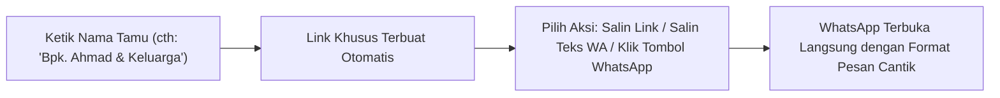

# 📖 Buku Panduan Pengguna & Manual Book Lengkap (User Manual)

Buku panduan ini disusun khusus untuk calon pengantin, keluarga penyelenggara acara, maupun operator non-teknis dalam mengelola dan menyebarkan undangan pernikahan digital **Betawi Heritage Wedding Invitation**.

---

## 💍 1. Profil Singkat Sistem & Manfaat Operasional

Aplikasi ini adalah platform undangan pernikahan digital berbasis web responsif yang menggabungkan estetika adat Betawi dengan teknologi modern.

### Nilai Utama untuk Pengguna:
* **Hemat Biaya & Waktu**: Tidak perlu mencetak dan mendistribusikan ratusan undangan fisik secara manual.
* **Personalisasi Instan**: Nama tamu dapat disematkan langsung pada amplop digital dan template pesan WhatsApp.
* **Rekapitulasi Kehadiran Otomatis**: Mengetahui secara pasti jumlah tamu yang akan hadir untuk efisiensi katering.
* **Amplop Digital Cashless**: Memudahkan tamu memberikan hadiah pernikahan via transfer bank dan QRIS.
* **Bebas Ribet Tanpa Coding**: Pengantin dapat mengubah nama, tanggal, lokasi, lagu, hingga foto galeri secara mandiri lewat layar Admin Panel yang sederhana.

---

## 👥 2. Matriks Hak Akses Peran Pengguna

| Fitur / Tindakan | Tamu Undangan *(Public Guest)* | Calon Pengantin / Admin |
| :--- | :---: | :---: |
| Membuka sampul digital dengan nama pribadi | ✅ Ya | ✅ Ya |
| Mendengarkan & mengontrol pemutar musik latar | ✅ Ya | ✅ Ya |
| Melihat jadwal, peta lokasi, & kisah cinta | ✅ Ya | ✅ Ya |
| Mengisi konfirmasi kehadiran (RSVP) | ✅ Ya | ✅ Ya |
| Menulis doa restu di dinding ucapan | ✅ Ya | ✅ Ya |
| Mengakses generator pesan WhatsApp nama tamu | ❌ Tidak | ✅ Ya |
| Mengubah teks mempelai, tanggal acara, & lokasi | ❌ Tidak | ✅ Ya |
| Mengunggah foto mempelai & galeri foto | ❌ Tidak | ✅ Ya |
| Mengatur daftar rekening & upload kode QRIS | ❌ Tidak | ✅ Ya |
| Mengatur playlist musik & mode putar lagu | ❌ Tidak | ✅ Ya |
| Memantau total tamu hadir & menghapus RSVP/ucapan spam | ❌ Tidak | ✅ Ya |

---

## 🔐 3. Cara Mengakses Admin Panel

Demi menjaga keanggunan tampilan undangan saat dibuka oleh tamu, **tombol akses admin sengaja tidak diletakkan di layar utama undangan**.

### Langkah Masuk ke Admin Panel:
1. Buka peramban di ponsel atau komputer Anda.
2. Ketik alamat website undangan Anda, kemudian tambahkan kata `?admin` pada bagian paling belakang URL:
   - Contoh di komputer lokal: `http://localhost:3000/?admin`
   - Contoh di website publik: `https://undangan-saya.vercel.app/?admin`
3. Layar kunci pengaman (*Passcode Gate*) akan muncul.
4. Masukkan salah satu passcode bawaan:
   - **`password`** (atau `admin`, `admin123`)
5. Klik tombol **"Masuk"**. Anda akan langsung diarahkan ke dasbor utama Admin Panel.
6. Untuk kembali ke tampilan undangan tamu, klik tombol silang (**✕**) di pojok kanan atas.

---

## 🔗 4. Modul Generator Link Tamu & Pesan WhatsApp (Tab 1)

Modul ini adalah fitur paling sering digunakan saat Anda siap menyebarkan undangan ke keluarga dan sahabat.

### Langkah-Langkah:
1. Masuk ke Admin Panel, pilih tab **"Link Tamu Undangan"** (tab pertama).
2. Pada kolom **Nama Tamu Undangan**, ketikkan nama tamu yang ingin Anda undang.
   - *Contoh format santai*: `Budi Santoso`
   - *Contoh format formal*: `Bapak Dr. H. Faisal, M.Si & Keluarga`
3. Sistem secara otomatis membuat:
   - **Link Khusus**: Berisi parameter `?to=...` yang memastikan nama tamu tersebut muncul di sampul depan undangan.
   - **Template Pesan WhatsApp**: Pesan sopan berformat islami dan rapi yang langsung memuat nama tamu serta tautan undangan.
4. **Pilih Metode Pembagian:**
   - **Klik "Kirim / Bagikan via WhatsApp"**: Peramban akan otomatis membuka aplikasi WhatsApp dengan teks pesan yang sudah terisi. Anda tinggal memilih kontak tujuan dan klik kirim.
   - **Salin Teks WA**: Klik tombol *"Salin Teks WA"* jika ingin mengedit atau menempelkan pesan ke aplikasi chat lain (Telegram/Email).
   - **Salin URL**: Hanya menyalin tautan website singkatnya saja.

---

## ✏️ 5. Modul Edit Data Website & Konten (Tab 2)

Melalui modul ini, Anda dapat memperbarui seluruh isi undangan pernikahan Anda kapan saja secara *real-time*.

### A. Mempelai Pria & Wanita (Groom & Bride)
* Masukkan **Nama Panggilan** (digunakan untuk judul sampul dan link preview).
* Masukkan **Nama Lengkap** beserta gelar akademik.
* Masukkan **Nama Orang Tua** (ayah dan ibu).
* Masukkan akun **Instagram** (opsional).
* **Unggah Foto Mempelai**: Klik tombol ikon upload (unggah) untuk memilih foto dari ponsel atau galeri komputer. Sistem secara cerdas akan mengompresi foto secara otomatis agar ringan dibuka oleh tamu.

### B. Tanggal Pernikahan & Live Countdown Timer
* **Tanggal Format Teks**: Ketik teks tanggal formal yang akan dicetak di layar (misal: `Minggu, 20 September 2026`).
* **Format ISO untuk Hitung Mundur**: Format waktu target untuk penghitung mundur otomatis (format: `YYYY-MM-DDTHH:mm:ss+07:00`, contoh: `2026-09-20T09:00:00+07:00`).

### C. Detail Acara Akad Nikah & Resepsi
* Ubah **Judul Acara**, **Hari**, **Tanggal**, dan **Waktu Pelaksanaan** (misal: `09:00 - 11:00 WIB`).
* Masukkan **Nama Gedung / Masjid** dan **Alamat Lengkap**.
* Tempelkan **Tautan Google Maps** agar tamu dapat membuka navigasi peta GPS hanya dengan 1-klik.

### D. Linimasa Kisah Cinta (Love Story)
* Anda dapat menambah, mengedit, atau menghapus momen perjalanan asmara kedua mempelai dengan mengisi **Tahun**, **Judul Momen**, dan **Cerita Singkat**.

### E. Musik Latar Belakang (Audio Playlist)
* Masukkan URL lagu dari **YouTube** (contoh: `https://www.youtube.com/watch?v=RO75uUZiAw0`) atau tautan audio **Google Drive** yang diset publik.
* Klik tombol **"+ Tambah Lagu"** jika ingin membuat daftar putar (*playlist*) multi-lagu.
* Pilih **Mode Pemutaran**:
  - *Repeat All*: Memutar seluruh daftar lagu berulang-ulang tanpa henti.
  - *Repeat One*: Mengulang satu lagu yang sama terus-menerus.
  - *Shuffle*: Memutar lagu-lagu di dalam daftar secara acak.
  - *Linear*: Memutar lagu dari awal hingga akhir lalu berhenti.

### F. Amplop Digital (Hadiah Bank & QRIS)
* Klik **"+ Tambah Akun"** untuk menambahkan rekening baru.
* Centang opsi **"Gunakan QRIS untuk akun ini"** apabila Anda ingin menampilkan gambar kode barcode QRIS (misal: Gopay, OVO, ShopeePay, atau QRIS Bank).
* Klik tombol **"Pilih QRIS"** untuk mengunggah gambar barcode.
* Jika berupa transfer bank biasa: Isi **Nama Bank**, **Nomor Rekening**, dan **Atas Nama Pemilik Rekening**.

### G. Galeri Foto Pernikahan
* Tambahkan foto-foto pra-nikah (*prewedding*) Anda.
* Anda dapat memasukkan URL gambar langsung atau klik tombol upload untuk memilih file gambar dari memori perangkat.

### H. Pengaturan SEO & Pratinjau Sosial Media
* **Judul Halaman**: Judul yang tampil di tab peramban dan judul preview saat dibagikan ke WhatsApp.
* **Deskripsi Singkat**: Kalimat pendek yang muncul di bawah judul saat link dibagikan.
* **Gambar Thumbnail Preview**: Foto yang menjadi sampul thumbnail kartu di chat WhatsApp.

> [!IMPORTANT]
> Jangan lupa menekan tombol **"Simpan ke Firestore"** di bagian paling bawah setelah selesai melakukan perubahan. Indikator toast hijau akan muncul sebagai tanda data berhasil tersimpan ke cloud.

---

## 📊 6. Modul Pemantauan RSVP Kehadiran (Tab 3)

Tab ini memberikan rekapitulasi konfirmasi kehadiran dari para tamu:

1. **Kotak Indikator Ringkasan**:
   - **Total Tamu Hadir**: Akumulasi total orang yang menyatakan hadir (termasuk jumlah rombongan keluarga yang dibawa).
   - **Tidak Hadir**: Jumlah tamu yang mengonfirmasi berhalangan hadir.
   - **Total Respon**: Total keseluruhan data respon konfirmasi yang telah masuk.
2. **Daftar Kartu Respon**:
   - Memperlihatkan nama tamu, status konfirmasi, jumlah tamu, catatan/doa yang disertakan, serta tanggal pengisian.
3. **Menghapus Data Spam**:
   - Jika terdapat data iseng atau dobel, klik tombol tong sampah pada kartu yang bersangkutan. Dialog konfirmasi modern akan muncul menanyakan kepastian Anda sebelum data dihapus secara permanen.

---

## 💬 7. Modul Moderasi Ucapan Doa (Tab 4)

Dinding ucapan doa restu tamu diperbarui secara otomatis secara *real-time*:

1. Setiap kali tamu mengirimkan ucapan di website, pesan tersebut akan langsung muncul di tab ini tanpa perlu memuat ulang peramban (*auto-sync*).
2. Anda dapat membaca seluruh ucapan doa dari sahabat dan kerabat.
3. Jika terdapat pesan yang tidak sopan atau spam iklan, Anda dapat menghapusnya dengan mengklik ikon tong sampah merah pada pesan tersebut.

---

## ❓ 8. Tanya Jawab Umum (FAQ)

### T: Apakah musik otomatis berputar saat tamu pertama kali membuka website?
**J:** Kebijakan peramban modern (Chrome, Safari, iOS) melarang suara berputar otomatis (*autoplay*) sebelum ada interaksi fisik dari pengguna. Oleh sebab itu, aplikasi menyediakan gerbang **Opening Cover** dengan tombol *"Buka Undangan"*. Saat tamu mengetuk tombol tersebut, musik akan langsung berputar secara mulus.

### T: Apakah foto yang saya upload akan menghabiskan kuota bayar Google Firebase?
**J:** Tidak. Aplikasi ini dirancang dengan teknologi kompresi kanvas di peramban, di mana foto dikompresi menjadi teks Base64 yang sangat efisien dan disimpan langsung ke Firestore. Anda tidak memerlukan penyimpanan *Firebase Storage* berbayar.

### T: Bagaimana jika saya lupa passcode untuk masuk ke Admin Panel?
**J:** Passcode default adalah `password`. Jika Anda ingin mengubah passcode ini, Anda dapat memintanya kepada developer untuk memperbarui variabel pada berkas `AdminPanel.tsx`.

### T: Apakah nama tamu dengan karakter khusus (seperti gelar, tanda koma, atau "&") akan terbaca normal?
**J:** Ya. Generator link WhatsApp pada Tab 1 sudah dilengkapi fitur *URL Encoding* otomatis, sehingga karakter khusus seperti `&`, spasi, titik, dan koma akan tetap tampil sempurna di layar tamu.
