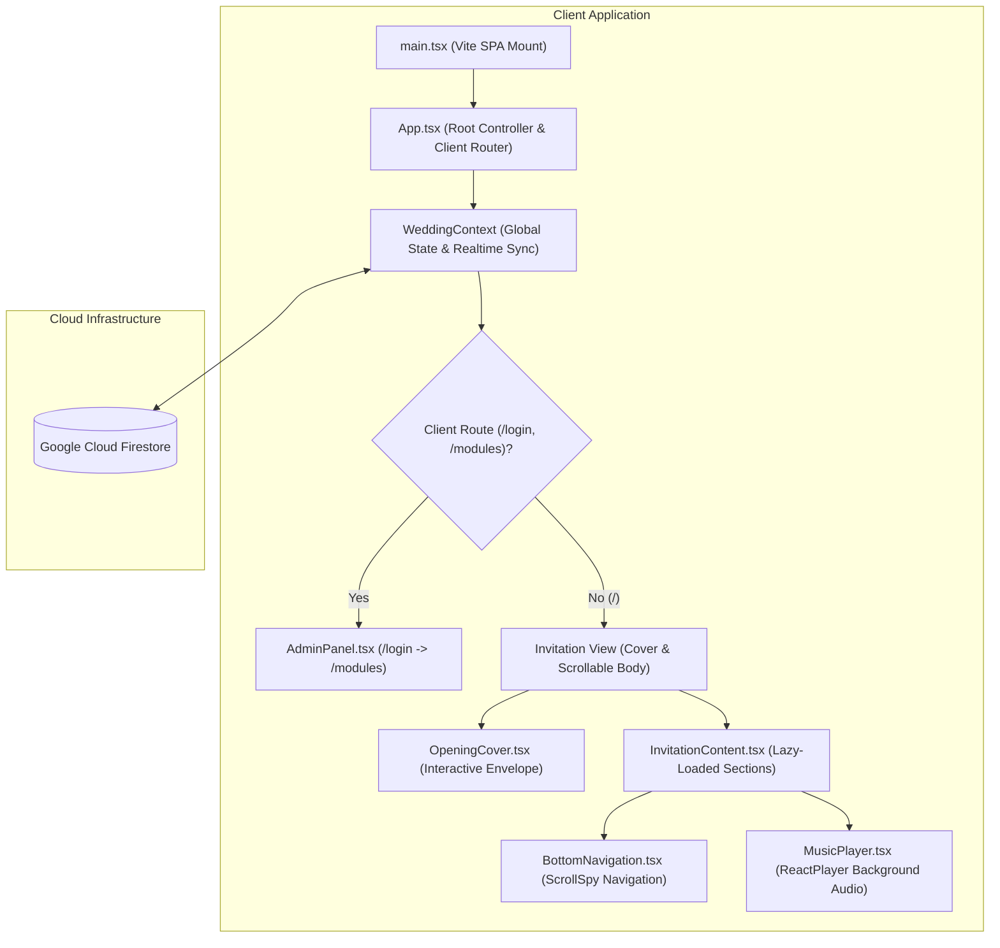
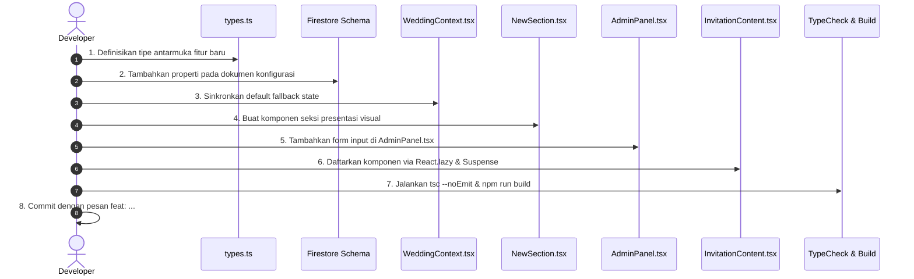

# 🛠️ Panduan Pengembang & Arsitektur Sistem (Developer Guide)

Dokumen ini ditujukan bagi *Software Engineers*, *Code Reviewers*, dan *Maintainers* proyek **app_weddingbetawi_react**. Panduan ini menguraikan arsitektur sistem, hirarki komponen, model data Firestore, prinsip keamanan OWASP, serta standar siklus penambahan fitur baru.

---

## 🏛️ 1. Filosofi & Pola Arsitektur Sistem

Aplikasi dibangun sebagai **Single Page Application (SPA)** berbasis **React 19** dan **TypeScript 5.8** dengan memanfaatkan pola arsitektur terdesentralisasi:



### Prinsip Utama:
1. **Separation of Concerns**: Logika bisnis dan sinkronisasi basis data diisolasi di dalam `WeddingContext.tsx`, sementara komponen seksi hanya bertanggung jawab atas rendering presentasi (*presentational components*).
2. **Performance Below-the-Fold**: Bagian seksi di bawah sampul (*Hero*, *Couple*, *Event*, *Gallery*, *RSVP*, *Wishes*) dimuat secara dinamis menggunakan `React.lazy()` dan `React.Suspense` untuk mempercepat *First Contentful Paint (FCP)* pada jaringan seluler 4G/3G.
3. **Zero Storage Infrastructure**: Media gambar dikompresi di sisi peramban pengguna (*Client-side Canvas Image Compression*) menjadi string Base64 JPEG (kualitas 0.6, resolusi maksimal 1000px) sebelum disimpan langsung ke dokumen Firestore. Pola ini memangkas ketergantungan pada Google Cloud Storage / AWS S3 berbayar.

---

## 📂 2. Peta Struktur Direktori Codebase

```text
app_weddingbetawi_react/
├── docs/                       # Dokumentasi resmi proyek & blueprint skema Firestore
├── public/                     # Aset publik statis (favicon, robots.txt, sitemap.xml, webmanifest)
├── src/
│   ├── modules/                # Arsitektur Modular Berbasis Domain (Lowercase Standard)
│   │   ├── auth/
│   │   │   └── Login.tsx       # Halaman autentikasi panel admin
│   │   ├── backend/
│   │   │   ├── components/     # Komponen sub-modul admin (ThemeSelector, DragDropUpload, dsb.)
│   │   │   └── Panel.tsx       # Dasbor pengelolaan lengkap (Overview, Tamu WA, Konten, RSVP, Doa)
│   │   └── frontend/
│   │       ├── shared/         # Komponen & Seksi domain bersama lintas tema
│   │       │   ├── components/ # BottomNavigation, MusicPlayer, SEO
│   │       │   └── sections/   # Seksi netral (RSVP, Wishes, Countdown, Event, Gallery, dsb.)
│   │       └── themes/         # Multi-Theme Architecture Engine
│   │           ├── betawi/     # Adapter tema Betawi Heritage (OpeningCover, Invitation, decor)
│   │           ├── jawa/       # Adapter tema Javanese Royal Kraton (Gunungan, Pawiwahan, decor)
│   │           ├── sunda/      # Adapter tema Sundanese Parahyangan (Mahkota Siger, Priangan, decor)
│   │           ├── minimalist/ # Adapter tema Modern Botanical Minimalist (Eucalyptus, decor)
│   │           ├── islamic/    # Adapter tema Islamic Arabian Garden (Arabesque Arch, Hilal, decor)
│   │           ├── index.ts    # Centralized Registry (THEMES, resolveTheme, THEME_CATALOG)
│   │           └── types.ts    # ThemeMeta & ThemeDefinition interface contracts
│   ├── context/
│   │   └── WeddingContext.tsx  # Context provider global untuk sinkronisasi data Firestore
│   ├── data/
│   │   └── config.ts           # Nilai default fallback ketika Firestore belum terinisialisasi
│   ├── hooks/
│   │   ├── useGuestName.ts     # Hook ekstraksi & dekode parameter ?to= dari URL
│   │   └── useScrollSpy.ts     # Hook pelacak ID seksi aktif saat pengguna melakukan scrolling
│   ├── lib/
│   │   └── firebase.ts         # Inisialisasi Firebase Client App & Firestore instance
│   ├── utils/
│   │   └── cn.ts               # Utility fungsi penggabung clsx dan twMerge
│   ├── App.tsx                 # Root component aplikasi & router switch
│   ├── index.css               # Styling tema Tailwind CSS v4 (@theme tokens)
│   ├── main.tsx                # Titik masuk aplikasi (DOM root mount)
│   ├── types.ts                # Deklarasi tipe data TypeScript (strict typing)
│   └── vite-env.d.ts           # Deklarasi tipe variabel lingkungan Vite (ImportMetaEnv)
├── .env.example                # Template variabel lingkungan
├── firestore.rules             # Berkas aturan keamanan database Firestore
├── package.json                # Metadata proyek, scripts, dan dependensi
├── tsconfig.json               # Konfigurasi compiler TypeScript
└── vite.config.ts              # Konfigurasi bundler Vite & Tailwind v4 plugin
```

---

## 🗄️ 3. Skema Data & Model Firestore

Sistem menggunakan model NoSQL berbasis dokumen tunggal dan koleksi transaksi terpisah.

> [!TIP]
> **Blueprint Skema Mesin (JSON Schema):**
> Kamus skema data deklaratif dalam format JSON tersedia pada berkas [**`docs/firebase-blueprint.json`**](firebase-blueprint.json) untuk referensi pemetaan koleksi dan dokumen Firestore.

### 1. Dokumen Konfigurasi: `wedding_config/main`
Tipe data didefinisikan secara ketat pada [`src/types.ts`](../src/types.ts):

```typescript
export interface WeddingConfig {
  groom: PersonInfo;
  bride: PersonInfo;
  dateStr: string;
  dateISO: string;
  events: EventsConfig;
  gallery: string[];
  banks?: BankInfo[];
  loveStory: LoveStoryItem[];
  music?: MusicSettings;
  seo?: SEOSettings;
}
```

### 2. Koleksi Konfirmasi Kehadiran: `rsvps`
```typescript
export interface RSVPResponse {
  id?: string;
  name: string;
  attendance: 'hadir' | 'tidak_hadir';
  guestCount: number;
  notes: string;
  createdAt?: Timestamp | Date | { toDate?: () => Date; seconds?: number; nanoseconds?: number } | null;
}
```

### 3. Koleksi Doa & Ucapan: `wishes`
```typescript
export interface Wish {
  id?: string;
  name: string;
  text: string;
  time?: string;
  createdAt?: Timestamp | Date | { toDate?: () => Date; seconds?: number; nanoseconds?: number } | null;
}
```

---

## 🎨 4. Design System & Tema Budaya Betawi (Tailwind v4)

Warna dan token tema dikonfigurasi melalui sintaks `@theme` modern Tailwind CSS v4 di [`src/index.css`](../src/index.css):

```css
@theme {
  /* Palet Warna Khas Budaya Betawi Kontemporer */
  --color-sage: #8DA66B;
  --color-sage-soft: #B6C79A;
  --color-sage-dark: #566B46;
  --color-betawi-red: #B7473F;
  --color-deep-red: #8D3433;
  --color-gold: #D6A840;
  --color-gold-soft: #E6C875;
  --color-blue-accent: #496CA6;
  
  --color-ivory: #F8F5EE;
  --color-warm-white: #FCFAF5;
  --color-light-gray: #EEEEEA;
  --color-text-dark: #292925;
  
  /* Tipografi */
  --font-heading: 'Cormorant Garamond', serif;
  --font-body: 'Plus Jakarta Sans', sans-serif;
}
```

---

## 🔒 5. Standar Keamanan OWASP

Proyek mematuhi prinsip keamanan web modern:

1. **Pencegahan Cross-Site Scripting (XSS)**:
   - Tidak menggunakan `dangerouslySetInnerHTML` di seluruh komponen.
   - Karakter nama tamu dari parameter URL di-*decode* secara aman dan dirender sebagai teks murni oleh React virtual DOM.
2. **Pencegahan Pengindeksan Halaman Admin oleh Mesin Pencari**:
   - Berkas [`public/robots.txt`](../public/robots.txt) memuat aturan `Disallow: /login`, `Disallow: /modules`, dan `Disallow: /admin`.
   - Komponen [`SEO.tsx`](../src/components/SEO.tsx) menyematkan tag `<meta name="robots" content="noindex, nofollow" />` pada rute `/login` dan `/modules`.
3. **Penyembunyian & Proteksi Rute Admin**:
   - Rute admin tidak diekspos melalui tautan publik.
   - Pintu masuk dilindungi gerbang verifikasi passcode (`/login`) dan validasi sesi di peramban (`sessionStorage`) sebelum menampilkan dasbor `/modules`.
4. **Sanitasi Input Firestore**:
   - Fungsi pengiriman data melakukan `.trim()` pada string nama, doa, dan catatan sebelum dikirimkan ke koleksi `rsvps` maupun `wishes`.

---

## 🧼 6. Standar Kerapian Kode (*Clean Code Standards*)

1. **Zero `any` Typing**:
   - Seluruh variabel, antarmuka, dan state wajib memiliki tipe yang eksplisit. Variabel lingkungan diatur melalui [`src/vite-env.d.ts`](../src/vite-env.d.ts).
2. **Zero Native `alert()` / `confirm()`**:
   - Seluruh status operasional harus menggunakan *inline feedback banner*, notifikasi *toast* non-blocking, atau modal dialog kustom untuk tindakan destruktif (seperti hapus data).
3. **No Dead Code**:
   - Dilarang menyimpan file usang, blok kode yang dikomentari, atau `console.log` peninggalan proses debugging.

---

## 🚀 7. Panduan Menambahkan Seksi / Fitur Baru (8 Langkah)

Jika Anda ingin menambahkan seksi baru (misalnya: *Seksi Protokol Kesehatan* atau *Seksi Live Streaming*):



1. **Langkah 1 (Type Definition)**: Tambahkan properti baru di [`src/types.ts`](../src/types.ts) pada antarmuka `WeddingConfig`.
2. **Langkah 2 (Default Data)**: Berikan nilai default pada [`src/data/config.ts`](../src/data/config.ts).
3. **Langkah 3 (Context Sync)**: Pastikan fallback spread operator di [`src/context/WeddingContext.tsx`](../src/context/WeddingContext.tsx) memetakan field baru tersebut.
4. **Langkah 4 (Component Section)**: Buat komponen presentasional baru di dalam folder `src/components/sections/`.
5. **Langkah 5 (Admin Control)**: Tambahkan form input pengeditan di dalam tab Edit Data Website pada [`src/components/admin/AdminPanel.tsx`](../src/components/admin/AdminPanel.tsx).
6. **Langkah 6 (Lazy Mount)**: Daftarkan komponen seksi baru di [`src/components/InvitationContent.tsx`](../src/components/InvitationContent.tsx) menggunakan `React.lazy()`.
7. **Langkah 7 (Kompilasi & Verifikasi)**: Jalankan pengujian compiler dengan `npm run lint` dan `npm run build`.
8. **Langkah 8 (Git Commit)**: Commit pekerjaan Anda menggunakan standar pesan konvensional (`git commit -m "feat: tambah seksi live streaming"`).
