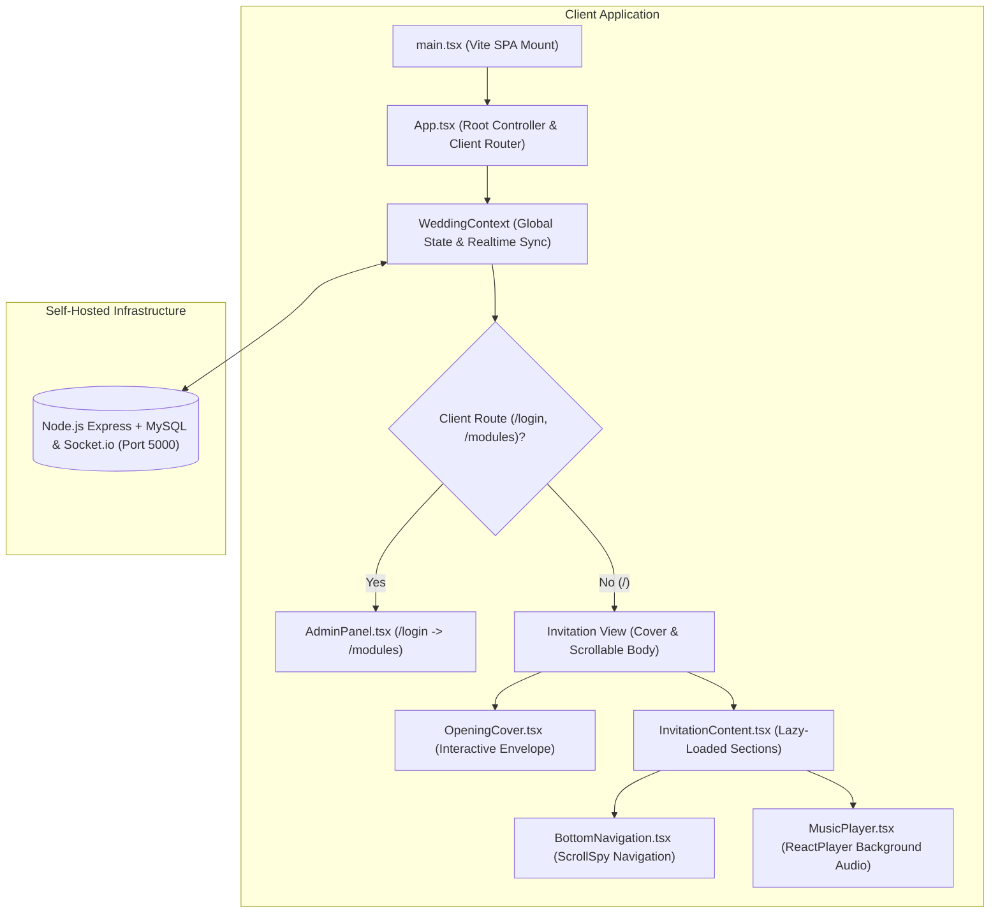
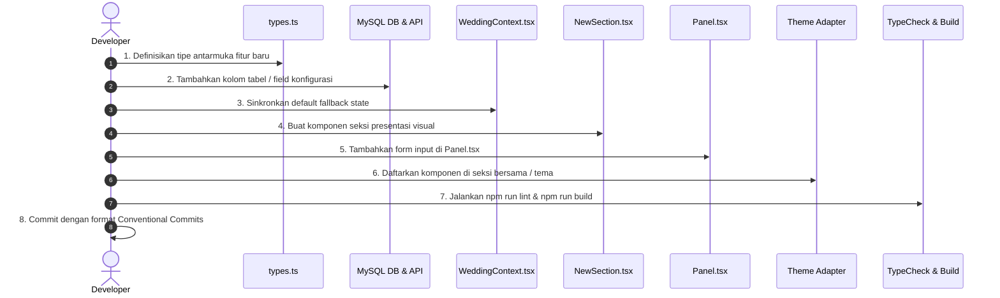

# 🛠️ Panduan Pengembang & Arsitektur Sistem (Developer Guide)

Dokumen ini ditujukan bagi *Software Engineers*, *Code Reviewers*, dan *Maintainers* proyek **Mari Partner Digital Wedding Invitation SPA**. Panduan ini menguraikan arsitektur sistem, hirarki komponen, model data relasional MySQL & REST API, prinsip keamanan OWASP, serta standar siklus penambahan fitur baru.

---

## 🏛️ 1. Filosofi & Pola Arsitektur Sistem

Aplikasi dibangun sebagai **Single Page Application (SPA)** berbasis **React 19** dan **TypeScript 5.8** dengan backend mandiri **Node.js Express + MySQL + Socket.io** memanfaatkan pola arsitektur terdesentralisasi:



### Prinsip Utama:
1. **Separation of Concerns**: Logika bisnis dan sinkronisasi basis data diisolasi di dalam `WeddingContext.tsx` dan `src/services/api.ts`, sementara komponen seksi hanya bertanggung jawab atas rendering presentasi (*presentational components*).
2. **Performance Below-the-Fold**: Bagian seksi di bawah sampul (*Hero*, *Couple*, *Event*, *Gallery*, *RSVP*, *Wishes*) dimuat secara dinamis menggunakan `React.lazy()` dan `React.Suspense` untuk mempercepat *First Contentful Paint (FCP)* pada jaringan seluler 4G/3G.
3. **Penyimpanan Efisien & Pembersihan Disk Otomatis (*Zero Storage Leak*)**: Media foto profil mempelai, banner, dan gambar QRIS yang diunggah dikelola langsung oleh Multer pada backend di folder `server/uploads/` dengan sistem *auto-unlink* pembersihan disk otomatis. Saat foto diganti atau dihapus, file lama otomatis terhapus dari server. Selain itu, fitur photostrip studio dan tiket e-pass diproses 100% di sisi klien menggunakan HTML5 Canvas API dan jsPDF tanpa membebani penyimpanan server.

---

## 📂 2. Peta Struktur Direktori Codebase

```text
app_weddingbetawi_react/
├── docs/                       # Dokumentasi resmi proyek
├── public/                     # Aset publik statis (favicon, robots.txt, sitemap.xml, webmanifest)
│   └── assets/themes/{theme_id}/ # Paket aset luring mandiri (thumbnail.svg, pattern.svg, favicon.svg)
├── server/                     # Backend Node.js Express + MySQL + Socket.io
│   ├── src/
│   │   ├── __tests__/          # Automated Test Suite (Vitest)
│   │   │   ├── api.test.ts     # Pengujian integrasi REST API server
│   │   │   └── whatsappGateway.test.ts # Pengujian unit provider WhatsApp
│   │   ├── db/
│   │   │   ├── index.ts        # Koneksi pool MySQL (mysql2/promise)
│   │   │   ├── migrate.ts      # Skrip DDL migrasi tabel otomatis
│   │   │   └── seed.ts         # Skrip seeder data awal (superadmin & default config)
│   │   ├── middleware/         # Middleware Keamanan & Proteksi
│   │   │   ├── auth.ts         # Verifikasi JWT Bearer Token (7 hari)
│   │   │   └── rateLimiter.ts  # Anti-Spam Sliding Window Rate Limiter
│   │   ├── routes/             # Rute REST API Express
│   │   │   ├── auth.ts         # Login & Ubah Password (bcryptjs)
│   │   │   ├── config.ts       # Wedding Config & Auto-Unlink Disk Cleanup
│   │   │   ├── wishes.ts       # Ucapan & Doa (+ Realtime Socket.io Broadcast)
│   │   │   ├── rsvps.ts        # Konfirmasi Kehadiran Tamu (+ Two-Way WA Alert)
│   │   │   ├── guests.ts       # Manajemen Tamu Undangan
│   │   │   ├── budget.ts       # Pos Anggaran & Vendor Tracker
│   │   │   ├── seating.ts      # Denah Meja & Alokasi Kursi
│   │   │   ├── trivia.ts       # Kuis Interaktif Trivia Tamu
│   │   │   ├── checkins.ts     # Check-in Resepsi Hari-H & Souvenir
│   │   │   ├── upload.ts       # Upload Berkas Multer & Auto-Unlink
│   │   │   └── whatsapp.ts     # Endpoint Uji Coba & Kirim WhatsApp Gateway
│   │   ├── services/           # Logika Bisnis & Gateway Pihak Ketiga
│   │   │   └── whatsappGateway.ts # Provider Registry (Manual, Fonnte, WAHA, Twilio)
│   │   └── index.ts            # Entrypoint server Express & Socket.io (Port 5000)
│   └── uploads/                # Direktori penyimpanan berkas (.gitkeep)
├── src/
│   ├── modules/                # Arsitektur Modular Berbasis Domain (Lowercase Standard)
│   │   ├── auth/
│   │   │   └── Login.tsx       # Halaman autentikasi panel admin (Username & Password)
│   │   ├── backend/
│   │   │   ├── components/     # Komponen sub-modul admin (Budget, Seating, Checkin, Trivia, dll.)
│   │   │   └── Panel.tsx       # Dasbor pengelolaan lengkap & Modal Ganti Password
│   │   └── frontend/
│   │       ├── shared/         # Komponen & Seksi domain bersama lintas tema (100% netral budaya)
│   │       │   ├── components/ # BottomNavigation, MusicPlayer, SEO
│   │       │   └── sections/   # Seksi netral (RSVP, Wishes, Countdown, Event, Gallery, dsb.)
│   │       └── themes/         # Multi-Theme Architecture Engine (35 Tema)
│   │           ├── betawi/     # Adapter tema Betawi Heritage
│   │           ├── jawa/       # Adapter tema Javanese Royal Kraton
│   │           ├── sunda/      # Adapter tema Sundanese Parahyangan
│   │           ├── sunda_maroon/ # Adapter tema Sunda Priangan Maroon & Gold
│   │           ├── ...         # Adapter tema modern (instagram, spotify, netflix, arcade, cyberpunk, dll.)
│   │           ├── catalog.ts  # Katalog meta 35 tema (metadata, warna, fitur, status)
│   │           ├── index.ts    # Centralized Registry (THEMES, resolveTheme, THEME_CATALOG)
│   │           └── types.ts    # ThemeMeta & ThemeDefinition interface contracts
│   ├── context/
│   │   └── WeddingContext.tsx  # Context provider global untuk sinkronisasi state via REST API
│   ├── data/
│   │   └── config.ts           # Nilai default fallback ketika backend belum terhubung
│   ├── hooks/
│   │   ├── useGuestName.ts     # Hook ekstraksi & dekode parameter ?to= dari URL
│   │   └── useScrollSpy.ts     # Hook pelacak ID seksi aktif saat pengguna melakukan scrolling
│   ├── services/
│   │   └── api.ts              # Client SDK REST API terpusat untuk komunikasi backend
│   ├── utils/
│   │   ├── cn.ts               # Utility fungsi penggabung clsx dan twMerge
│   │   └── digitalPassGenerator.ts # Generator tiket PNG HD & PDF via jsPDF (v1.37.0)
│   ├── App.tsx                 # Root component aplikasi & router switch
│   ├── index.css               # Styling tema Tailwind CSS v4 (@theme tokens)
│   ├── main.tsx                # Titik masuk aplikasi (DOM root mount)
│   ├── types.ts                # Deklarasi tipe data TypeScript (strict typing)
│   ├── version.ts              # Single source of truth versi aplikasi (v1.43.0)
│   └── vite-env.d.ts           # Deklarasi tipe variabel lingkungan Vite (ImportMetaEnv)
├── .env.example                # Template variabel lingkungan
├── package.json                # Metadata proyek, scripts, dan dependensi
├── tsconfig.json               # Konfigurasi compiler TypeScript
└── vite.config.ts              # Konfigurasi bundler Vite & Tailwind v4 plugin
```

---

## 🗄️ 3. Skema Basis Data Relasional MySQL & REST API

Sistem menggunakan basis data relasional **MySQL** (kompatibel dengan Laragon / MariaDB) yang dikelola melalui REST API Express dan skrip migrasi otomatis [`server/src/db/migrate.ts`](../server/src/db/migrate.ts).

### A. Tabel Basis Data:

| Nama Tabel | Kolom Utama | Deskripsi |
| :--- | :--- | :--- |
| **`users`** | `id`, `username`, `password`, `role`, `created_at`, `updated_at` | Kredensial login admin dengan kata sandi ter-hash `bcryptjs`. |
| **`wedding_config`** | `id`, `config_data` (LONGTEXT JSON), `updated_at` | Seluruh pengaturan mempelai, tanggal, rekening, galeri, musik, dan SEO. |
| **`wishes`** | `id`, `name`, `text`, `created_at` | Ucapan doa tamu, dibroadcast real-time via Socket.io. |
| **`rsvps`** | `id`, `name`, `phone`, `attendance`, `guest_count`, `notes`, `created_at` | Konfirmasi kehadiran tamu undangan & kontak notifikasi. |
| **`guests`** | `id`, `name`, `phone`, `pax`, `status`, `assigned_table`, `qr_code`, `created_at`, `updated_at` | Buku tamu undangan & generator WhatsApp. |
| **`budget_items`** | `id`, `category`, `name`, `vendor`, `phone`, `estimated_cost`, `actual_cost`, `paid_amount`, `status`, `is_ready`, `created_at`, `updated_at` | Pelacak pos anggaran pernikahan dan kesiapan vendor. |
| **`seating_tables`** | `id`, `table_number`, `table_name`, `zone`, `capacity`, `shape`, `assigned_guests` (JSON), `notes`, `created_at`, `updated_at` | Denah meja & alokasi kursi resepsi. |
| **`trivia_questions`** | `id`, `question`, `options` (JSON), `correct_answer_index`, `explanation`, `created_at`, `updated_at` | Kuis interaktif seputar kedua mempelai. |
| **`checkins`** | `id`, `guest_id`, `guest_name`, `pax`, `souvenir_taken`, `checked_in_at` | Pencatatan kehadiran meja resepsi & pembagian suvenir hari-H. |

### B. Mekanisme Pembersihan Disk Otomatis (*Garbage Collection / Auto-Unlink*):
Untuk menjaga efisiensi penyimpanan server, backend mengimplementasikan fungsi `cleanupUnusedUploads` pada [`server/src/routes/config.ts`](../server/src/routes/config.ts) dan [`server/src/routes/upload.ts`](../server/src/routes/upload.ts):
- Setiap kali foto baru diunggah (misal mengganti foto profil mempelai atau kode QRIS), path file lama diperiksa.
- Jika file lama berada di folder `uploads/` lokal, backend secara otomatis memanggil `fs.promises.unlink()` untuk menghapus berkas fisik lama dari disk server.
- Folder `server/uploads/` dilindungi oleh `.gitignore` sehingga berkas unggahan pengguna tidak akan terdorong ke repositori Git publik, sementara struktur folder dijaga melalui berkas `server/uploads/.gitkeep`.

---

## 🎨 4. Design System, Theme Tokens & Visual Engine (Tailwind v4)

### A. Semantic Theme Tokens & Styling Tailwind v4
Warna dan token tema dikonfigurasi melalui sintaks `@theme` modern Tailwind CSS v4 di [`src/index.css`](../src/index.css) dan dipetakan ke runtime melalui `ThemeVisualTokens` (`ThemeProvider`):

```css
@theme {
  /* Palet Warna Khas Budaya Kontemporer */
  --color-sage: #8DA66B;
  --color-sage-soft: #B6C79A;
  --color-sage-dark: #566B46;
  --color-betawi-red: #B7473F;
  --color-deep-red: #8D3433;
  --color-gold: #D6A840;
  --color-gold-soft: #E6C875;
  --color-blue-accent: #496CA6;
  
  --color-ivory: #F8F5EE;
  --color-warm-white: #FCFAF5;
  --color-light-gray: #EEEEEA;
  --color-text-dark: #292925;
  
  /* Tipografi */
  --font-heading: 'Cormorant Garamond', serif;
  --font-body: 'Plus Jakarta Sans', sans-serif;
}
```

### B. Arsitektur Virtual Photo Booth & Dynamic Viewport Handling (v1.43.0)
Untuk memastikan seluruh antarmuka interaktif bekerja sempurna pada perangkat seluler tanpa ada tombol yang terpotong (*zero button cutoff*), komponen [`PhotoBoothModal.tsx`](../src/modules/frontend/shared/components/PhotoBoothModal.tsx) menerapkan prinsip:
1. **Dynamic Viewport Units (`100dvh`)**: Kontainer modal menggunakan `fixed inset-0 w-screen h-[100dvh] max-h-[100dvh]` guna mengantisipasi perubahan ukuran viewport dinamis saat *address bar* atau *navigation bar* pada peramban seluler (iOS Safari & Android Chrome) muncul/hilang.
2. **Sticky Bottom Action Bar**: Seluruh tombol tindakan (Mulai, Shutter, Lanjut, dan Unduh PNG) diisolasi di luar elemen *scrollable body* (`flex-1 overflow-y-auto min-h-0`) dan ditempatkan pada baris aksi bawah permanen (`shrink-0 backdrop-blur-md pb-[calc(env(safe-area-inset-bottom,0px)+0.75rem)]`).
3. **Adaptive Camera Viewfinder**: Tinggi kontainer kamera dibatasi (`max-h-[36vh] xs:max-h-[40vh] md:max-h-[340px]`) dan thumbnail pose dibuat kompak (`12x12` / `14x14`) agar seluruh tahapan foto studio muat dalam satu layar tanpa perlu scroll vertikal.
4. **Client-Side Canvas Image Synthesis**: Seluruh layout 3-pose strip maupun single polaroid disintesis murni di sisi peramban pengguna menggunakan HTML5 Canvas API dengan resolusi HD (600x1800 px / 800x1000 px) dengan filter warna (*Natural*, *B&W Vintage*, *Sepia Retro*, *Warm Glow*) tanpa membebani penyimpanan server.

---

## 🔒 5. Standar Keamanan OWASP

Proyek mematuhi prinsip keamanan web modern:

1. **Pencegahan Cross-Site Scripting (XSS)**:
   - Tidak menggunakan `dangerouslySetInnerHTML` di seluruh komponen.
   - Karakter nama tamu dari parameter URL di-*decode* secara aman dan dirender sebagai teks murni oleh React virtual DOM.
2. **Pencegahan Pengindeksan Halaman Admin oleh Mesin Pencari**:
   - Berkas [`public/robots.txt`](../public/robots.txt) memuat aturan `Disallow: /login`, `Disallow: /modules`, dan `Disallow: /admin`.
   - Komponen [`SEO.tsx`](../src/modules/frontend/shared/components/SEO.tsx) menyematkan tag `<meta name="robots" content="noindex, nofollow" />` pada rute `/login` dan `/modules`.
3. **Penyembunyian & Proteksi Rute Admin**:
   - Rute admin dilindungi autentikasi pengguna (`superadmin`) dengan hashing `bcryptjs` berbasis basis data MySQL (`users`).
   - Sesi login diverifikasi melalui token dan disimpan di peramban (`localStorage`), dengan proteksi akses rute `/modules`.
4. **Sanitasi Input & Prepared Statements MySQL**:
   - Seluruh kueri basis data pada REST API Node.js Express menggunakan *parameterized queries* / *prepared statements* (`mysql2/promise`) untuk mencegah SQL Injection (SQLi).
   - Seluruh input teks tamu di-`.trim()` dan divalidasi sebelum disimpan ke basis data.

---

## 🎭 6. Arsitektur Multi-Tema & Protokol Aset Luring (AGENTS.md Pilar 2)

Proyek mengadopsi arsitektur multi-tema modular terstandarisasi dengan **35 tema** (21 siap pakai dan 14 segera hadir):

### A. Kontrak Interface Tema (`src/modules/frontend/themes/types.ts`)
```typescript
export interface ThemeMeta {
  id: string;
  name: string;
  category: 'adat' | 'modern' | 'islami';
  subtitle: string;
  description: string;
  thumbnail: string;
  previewColors: ThemeColors;
  features: string[];
  status: 'ready' | 'coming_soon';
  favicon?: string;
}
```

### B. Lifecycle Status Tema (`ready` vs `coming_soon`)
- **`status: 'ready'`**: Tema memiliki adapter lengkap (`OpeningCover`, `InvitationContent`, `AppFrame`, dekorasi partikel melayang) dan dapat diaktifkan oleh pengantin via tombol **"Aktifkan Tema"** di Admin Panel atau diakses via query parameter `?theme={id}`.
- **`status: 'coming_soon'`**: Tema berstatus kurasi masa depan. Pada UI `ThemeSelector.tsx`, kartu tema menampilkan badge `<Clock /> Segera Hadir`, tombol aktivasi dinonaktifkan (`disabled`), dan tautan live demo disembunyikan untuk menjaga ekspektasi pengguna.

### C. Standar Paket Aset Default Luring Tema (Pilar 2 Rule 7)
Setiap tema pada `THEME_CATALOG` (`src/modules/frontend/themes/catalog.ts`) **WAJIB** menyediakan paket aset lokal mandiri di `public/assets/themes/{theme_id}/`:
- `thumbnail.svg` (Ukuran viewBox `400x250`, ilustrasi motif khas budaya/modern, palet warna, nama, dan subtitle).
- `pattern.svg` (Ukuran viewBox `60x60`, pola seamless tile budaya).
- `favicon.svg` (Ukuran viewBox `64x64`, ikon monogram bulat).
- **Invarian Nol Dependensi**: DILARANG mengandalkan CDN pihak ketiga untuk aset visual tema agar aplikasi tetap dapat diakses secara luring (*zero external network download*).

### D. Invarian Netralitas Budaya pada Layer Bersama (Pilar 2 Rule 6)
Direktori `src/modules/frontend/shared/` mengisolasi komponen bersama (`BottomNavigation`, `MusicPlayer`, `SEO`) dan seksi domain bersama (`RSVP`, `Wishes`, `Countdown`, `Event`, `Gallery`, `Location`, `LoveStory`, `WeddingGift`). Seluruh berkas pada layer ini **WAJIB 100% netral budaya** (*culturally agnostic*) tanpa mengimpor ornamen adat spesifik.

### E. Arsitektur Audio Multi-Track & Smart Auto-Ducking (v1.45.0)
- **Komunikasi Terisolasi Event Bus**: Pemutaran musik latar (`MusicPlayer.tsx`) dan pesan suara/audio doa (`WishAudioPlayer.tsx`) saling terisolasi tanpa *tight coupling* melalui CustomEvent `window.dispatchEvent(new CustomEvent('wedding:voice-memo-play', { detail: { isPlaying } }))`.
- **Auto-Ducking**: Saat pesan suara diputar, volume latar turun otomatis ke 15% dan kembali ke volume pengguna setelah pesan suara selesai atau dijeda.
- **Floating Audio Studio Card**: Menyediakan visualisasi piringan hitam, marquee judul lagu, equalizer animasi, slider volume 0-100%, mute toggle, navigasi Prev/Next, serta laci daftar putar multi-track.
### F. Export & Reporting Suite untuk Wedding Organizer (v1.48.0)
- **Client-Side Synthesis (Zero Server Overhead)**: Pembuatan berkas Excel (`.xlsx`) dan PDF (`.pdf`) berjalan 100% di browser klien menggunakan pustaka `xlsx` dan `jspdf` tanpa beban komputasi server.
- **Master Workbook Excel Multi-Sheet**:
  - `Sheet 1: Ringkasan Eksekutif`: Rekap statistik kehadiran, total pax, keterisian meja, dan realisasi anggaran vs estimasi.
  - `Sheet 2: Daftar Tamu & Kehadiran`: Nomor WA, status pengiriman, status konfirmasi RSVP, plot meja, dan check-in fisik.
  - `Sheet 3: Susunan Meja (WO)`: Nomor meja, zona penempatan, kapasitas, pax terisi, dan daftar tamu terplot.
  - `Sheet 4: Rincian Anggaran & Vendor`: Kategori pos, nama vendor, kontak, biaya aktual, terbayar, dan sisa.
- **Dokumen Print-Ready PDF Berstandar WO**:
  - Layout A4 standar dengan kop resmi nama kedua mempelai, tanggal acara, styling emas/slate elegan, penomoran halaman otomatis (*Halaman X dari Y*), serta auto-wrap teks dan auto-pagination.
- **Komponen Modular**:
  - [`src/utils/reportExporter.ts`](../src/utils/reportExporter.ts): Engine sintesis data Excel & PDF.
  - [`src/modules/backend/components/ExportReportModal.tsx`](../src/modules/backend/components/ExportReportModal.tsx): Antarmuka Pusat Laporan & Ekspor 1-klik di panel admin.

---

## 🧼 7. Standar Kerapian Kode (*Clean Code Standards*)

1. **Zero `any` Typing**:
   - Seluruh variabel, antarmuka, dan state wajib memiliki tipe yang eksplisit. Variabel lingkungan diatur melalui [`src/vite-env.d.ts`](../src/vite-env.d.ts).
2. **Zero Native `alert()` / `confirm()`**:
   - Seluruh status operasional harus menggunakan *inline feedback banner*, notifikasi *toast* non-blocking, atau modal dialog kustom untuk tindakan destruktif (seperti hapus data).
3. **No Dead Code**:
   - Dilarang menyimpan file usang, blok kode yang dikomentari, atau `console.log` peninggalan proses debugging.

---

## 🚀 8. Panduan Menambahkan Seksi / Fitur Baru (8 Langkah)

Jika Anda ingin menambahkan seksi baru (misalnya: *Seksi Protokol Kesehatan* atau *Seksi Live Streaming*):



1. **Langkah 1 (Type Definition)**: Tambahkan properti baru di [`src/types.ts`](../src/types.ts) pada antarmuka `WeddingConfig`.
2. **Langkah 2 (Default Data)**: Berikan nilai default pada [`src/data/config.ts`](../src/data/config.ts).
3. **Langkah 3 (Context Sync)**: Pastikan fallback spread operator di [`src/context/WeddingContext.tsx`](../src/context/WeddingContext.tsx) memetakan field baru tersebut.
4. **Langkah 4 (Component Section)**: Buat komponen presentasional baru di dalam folder `src/modules/frontend/shared/sections/`.
5. **Langkah 5 (Admin Control)**: Tambahkan form input pengeditan di dalam tab Edit Data Website pada [`src/modules/backend/Panel.tsx`](../src/modules/backend/Panel.tsx).
6. **Langkah 6 (Lazy Mount)**: Daftarkan komponen seksi baru di adapter tema (`src/modules/frontend/themes/{id}/InvitationContent.tsx`) menggunakan `React.lazy()`.
7. **Langkah 7 (Kompilasi & Verifikasi)**: Jalankan pengujian compiler dengan `npm run lint` dan `npm run build`.
8. **Langkah 8 (Git Commit)**: Commit pekerjaan Anda menggunakan standar pesan konvensional (`git commit -m "feat(module): deskripsi perubahan"`).

---

## 🔐 9. Manajemen Kunci Rahasia & Environment Variables

Proyek ini mewajibkan seluruh pengembang untuk menjaga konsistensi berkas `.env` dan `.env.example`:

1. **Konsistensi Mutlak**: Setiap kali ada penambahan variabel lingkungan baru di backend maupun frontend, variabel tersebut wajib dicatatkan di `.env.example` dengan format dan penamaan yang identik.
2. **Generator Otomatis `JWT_SECRET`**:
   Untuk menghasilkan kunci rahasia berkekuatan kriptografi tinggi tanpa bergantung pada pustaka eksternal, gunakan perintah resmi:
   ```bash
   npm run secret:generate
   ```
   Perintah ini memanfaatkan modul native Node.js `crypto.randomBytes(32)` untuk memproduksi 64 karakter string heksadesimal acak.
3. **Pemberian Nilai di Server Produksi**: Pada server deployment (VPS / aaPanel), salin output dari `npm run secret:generate` ke dalam konfigurasi `JWT_SECRET` pada berkas `.env` produksi.

---

## 🛡️ 10. Arsitektur Keamanan REST API & Rate Limiting

Aplikasi menerapkan pengamanan berlapis pada seluruh antarmuka REST API:

1. **JWT Bearer Token Middleware (`server/src/middleware/auth.ts`)**:
   - Seluruh mutasi konfigurasi dan endpoint manajemen dilindungi oleh middleware `authenticateJwt`.
   - Token ditandatangani saat login (`POST /api/auth/login`) dengan masa berlaku 7 hari dan divalidasi menggunakan rahasia `JWT_SECRET`.
   - Sisi klien (`src/services/api.ts`) otomatis menyertakan token dari `sessionStorage` dan menangani error 401 dengan auto-logout serta event global `auth:unauthorized`.
2. **Anti-Spam Sliding Window Rate Limiter (`server/src/middleware/rateLimiter.ts`)**:
   - Endpoint publik penerima formulir (`POST /api/wishes` dan `POST /api/rsvps`) dibatasi maksimum 2 permintaan per 60 detik per IP.
   - Endpoint login admin (`POST /api/auth/login`) dibatasi maksimum 5 permintaan per 5 menit per IP.
   - Menggunakan algoritma in-memory sliding window dengan pembersihan berkala dan deteksi IP pengunjung di balik reverse proxy (`x-forwarded-for`).
3. **Optimasi Beban Data & Paginasi Doa**:
   - Kueri `GET /api/wishes` dibatasi default `LIMIT 50` dengan dukungan `offset` untuk paginasi inkremental di sisi klien, mencegah penurunan performa rendering DOM browser saat jumlah ucapan doa bertambah banyak. Mode `?all=true` tetap didukung untuk Dasbor Admin dan Layar Panggung Proyektor (`/live`).

---

## 📲 11. Arsitektur WhatsApp Gateway Multi-Provider & Two-Way RSVP Engine (v1.57.0)

Untuk memfasilitasi pengiriman undangan secara masif dan interaktivitas status konfirmasi kehadiran secara otomatis, sistem menerapkan arsitektur WhatsApp modular:

### A. Provider Pattern & Kontrak Antarmuka (`server/src/services/whatsappGateway.ts`)
```typescript
export type WhatsAppGatewayProvider = 'manual' | 'fonnte' | 'waha' | 'twilio';

export interface SendMessageResult {
  success: boolean;
  provider: string;
  messageId?: string;
  error?: string;
  details?: unknown;
}

export interface IWhatsAppProvider {
  readonly name: string;
  sendMessage(to: string, message: string, config: WhatsAppGatewayConfig): Promise<SendMessageResult>;
}
```

- **Registri Provider Modular (`providerRegistry`)**:
  - `ManualProvider`: Fallback standar tanpa biaya. Mengembalikan status sukses instan untuk memicu link `https://wa.me/...`.
  - `FonnteProvider`: Menggunakan endpoint `https://api.fonnte.com/send` dengan header `Authorization: token` dan payload form-encoded.
  - `WahaProvider`: Menggunakan endpoint `/api/sendText` server WAHA (WhatsApp HTTP API) dengan JSON body `{ session, chatId, text }` dan header `X-Api-Key`.
  - `TwilioProvider`: Menggunakan API Twilio Messages via Basic Auth (`AccountSid:AuthToken`) dengan format nomor `whatsapp:+62...`.
- **Normalisasi Nomor Telepon (`cleanPhoneNumber`)**:
  - Mengonversi format lokal (`0812...` atau `812...`) maupun internasional bersimbol (`+62 812-...`) menjadi nomor standar internasional murni digit tanpa simbol (`62812...`).

### B. Two-Way RSVP Automated Notification Engine (`server/src/routes/rsvps.ts`)
Saat tamu mengirimkan formulir konfirmasi kehadiran (`POST /api/rsvps`):
1. Data disimpan ke MySQL dengan kolom baru `phone`.
2. Response HTTP 201 segera dikembalikan ke tamu (*0ms lag*).
3. Di latar belakang (*fire-and-forget async worker*):
   - **Alert ke Admin**: Jika `notifyAdminOnRsvp: true` dan `adminPhone` terisi, sistem mengirimkan rincian nama tamu, status kehadiran (`hadir`/`tidak_hadir`), jumlah rombongan (*pax*), dan doa restu.
   - **Konfirmasi Otomatis ke Tamu**: Jika `notifyGuestOnRsvp: true` dan tamu menyertakan nomor teleponnya, sistem mengirimkan pesan terima kasih personal lengkap dengan link kartu undangan personal dan akses tiket digital QR pass tamu.

### C. Automated Test Suite (Vitest - 14 Test Cases)
Pengujian unit pada [`server/src/__tests__/whatsappGateway.test.ts`](../server/src/__tests__/whatsappGateway.test.ts) mencakup:
- Normalisasi format nomor telepon (`cleanPhoneNumber`).
- Eksekusi instan fallback mode `manual`.
- Validasi kredensial kosong per-provider (Fonnte token, WAHA endpoint, Twilio Account SID/token/from).
- Penolakan nomor tujuan tidak valid atau terlalu pendek.
- Mocked network API calls untuk Fonnte, WAHA, dan Twilio.
- Fungsi ping uji konektivitas gateway (`testWhatsAppGateway`).

