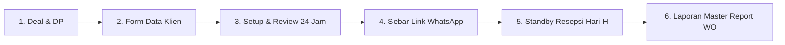

# 💼 Panduan Bisnis Kemitraan, Strategi Penjualan & Sales Playbook

Dokumen ini adalah **buku panduan komersialisasi dan kemitraan resmi** untuk memasarkan dan menjual platform **Mari Partner Digital Wedding Invitation SPA** ke industri pernikahan (khususnya *Wedding Organizer*, vendor pernikahan, dan calon pengantin kelas menengah-atas).

---

## 📑 Daftar Isi
1. [Audit Kesiapan Production & Nilai Jual Komersial](#1-audit-kesiapan-production--nilai-jual-komersial)
2. [5 Fitur Pembeda "Luxury & Ultra-Premium" (Next-Level Upgrades)](#2-5-fitur-pembeda-luxury--ultra-premium-next-level-upgrades)
3. [Peta Target Pasar & Ekosistem Mitra (B2B vs B2C)](#3-peta-target-pasar--ekosistem-mitra-b2b-vs-b2c)
4. [Taktik Pencarian Prospek WO (Google Maps, Instagram & Bridestory)](#4-taktik-pencarian-prospek-wo-google-maps-instagram--bridestory)
5. [Skrip Copywriting Pendekatan Awal (Cold Outreach WhatsApp & DM)](#5-skrip-copywriting-pendekatan-awal-cold-outreach-whatsapp--dm)
6. [Skema Harga & Model Kemitraan Bagi Hasil (Pricing Strategy)](#6-skema-harga--model-kemitraan-bagi-hasil-pricing-strategy)
7. [Objection Handling Playbook (Trik Menjawab Pertanyaan Kritis WO)](#7-objection-handling-playbook-trik-menjawab-pertanyaan-kritis-wo)
8. [SOP Operasional Pelayanan Proyek (Dari Deal Hingga Hari-H)](#8-sop-operasional-pelayanan-proyek-dari-deal-hingga-hari-h)

---

## 1. Audit Kesiapan Production & Nilai Jual Komersial

### ⚖️ Apakah Aplikasi Ini Sudah Siap Production?
**JAWABAN: YA, 100% SUDAH SANGAT SIAP (PRODUCTION-GRADE).**

Bahkan, secara arsitektur teknis, platform ini berada **jauh di atas rata-rata undangan digital pasaran** di Indonesia yang mayoritas masih menggunakan WordPress/Elementor lambat atau template Canva statis.

### 💎 Keunggulan Kompetitif Dibandingkan Kompetitor Pasaran:
| Aspek | Undangan WordPress / Template Biasa | Platform Mari Partner (React 19 SPA) | Dampak Penjualan ke WO |
| :--- | :--- | :--- | :--- |
| **Kecepatan Buka (Load Time)** | 4 - 8 detik (banyak plugin berat, sering blank) | **< 0.8 detik** (Instant SPA, bundling Vite terkompresi) | Tamu tidak kesal, impresi pertama sangat mewah & modern. |
| **Beban Server Saat Hari-H** | Sering *502 Bad Gateway* jika dibuka 500 tamu serentak | **Tahan ribuan koneksi konkuren** (Node.js event-driven + REST API) | **Garansi Zero Down Time** di depan Wedding Organizer. |
| **Buku Tamu & Layar Resepsi** | Harus refresh browser manual untuk melihat ucapan baru | **Realtime Socket.io** (Doa langsung muncul di layar proyektor panggung) | Nilai jual interaktif panggung yang sangat disukai pengantin. |
| **Penyimpanan Gambar** | Server lelet karena foto ukuran 10MB langsung diunggah | **Kompresi Canvas Otomatis (max 1400px)** + Auto-Unlink file lama | Hemat bandwidth 95%, disk server bersih tanpa tagihan bengkak. |
| **Perangkat WO** | WO harus rekap manual RSVP dari WhatsApp / Google Form | **WO Export Suite Otomatis** (Download Excel 4-Sheet & PDF A4 sekali klik) | **Menyelesaikan pusingnya WO** saat rekap tamu dan meja. |
| **Audio Player** | Musik langsung menabrak suara lain di HP | **Smart Auto-Ducking**: Musik otomatis mengecil saat voice memo doa diputar | Standar audio kelas studio rekaman (*Audiophile Grade*). |

---

## 2. 5 Fitur Pembeda "Luxury & Ultra-Premium" (Next-Level Upgrades)

Untuk menaikkan harga jual dari kelas menengah (Rp 150.000 - Rp 300.000) menjadi kelas **Sultan / Ultra-Luxury (Rp 750.000 - Rp 2.500.000 per acara)**, berikut 5 rekomendasi fitur bernilai tinggi yang bisa ditambahkan bertahap:

### 🌟 1. Dual-Language Switcher (Bilingual: ID ⇄ EN)
- **Mengapa Penting**: Pernikahan kalangan jetset, ekspatriat, atau keluarga terpandang hampir selalu mengundang kolega internasional atau relasi kerja asing.
- **Implementasi**: Tombol pill elegan di sudut atas: `[ ID | EN ]` yang langsung menerjemahkan istilah adat, sapaan hormat, countdown, form RSVP, dan petunjuk lokasi secara instan tanpa reload halaman.

### 🌟 2. VIP Guest Tiering & Dedicated QR Access Pass
- **Mengapa Penting**: Pengantin ingin memperlakukan tamu penting (Keluarga Inti, Pejabat, Tamu VVIP) secara berbeda dari tamu reguler.
- **Implementasi**:
  - Penanda badge khusus: `[ ✨ VVIP GUEST ]` pada kartu pembuka tamu bersangkutan.
  - Alokasi akses khusus: Akses Ruang VIP / Meja Prioritas Baris Depan.
  - Penanda souvenir khusus (*Exclusive Hampers Token*).

### 🌟 3. Digital Souvenir & Photobooth Redemption Tracker
- **Mengapa Penting**: Mencegah tamu mengambil souvenir dobel atau tamu titipan yang tidak sah.
- **Implementasi**: 
  - Pada halaman check-in scanner admin/petugas WO, terdapat tombol: `[ Berikan Souvenir ]`.
  - Sekali di-tap, status berubah menjadi `Sudah Diambil (Pukul 19:45 WIB oleh Meja Resepsi 1)`.

### 🌟 4. White-Label Branding untuk Wedding Organizer (Agensi Mode)
- **Mengapa Penting**: WO ternama tidak mau ada tulisan "Powered by Vendor Lain". Mereka ingin terlihat memiliki teknologi in-house sendiri.
- **Implementasi**:
  - Di footer atau panel admin, logo Mari Partner dapat diganti dengan logo resmi WO (`Co-Branded` atau `100% White-Label WO Name`).
  - Domain kustom pengantin: `undangan.namapengantin.com` atau subdomain WO: `klien.namaluxurywo.com`.

### 🌟 5. Live Wedding Rundown & Status Broadcast (Hari-H Notifier)
- **Mengapa Penting**: Tamu sering bingung apakah acara akad sudah selesai atau resepsi sudah dibuka prasmanannya.
- **Implementasi**:
  - Banner dinamis beranimasi halus di bagian atas undangan: *"Sedang Berlangsung: Sesi Foto Keluarga & Ramah Tamah"* yang diubah realtime oleh tim WO dari Admin Panel HP.

---

## 3. Peta Target Pasar & Ekosistem Mitra (B2B vs B2C)

Jangan hanya menjual satu per satu ke calon pengantin (*B2C Direct*) karena Anda harus terus mencari pelanggan baru setiap minggu. **Fokuslah 80% pada Kemitraan B2B (Vendor & WO)**. Sekali bermitra dengan 1 WO aktif, Anda akan mendapatkan 20 hingga 50 pesanan pengantin secara otomatis sepanjang tahun!

```text
┌─────────────────────────────────────────────────────────────────────────────────┐
│                          EKOSISTEM KEMITRAAN B2B                                │
├──────────────────────────┬──────────────────────────┬───────────────────────────┤
│ 1. Wedding Organizer (WO)│ 2. Venue & Ballroom      │ 3. Fotografer & MUA       │
│ • Mitra Utama (#1)       │ • Hotel Bintang 4/5      │ • Bundling paket album    │
│ • Butuh sistem rekap tamu│ • Gedung Pernikahan      │ • Butuh showcase foto     │
│ • Butuh QR Check-in meja │ • Butuh estimasi pax     │ • Berbagi komisi klien    │
└──────────────────────────┴──────────────────────────┴───────────────────────────┘
```

### 1. Wedding Organizer (WO) & Event Planner (Prioritas #1)
- **Alasan**: WO adalah pihak yang paling pusing mengurus daftar hadir tamu, susunan meja resepsi, dan RSVP. Platform Anda memecahkan beban kerja fisik mereka dengan fitur **Master Export Excel & Scanner QR**.
- **Target Ideal**: WO dengan 15-60 event per tahun (skala menengah ke atas).

### 2. Wedding Photographer & Videographer Studio
- **Alasan**: Undangan digital Anda memiliki seksi galeri foto prewedding interaktif dan pemutar video YouTube/Mux. Fotografer sangat bangga jika karya foto mereka ditampilkan di platform sekelas ini.
- **Bentuk Kemitraan**: Fotografer menjual paket *"Prewedding + Undangan Digital Luxury SPA"* sebagai paket bundling.

### 3. Gedung / Hotel / Ballroom Wedding Sales
- **Alasan**: Sales banquet hotel selalu memberikan bonus/rekomendasi vendor rekanan kepada calon pengantin yang mem-booking ballroom mereka.

---

## 4. Taktik Pencarian Prospek WO (Google Maps, Instagram & Bridestory)

Berikut adalah taktik praktis *Lead Generation* harian untuk mengumpulkan 50 - 100 kontak pemilik/lead WO berkualitas tinggi per minggu:

### 📍 Taktik 1: Google Maps Sourcing (Database Kontak Tercepat)
1. **Langkah 1**: Buka Google Maps pada browser Anda.
2. **Langkah 2**: Ketik kata kunci spesifik per wilayah target:
   - `Wedding Organizer Jakarta Selatan`
   - `Wedding Planner Surabaya Barat`
   - `Wedding Organizer Bandung`
   - `Bridal Organizer Medan`
   - `Wedding Planner Semarang / Solo / Jogja / Bali`
3. **Langkah 3: Saring Kualitas (Filter Kriteria)**:
   - Pilih yang memiliki rating **4.7 ke atas** dengan jumlah ulasan minimal 15-20 ulasan.
   - Buka profilnya: Cari nomor handphone/WhatsApp bisnis dan link akun Instagram mereka.
4. **Langkah 4: Masukkan ke Spreadsheet Prospek**:
   - Catat: `Nama WO`, `Nama Pemilik/PIC (jika ada)`, `Nomor WA`, `Username IG`, `Kota`, `Status Outreach`.

### 📸 Taktik 2: Instagram Reconnaissance (Visual & Portofolio)
1. **Langkah 1**: Cari via hashtag:
   - `#weddingorganizerjakarta`, `#jakartaweddingplanner`, `#wobandung`, `#wosurabaya`, `#weddingplannermedan`.
2. **Langkah 2**: Kunjungi profil WO yang memiliki feed estetis, rapi, dan aktif mengunggah *Story* resepsi terbaru dalam 7 hari terakhir (tanda bahwa WO tersebut sedang banjir klien).
3. **Langkah 3**: Buka tautan di bio mereka (biasanya ada tautan `linktr.ee` atau nomor kontak langsung ke *"Kak Sari - Marketing/Owner"*). Simpan nama kontak tersebut agar pesan sapaan Anda personal.

### 💍 Taktik 3: Direktori Resmi Bridestory & Weddingku
1. Buka situs [Bridestory.com](https://www.bridestory.com) atau [Weddingku.com](https://www.weddingku.com).
2. Masuk ke menu **Vendors** ➡️ Pilih kategori **Wedding Planning & Ceremony**.
3. Filter berdasarkan kota target (misal: Jabodetabek / Surabaya / Bali).
4. Di sini Anda mendapatkan daftar ratusan WO berlisensi resmi lengkap dengan portofolio rentang harga klien mereka (apakah budget Rp 50jt, Rp 100-250jt, atau Luxury > Rp 500jt).

### 🎪 Taktik 4: Kunjungan Langsung Pameran Pernikahan (Wedding Expo)
1. Cek jadwal pameran pernikahan terdekat di kota Anda (misal: *Bridestory Market*, *Wedding Celebration Festival* di ICE BSD / JCC / Grand City Surabaya).
2. Masuk sebagai pengunjung: Datangi booth-booth Wedding Organizer.
3. Berkenalan langsung dengan owner atau marketing manager di tempat, tukarkan kartu nama fisik, dan tawarkan demo interaktif langsung di layar tablet/iPad Anda.

---

## 5. Skrip Copywriting Pendekatan Awal (Cold Outreach WhatsApp & DM)

> [!IMPORTANT]
> **Aturan Emas Pendekatan B2B**:
> Dilarang mengirim broadcast kaku seperti robot/spam. Gunakan pendekatan **apresiatif, santun, personal, dan fokus pada keuntungan yang didapatkan WO (Bukan sekadar memamerkan fitur Anda)**.

---

### 📱 Template 1: WhatsApp B2B Partnership (Rekomendasi Utama)
Gunakan skrip ini untuk nomor WhatsApp PIC/Owner WO yang didapatkan dari Google Maps / Instagram:

```text
Halo selamat pagi/siang Kak [Nama PIC / Tim Nama WO], salam kenal saya [Nama Anda] dari Mari Partner Digital.

Sebelumnya selamat atas suksesnya event pernikahan klien Kakak yang di [Sebutkan nama venue/gedung terakhir dari postingan IG mereka, contoh: Glass House / Hotel Mulia] kemarin, konsep dekorasinya sangat elegan dan rapi sekali! 🙌

Melihat standar kualitas event yang Kakak tangani sangat berkelas, izinkan kami bersilaturahmi singkat.

Kami di Mari Partner mengembangkan teknologi Luxury Wedding Invitation SPA (Single Page Application) yang dilengkapi sistem otomatisasi khusus untuk membantu tim WO di lapangan:

1. Rekap Data Tamu & Meja Resepsi Otomatis (Ekspor Master Excel 4-Sheet & Dokumen WO PDF dalam 1 klik, tanpa perlu tim Kakak rekap manual lagi).
2. QR Code Fast Check-in System di meja resepsi (Scan 0.5 detik via HP, anti-antre panjang).
3. Live Wishes Projector (Ucapan doa tamu muncul realtime langsung di layar LED panggung resepsi).
4. Server Tahan Beban (Zero down-time, loading di bawah 1 detik tanpa lemot saat dibuka ratusan tamu bersamaan).

Kami sangat terbuka untuk menjalin kerja sama kemitraan/vendor rekanan resmi dengan [Nama WO], baik dengan sistem komisi profit-sharing yang menarik (30-40% per klien) atau paket bundling khusus klien Kakak.

Berikut contoh demo live interaktif yang bisa Kakak coba langsung di smartphone:
👉 [Masukkan Link Demo Anda, contoh: https://undangan.domainanda.com/?to=Tamu+Kehormatan]

Kira-kira apakah boleh kami kirimkan Company Profile singkat dan proposal skema kemitraan khususnya, Kak?

Terima kasih banyak atas waktunya, Kak [Nama PIC], semoga [Nama WO] semakin sukses dan lancar seluruh event-nya! 🙏
```

---

### 💬 Template 2: Instagram Direct Message (Pintu Pembuka Santun)
Gunakan ini jika di bio Instagram mereka tidak mencantumkan nomor WhatsApp langsung:

```text
Halo Kak [Nama WO], salam kenal dari tim Mari Partner! ✨

Suka banget melihat portfolio handling event Kakak, detail dan manajemen rundown-nya terlihat sangat rapi.

Boleh izin bertanya Kak, untuk urusan teknologi undangan digital & sistem rekap tamu QR resepsi klien-klien [Nama WO], biasanya tim Kakak sudah ada vendor rekanan eksklusif atau saat ini terbuka untuk kolaborasi vendor baru?

Kami punya teknologi SPA Invitation dengan fitur instant report Excel & QR Meja yang sangat meringankan operasional tim lapangan WO.

Kalau berkenan, boleh minta nomor WhatsApp tim PIC vendor/partnership [Nama WO] agar kami bisa kirimkan demo & proposal kerja samanya, Kak? Terima kasih banyak sebelumnya! 🙏
```

---

### 🔁 Template 3: Follow-Up Hangat (Jika 24-48 Jam Belum Ada Respon)
Jangan berkecil hati jika WO belum membalas, karena mereka sering kali sedang sibuk di lapangan mengurus gladi resik atau meeting klien:

```text
Halo selamat siang Kak [Nama PIC], izin menyapa kembali. 

Semoga pekan ini persiapan event [Nama WO] berjalan lancar ya Kak. 

Hanya ingin memastikan apakah pesan demo platform undangan digital & sistem rekap QR WO kemarin sudah sempat mampir di layar Kakak? 

Jika ada waktu santai 5 menit, kami sangat senang jika bisa berbagi demo singkat. Terima kasih banyak Kak [Nama PIC]! 😊
```

---

## 6. Skema Harga & Model Kemitraan Bagi Hasil (Pricing Strategy)

Agar WO tertarik dan antusias merekomendasikan platform Anda ke setiap calon pengantinnya, tawarkan opsi kemitraan yang saling menguntungkan (*Win-Win*):

```text
┌─────────────────────────────────────────────────────────────────────────────────┐
│                       3 MODEL SKEMA HARGA KEMITRAAN                             │
├──────────────────────────┬──────────────────────────┬───────────────────────────┤
│ Model A: Revenue Share   │ Model B: Paket Bundling  │ Model C: Agensi / White   │
│ (Komisi Per Proyek)      │ (Voucher Borongan WO)    │ Label Full System         │
│ • Harga jual: Rp 350.000 │ • WO beli kuota 10 event │ • WO punya sistem sendiri │
│ • Komisi WO: Rp 150.000  │ • Harga modal: Rp 150.000│ • Biaya langganan tahunan │
│ • Bagian Anda: Rp 200.000│ • WO bebas mark-up harga │ • Bebas cetak tanpa limit │
└──────────────────────────┴──────────────────────────┴───────────────────────────┘
```

### 💰 Model A: Revenue Share (Komisi Per Proyek) — *Paling Mudah Diterima Pemula*
- **Harga Resmi ke Calon Pengantin**: Rp 350.000 - Rp 500.000.
- **Komisi Tunai untuk WO**: **30% - 40% (Rp 100.000 - Rp 175.000 per pasangan)**.
- **Tanggung Jawab**: Anda yang menangani setup input data pengantin, foto, dan lagu. WO hanya cukup menyodorkan link portofolio ke calon pengantin mereka. Begitu pengantin deal, komisi langsung ditransfer ke rekening WO.

### 💰 Model B: Paket Bundling Borongan (Prepaid License Voucher)
- WO membeli paket lisensi di awal untuk dimasukkan ke dalam katalog brosur paket *All-in Wedding Organizer* mereka:
  - **Paket 5 Event**: Rp 850.000 (Hanya Rp 170.000 / event).
  - **Paket 15 Event**: Rp 2.250.000 (Hanya Rp 150.000 / event).
- **Keuntungan WO**: Di dalam brosur mereka, mereka bisa menuliskan: *"Bonus Gratis Undangan Digital Luxury SPA senilai Rp 500.000"*. Pengantin merasa mendapatkan promo bernilai tinggi, sementara WO menghemat biaya dan operasional terbantu.

### 💰 Model C: White-Label Agensi Eksklusif
- Khusus untuk WO kelas atas yang ingin sistem ini tampil murni dengan nama brand mereka sendiri (`undangan.namawo.com`).
- **Skema**: Biaya setup awal Rp 2.500.000 + Biaya server/pemeliharaan Rp 500.000/bulan atau Rp 100.000 per event yang berjalan.

---

## 7. Objection Handling Playbook (Trik Menjawab Pertanyaan Kritis WO)

Saat Anda berbicara dengan manajer WO atau calon pengantin, mereka akan mengajukan pertanyaan atau keraguan. Gunakan panduan jawaban profesional berikut:

---

### ❓ Pertanyaan 1: "Kami sudah punya vendor langganan undangan digital lain."
> **Cara Menjawab yang Meyakinkan**:
> *"Wah mantap sekali Kak kalau sudah ada vendor rekanan. Kami sama sekali tidak bermaksud meminta Kakak memutus kerja sama dengan vendor yang lama kok Kak.*
>
> *Hanya saja, rata-rata platform undangan konvensional fokusnya hanya sebatas tampilan visual untuk tamu, sedangkan platform kami dirancang spesifik untuk **meringankan beban tim lapangan WO**—seperti ekspor otomatis Master Excel 4-Sheet (Ringkasan, Buku Tamu, RSVP, Susunan Meja) dan sistem scanner QR meja yang bisa dipakai oleh kru resepsi tanpa perlu instalasi aplikasi rumit.*
>
> *Boleh kami usulkan, jika sewaktu-waktu ada klien Kakak yang butuh konsep custom adat (seperti tema Betawi, Sunda, Jawa otentik) atau butuh sistem QR resepsi yang tidak dimiliki vendor lama, kami sangat siap menjadi opsi alternatif terbaik bagi Kakak."*

---

### ❓ Pertanyaan 2: "Bagaimana kalau di hari-H servernya down saat discan ratusan tamu?"
> **Cara Menjawab yang Meyakinkan**:
> *"Kekhawatiran yang sangat beralasan Kak, dan itulah alasan utama kami membangun sistem ini dengan teknologi Single Page Application (React 19) dan backend Node.js, bukan WordPress.*
>
> *WordPress rentan tumbang karena setiap kali tamu membuka halaman, server harus memproses puluhan skrip PHP yang berat. Sementara sistem kami hanya mengirimkan data JSON berukuran sangat kecil (di bawah 50KB) dan seluruh foto tamu dikompresi otomatis. Kami juga menggunakan arsitektur event-driven yang sanggup menampung ribuan koneksi konkuren secara bersamaan tanpa lag.*
>
> *Selain itu, panel admin kami memiliki sistem offline-first cache: meskipun sinyal internet di ballroom gedung sempat naik-turun, data tamu yang sudah dimuat tetap dapat diakses dengan lancar oleh tim resepsi."*

---

### ❓ Pertanyaan 3: "Apakah pengantin atau tim WO kami harus repot input data sendiri?"
> **Cara Menjawab yang Meyakinkan**:
> *"Sama sekali tidak Kak, tim kami yang akan memberikan layanan **Full-Service Concierge**:*
> 1. *Klien atau tim Kakak hanya perlu mengirimkan formulir data dasar (nama mempelai, foto, jadwal acara, rekening gift, dan daftar tamu).*
> 2. *Tim kami yang akan meng-input, mengompresi foto, menyelaraskan tema, hingga menguji link WhatsApp satu per satu.*
> 3. *Setelah selesai, kami serahkan link siap sebar beserta akses Admin Panel kepada tim Kakak dalam kondisi 100% matang.*
> *Jadi tim [Nama WO] bisa tetap fokus 100% mengurus teknis rundown dan koordinasi vendor lainnya."*

---

### ❓ Pertanyaan 4: "Bisa pakai musik lagu pilihan pengantin sendiri?"
> **Cara Menjawab yang Meyakinkan**:
> *"Tentu saja bisa 100% Kak! Sistem kami memiliki studio audio bawaan yang mendukung multi-track playlist. Pengantin bisa memasukkan hingga beberapa lagu sekaligus lengkap dengan navigasi lagu, laci playlist, dan kontrol volume.*
>
> *Bahkan ada teknologi **Auto-Ducking**: apabila ada tamu yang memutar voice note doa ucapan di undangan, musik latar otomatis mengecil perlahan ke 15% sehingga suara doa terdengar jernih, dan musik akan kembali mengalun normal saat suara doa selesai."*

---

### ❓ Pertanyaan 5: "Bisa custom domain nama pengantin (misal: rina-dan-dimas.com)?"
> **Cara Menjawab yang Meyakinkan**:
> *"Sangat bisa Kak! Standar link kami sudah sangat rapi (`domain.com/?to=Nama+Tamu`), namun jika pengantin menginginkan domain pribadi berekstensi `.com` khusus atas nama mereka berdua, tim teknis kami bisa mengaktifkannya dalam hitungan jam."*

---

## 8. SOP Operasional Pelayanan Proyek (Dari Deal Hingga Hari-H)

Untuk memastikan reputasi Anda dan WO selalu terjaga sempurna di mata pengantin, ikuti Standar Operasional Prosedur (SOP) 6 langkah ini:



### Langkah 1: Konfirmasi Deal & Pembayaran Komitmen
- Klien / WO mengisi nota pesanan dan membayar DP 50%.
- Kirimkan sambutan selamat dan formulir isian data melalui Google Form atau format template chat WhatsApp yang rapi.

### Langkah 2: Pengumpulan Aset & Materi
- Minta materi: Nama lengkap & panggilan mempelai, nama orang tua, foto prewedding (3-10 foto), jadwal akad/resepsi, alamat Google Maps, nomor rekening/QRIS untuk wedding gift, dan musik pilihan.

### Langkah 3: Setup & Preview (Maksimal 24 Jam Kerja)
- Input data ke Admin Panel.
- Lakukan pengujian di perangkat seluler (iPhone Safari & Android Chrome).
- Kirim link pratinjau (*preview*) ke pengantin dan WO untuk dicek: *"Silakan dicek penulisan nama keluarga, tanggal, dan lokasi ya Kak. Jika ada revisi, kami perbaiki segera tanpa biaya tambahan."*

### Langkah 4: Pelunasan & Distribusi Link Tamu
- Setelah revisi disetujui, klien melakukan pelunasan 50%.
- Berikan tutorial singkat generator link WhatsApp kepada pengantin agar mereka bisa menyebarkan undangan dengan satu klik.

### Langkah 5: Hari-H (D-Day Resepsi)
- Pastikan server berjalan optimal.
- Tim resepsi WO login ke panel scanner meja untuk menyambut tamu.
- Jika ada layar LED panggung, buka halaman `/live-projector` untuk menampilkan ucapan doa tamu yang masuk secara realtime.

### Langkah 6: Pasca Acara (Post-Event Service)
- Buka panel admin ➡️ Masuk menu **Ekspor Laporan**.
- Unduh **Master Workbook Excel 4-Sheet** dan **Dokumen PDF Laporan WO**.
- Kirimkan dokumen tersebut ke grup koordinasi WO:
  *"Selamat atas kelancaran pernikahan Kak [Nama Pengantin] kemarin! Berikut kami lampirkan rekap lengkap kehadiran tamu, susunan meja, dan seluruh ucapan doa berformat Excel & PDF untuk arsip keluarga dan tim WO. Terima kasih atas kerja sama luar biasanya!"*
- Tindakan ini akan membuat WO **sangat terkesan** dan memastikan mereka akan selalu memakai jasa Anda untuk proyek-proyek pernikahan berikutnya!
